<!--
[link](URL){:target="_blank"}
[Hello, world!](http://example.com/){target="_blank"}
[Go to this page](http://somelink.com/?target=_blank)
> :memo: <b>Memo or Note:</b>
$ npm 
-->
<!--
🐱‍👤 View this course in full now - without ads - on Net Ninja Pro:
https://netninja.dev/p/bootstrap-5-cr...

🐱‍💻 Access the course files on GitHub:
https://github.com/iamshaunjp/bootstr...

🐱‍💻 HTML & CSS Crash Course:
https://www.youtube.com/watch?v=hu-q2...

🐱‍💻 Node.js Crash Course:
https://www.youtube.com/playlist?list...

🐱‍💻 SASS Crash Course:
https://www.youtube.com/watch?v=St5B7...

🐱‍💻 VS Code - https://code.visualstudio.com/
🐱‍💻 Bootstrap 5 Docs - https://getbootstrap.com/docs/5.0/get...

🐱‍💻  Social Links:
Facebook - https://www.facebook.com/thenetninjauk
Twitter - https://twitter.com/thenetninjauk
Instagram - https://www.instagram.com/thenetninja/
-->

<h2 align="center">Coursera - React</h2>
<br/>
<!--~~~~~~~~~~~~~~~~~~~~~~~~~~~~~~~~~~~~~~~~~~~~~~~~~~~~~~~~~~~~~~~~~~~~~~~~~~~~~~~~~~~~~~~~~~~~-->
<!--~~~~~~~~~~~~~~~~~~~~~~~~~ readme.md of coursera-react.bauska.net ~~~~~~~~~~~~~~~~~~~~~~~~~~~-->
<!--~~~~~~~~~~~~~~~~~~~~~~~~~~~~~~~~~~~~~~~~~~~~~~~~~~~~~~~~~~~~~~~~~~~~~~~~~~~~~~~~~~~~~~~~~~~~-->
<!--~~~~~~~~~~~~~~~~~~~~~~~~~~~~~~~~~~~~~~ Coursera logo ~~~~~~~~~~~~~~~~~~~~~~~~~~~~~~~~~~~~~~~-->
<!--~~~~~~~~~~~~~~~~~~~~~~~~~~~~~~~~~~~~~~~~~~~~~~~~~~~~~~~~~~~~~~~~~~~~~~~~~~~~~~~~~~~~~~~~~~~~-->
<p align="center" width="100%">

</p>
<!--~~~~~~~~~~~~~~~~~~~~~~~~~~~~~~~~~~~~~~~~~~~~~~~~~~~~~~~~~~~~~~~~~~~~~~~~~~~~~~~~~~~~~~~~~~~~-->
<!---------------- 01. hong kong university of science and technology logo (01) ------------------>
<!--~~~~~~~~~~~~~~~~~~~~~~~~~~~~~~~~~~~~~~~~~~~~~~~~~~~~~~~~~~~~~~~~~~~~~~~~~~~~~~~~~~~~~~~~~~~~-->
<p align="center" width="100%">

</p>
<!-- {width="5.0in" height="2.202991032370954in"} -->

<h3>Project Structure</h3>
The hands-on project on Build Your First React Website is divided into following tasks:

Task 1: User interface orientation and finished product preview
Task 2: React Overview
Task 3: Create the starter website and start customising
Task 4: Render the banner image with a functional component
Task 5: Apply CSS to make the banner image responsive
Task 6: Display a prototype photo with a class-based component
Task 7: Make an album component and render all our photos
Task 8: Dynamically generate the content for the album with JSON
Task 9: Debugging React

# Front-End Web Development with React

(by The Hong Kong University of Science and Technology)

Part II of Front-end web development from Coursera

<!------------------------------------------------------------------------------------------------>
<!---------------- 01. hong kong university of science and technology logo (01) ------------------>
<!------------------------------------------------------------------------------------------------>
<p align="center" width="100%">

</p>
<!-- width="5.0in" height="2.6180555555555554in" --->

## About this course:

This course explores Javascript based front-end application development,
and in particular the React library (Currently Ver. 16.3). This course
will use JavaScript ES6 for developing React application. You will also
get an introduction to the use of Reactstrap for Bootstrap 4-based
responsive UI design. You will be introduced to various aspects of React
components. You will learn about React router and its use in developing
single-page applications. You will also learn about designing controlled
forms. You will be introduced to the Flux architecture and Redux. You
will explore various aspects of Redux and use it to develop React-Redux
powered applications. You will then learn to use Fetch for client-server
communication and the use of REST API on the server side. A quick tour
through React animation support and testing rounds off the course. You
must have preferably completed the previous course in the specialization
on Bootstrap 4, or have a working knowledge of Bootstrap 4 to be able to
navigate this course. Also, a good working knowledge of JavaScript,
especially ES 5 is strongly recommended.

<h2>At the end of this course, you will:</h2>

  - Be familiar with client-side Javascript application development and the React library

  - Be able to implement single page applications in React

  - Be able to use various React features including components and forms

  - Be able to implement a functional front-end web application using React

  - Be able to use Reactstrap for designing responsive React applications

  - Be able to use Redux to design the architecture for a React-Redux application

<b>Week 1 of 4 - Syllabus</b>

<b>Introduction to React</b> 10hrs

In this module we get a quick introduction to front-end JavaScript
frameworks and libraries, followed by an introduction to React. We will
also learn about React components and JSX.

<b>21 videos (Total 234 min), 23 readings</b>

## [Welcome to Front-End Web Development with React](https://www.coursera.org/lecture/front-end-react/welcome-to-front-end-web-development-with-react-zHA5u) 10m

## How to Use the Learning Resources 10m

## What is Full-Stack Web Development ?5m

## Exercise (Video): Setting up Git 6m

## Exercise (Video): Basic Git Commands 18m

## Exercise (Video): Online Git Repositories 12m

## Node.js and NPM 3m

## Exercise (Video): Setting up Node.js and NPM 2m

## Exercise (Video): Basics of Node.js and NPM 23m

## Front-end JavaScript Frameworks and Libraries Overview 12m

## Introduction to React 8m

## Exercise (Video): Getting Started with React 9m

## React App Overview 16m

## Introduction to JSX 5m

## Exercise (Video): Configuring your React Application 9m

## React Components 3m

## Exercise (Video): React Components Part 1 24m

## React Components: State and Props 9m

## Exercise (Video): React Components Part 2 22m

## React Components: Lifecycle Methods Part 1 14m

## Assignment 1 Requirements (Video): React Components 5m

<b>23 readings -- Chapter 1</b>

## Welcome to Front-End Web Development with React: Additional Resources 10m

## Full-Stack Web Development: The Big Picture: Objectives and Outcomes 10m

## Full Stack Web Development: Additional Resources 10m

## Setting up Your Development Environment: Git and Node: Objectives and Outcomes 10m

## Setting up your Development Environment 10m

## Exercise (Instructions): Setting up Git 10m

## Exercise (Instructions): Basic Git Commands 10m

## Exercise (Instructions): Online Git Repositories 10m

## Exercise (Instructions): Setting up Node.js and NPM 10m

## Exercise (Instructions): Basics of Node.js and NPM 10m

## Setting up your Development Environment: Git and Node: Additional Resources 10m

## Introduction to React: Objectives and Outcomes 10m

## Exercise (Instructions): Getting Started with React 10m

## Exercise (Instructions): Configuring your React Application 10m

## Introduction to React: Additional Resources 10m

## React Components: Objectives and Outcomes 10m

## Exercise (Instructions): React Components Part 1 10m

## Exercise (Instructions): React Components Part 2 10m

## React Components: Additional Resources 10m

## Assignment 1: React Components: Additional Resources 10m

## Ideation: Objectives and Outcomes 10m

## Ideation Report Template 10m

## Ideation: Additional Resources 10m

<b>Week 2</b>

<b>8 hours to complete</b>

### React Router and Single Page Applications

In this week, you will learn about various component types. You will
learn about React router and its use in designing single page
applications. You will also learn about single page applications and use
React Router to design single page applications.

<b>14 videos (Total 191 min), 16 readings</b>

## [Presentational and Container Components](https://www.coursera.org/lecture/front-end-react/presentational-and-container-components-TZMPB) 6m

## Exercise (Video): Presentational and Container Components 21m

## React Components: Lifecycle Methods Part 28m

## Functional Components 3m

## Exercise (Video): Functional Components 14m

## React Virtual DOM 6m

## Exercise (Video): Header and Footer 17m

## React Router 8m

## Exercise (Video): React Router 36m

## Single Page Applications 9m

## Exercise (Video): Single Page Applications Part 1 23m

## React Router: Parameters 6m

## Exercise (Video): Single Page Applications Part 2 23m

## Assignment 2: React Router and Single Page Applications 4m

<b>16 readings</b>

## React Component Types: Objectives and Outcomes 10m

## Exercise (Instructions): Presentational and Container Components 10m

## Exercise (Instructions): Functional Components 10m

## React Component Types: Additional Resources 10m

## React Router: Objectives and Outcomes 10m

## Exercise (Instructions): Header and Footer 10m

## Exercise (Instructions): React Router 10m

## React Router: Additional Resources 10m

## Single Page Applications: Objectives and Outcomes 10m

## Exercise (Instructions): Single Page Applications Part 1 10m

## Exercise (Instructions): Single Page Applications Part 2 10m

## Single Page Applications: Additional Resources 10m

## Assignment 2: React Router and Single Page Applications: Additional Resources 10m

## UI Design and Prototyping: Objectives and Outcomes 10m

## UI Design and Prototyping Report Template 10m

## UI Design and Prototyping: Additional Resources 10m

<b>Week 3</b>

<b>\
7 hours to complete</b>

### React Forms, Flow Architecture and Introduction to Redux

In this module you will be introduced to uncontrolled and controlled
forms and briefly examine form validation in React applications. You
will get an overview of the Flux architecture and introduced to Redux as
a way of realizing the flux architecture

<b>13 videos (Total 188 min), 15 readings</b>

## [Controlled Forms](https://www.coursera.org/lecture/front-end-react/controlled-forms-RYDaq) 5m

## Exercise (Video): Controlled Forms 35m

## Exercise (Video): Controlled Form Validation 23m

## Uncontrolled Components 2m

## Exercise (Video): Uncontrolled Forms 17m

## The Model-View-Controller Framework 7m

## The Flux Architecture 11m

## Introduction to Redux 20m

## Exercise (Video): Introduction to Redux 23m

## React Redux Forms 4m

## Exercise (Video): React Redux Form 13m

## Exercise (Video): React Redux Form Validation 15m

## Assignment 3: React Forms and Redux 5m

<b>15 readings</b>

## Controlled Forms: Objectives and Oute 10m

## Exercise (Instructions): Controlled Forms 10m

## Exercise (Instructions): Controlled Form Validation 10m

## Controlled Forms: Additional Resources 10m

## Uncontrolled Forms: Objectives and Outcomes 10m

## Exercise (Instructions): Uncontrolled Forms 10m

## Uncontrolled Forms: Additional Resources 10m

## Introduction to Redux: Objectives and Outcomes 10m

## Exercise (Instructions): Introduction to Redux 10m

## Introduction to Redux: Additional Resources 10m

## React Redux Form: Objectives and Outcomes 10m

## Exercise (Instructions): React Redux Form 10m

## Exercise (Instructions): React Redux Form Validation 10m

## React Redux Form: Additional Resources 10m

## Assignment 3: React Forms and Redux: Additional Resources 10m

<b>Week 4</b>

<b>12 hours to complete</b>

### More Redux and Client-Server Communication

In this module you will explore Redux further including Redux action,
combining reducers, and Redux thunk, client-server communication using
Fetch and the REST API. You will get a brief introduction to animation
in React. You will also learn about testing, building and deploying
React applications.

<b>20 videos (Total 312 min), 26 readings</b>

## [Redux Actions](https://www.coursera.org/lecture/front-end-react/redux-actions-hUr1y) 8m

## Exercise (Video): Combining Reducers 9m

## Exercise (Video): Redux Actions 24m

## Redux Thunk 10m

## Exercise (Video): Redux Thunk 50m

## Exercise (Video): React-Redux-Form Revisited 12m

## Networking Essentials 17m

## Brief Representational State Transfer (REST) 16m

## Exercise (Video): Setting up a Server using json-server 6m

## Promises 10m

## Fetch 20m

## Exercise (Video): Fetch from Server 33m

## Exercise (Video): Fetch Handling Errors 15m

## Exercise (Video): Fetch Post Comment 18m

## React Animations 13m

## Exercise (Video): React Animations 9m

## Exercise (Video): React Animation Components 9m

## Assignment 4: Redux, Client-Server Communication and Fetch 4m

## Introduction to Webpack 7m

## Exercise (Video): Building and Deploying the React Application 11m

<b>26 readings</b>

## Redux Actions: Objectives and Outcomes 10m

## Exercise (Instructions): Combining Reducers 10m

## Exercise (Instructions): Redux Actions 10m

## Redux Actions: Additional Resources 10m

## Redux Thunk: Objectives and Outcomes 10m

## Exercise (Instructions): Redux Thunk 10m

## Exercise (Instructions): React-Redux-Form Revisited 10m

## Redux Thunk: Additional Resources 10m

## Client-Server Communication: Objectives and Outcomes 10m

## Exercise (Instructions): Setting up a Server using json-server 10m

## Client-Server Communication: Additional Resources 10m

## Fetch: Objectives and Outcomes 10m

## Exercise (Instructions): Fetch from Server 10m

## Exercise (Instructions): Fetch Handling Errors 10m

## Exercise (Instructions): Fetch Post Comment 10m

## Fetch: Additional Resources 10m

## React Animations: Objectives and Outcomes 10m

## Exercise (Instructions): React Animations 10m

## Exercise (Instructions): React Animation Components 10m

## React Animations: Additional Resources 10m

## Assignment 4: Redux, Client-Server Communication and Fetch: Additional Resources 10m

## Building and Deployment: Objectives and Outcomes 10m

## Exercise (Instructions): Building and Deploying the React Application 10m

## Building and Deployment: Additional Resources 10m

## Project Implementation: Objectives and Outcomes 10m

## Final Report Template 10m

This course explores Javascript based front-end application development,
and in particular the React library (Currently Ver. 16.3).

This course will use JavaScript ES6 for developing React application.

-   You will also get an introduction to the use of Reactstrap for
    Bootstrap 4-based responsive UI design.

-   You will be introduced to various aspects of React components.

-   You will learn about React router and its use in developing
    single-page applications.

-   You will also learn about designing controlled forms.

-   You will be introduced to the Flux architecture and Redux.

-   You will explore various aspects of Redux and use it to develop
    React-Redux powered applications.

```{=html}
<!-- -->


-   You will then learn to use Fetch for client-server communication and
    the use of REST API on the server side.

A quick tour through React animation support and testing rounds off the
course.

You must have preferably completed the previous course in the
specialization on Bootstrap 4, or have a working knowledge of Bootstrap
4 to be able to navigate this course.

Also, a good working knowledge of JavaScript, especially ES 5 is
strongly recommended.

<b>At the end of this course, you will:</b>

  - Be familiar with client-side Javascript application development and the React library

  - Be able to implement single page applications in React

  - Be able to use various React features including components and forms

  - Be able to implement a functional front-end web application using React

  - Be able to use Reactstrap for designing responsive React applications

  - Be able to use Redux to design the architecture for a React-Redux application.

<https://reactjs.org/>

## Module 1: Full Stack Web Development: The Big Picture: Objectives and Outcomes

This lesson gives you a big picture view of the Full Stack Web
Development. The lecture gives you an overview of full stack web
development. At the end of this lesson, you will be able to:

-   Understand what is meant by full stack in the context of web
    development

-   Distinguish between front-end, back-end and full stack web
    development

-   Understand the position of this course in the context of this
    specialization

<h1>WEEK # 1</h1>

<h2>Introduction to React</h2>

In this module we get a quick introduction to front-end JavaScript
frameworks and libraries, followed by an introduction to React. We will
also learn about React components and JSX.

### Learning Objectives

-   Express the general characteristics of JavaScript frameworks and
    libraries

-   Create a new project using React

-   Create React components within your React application

-   Express what is meant by full-stack web development

## Welcome to Front-End Web Development with React 10m

### PDFs of Presentations

<b>0-Course-Overview.pdf</b>

PDF File

<b>How to Learn.pdf</b>

PDF File

### React Resources

-   [React Site](https://reactjs.org/)

### Coursera Resources

-   [Coursera Learner Help](https://learner.coursera.help/hc/en-us)

-   [Switching to a Different
    Session](https://learner.coursera.help/hc/en-us/articles/208279776)

## How to Use the Learning Resources 10m

<b>Module 2: What is Full-Stack Web Development?</b>

### Objectives and Outcomes

This lesson gives you a big picture view of the Full Stack Web
Development. The lecture gives you an overview of full stack web
development. At the end of this lesson, you will be able to:

-   Understand what is meant by full stack in the context of web
    development

-   Distinguish between front-end, back-end and full stack web
    development

-   Understand the position of this course in the context of this
    specialization

## Full Stack Web Development: Additional Resources

<b>Exercise (Video): Setting up Git</b>

### Useful Links

-   [What is a Full Stack
    developer?](http://www.laurencegellert.com/2012/08/what-is-a-full-stack-developer/)

-   [Wait, Wait... What is a Full-stack Web Developer After
    All?](http://edward-designer.com/web/full-stack-web-developer/)

-   [The Myth of the Full-stack
    Developer](http://andyshora.com/full-stack-developers.html)

-   [Multi-tier
    Architecture](https://en.wikipedia.org/wiki/Multitier_architecture)

-   [What is the 3-Tier
    Architecture?](http://www.tonymarston.net/php-mysql/3-tier-architecture.html)

## Module 3: Setting up Your Development Environment: Git and Node: Objectives and Outcomes

At the end of this lesson, you should have set up Git and Node.js on
your computer. You can skip this lesson if you have already completed
this as part of an earlier course in the specialization. At the end of
this lesson, you will be able to:

-   Set up a Git repository and perform basic Git operations

-   Set up and use online Git repositories

-   Use Node-based modules to perform basic operations.

### Setting up your Development Environment

### Software Requirements

1.  <b>Text editor of your choice</b>: Any text editor that you are already
    familiar with can be used for editing the project files. I will be
    using Visual Studio Code (<https://code.visualstudio.com/>) as the
    editor of choice in this specialization. You may also consider other
    editors such as Brackets (<http://brackets.io/>), Sublime Text
    (<http://www.sublimetext.com/)>, or Atom (<https://atom.io/>).

2.  <b>Browser of your choice</b>: You may use your preferred browser. I
    will be using Chrome as the browser in all the exercises. All the
    exercises and assignments in this course have been tested using
    Chrome v. 46. Please note that not all browsers may support all the
    HTML5 features to the same extent. You might encounter problems when
    using other browsers. I strongly urge you to use the latest Chrome
    browser for the exercises and assignments in this course so that any
    problems are minimized.

3.  <b>Command line shell</b>: Familiarity with the command-line shell will
    be essential for the exercises. In Windows a cmd window or power
    shell with admin privileges would be needed. On a Mac or in Linux, a
    terminal window can be used. Please get familiar with the \"sudo\"
    command in OS X and Linux.

4.  <b>Files required for the exercises</b>: We will provide additional
    starter files for the exercises wherever needed. Links to download
    the files will be provided inline in the <b>exercise instructions</b>
    that follow each exercise video. Please download the files provided
    there, if any, before beginning the exercise. The links are also
    available through the <b>Additional Resources</b> of the specific
    lesson.

Note: Please remember to retain the folders and all the files that you
create in the exercises. Further exercises will build upon the files
that you create in the preceding exercises. DO NOT DELETE the files at
the end of the exercises, unless otherwise instructed. You may wish to
set up your exercise folder as a Git repository and commit the files to
the repository at the end of each exercise.

## Exercise (Video): Setting up Git

## Exercise (Instructions): Setting up Git

### Objectives and Outcomes

In this exercise you will learn to install Git on your computer. Git is
required for using all the remaining Node.js and Node based tools that
we encounter in the rest of the course. At the end of this exercise, you
would be able to:

-   Install Git on your computer

-   Ensure that Git can be used from the command-line or command-prompt
    on your computer

-   Set up some of the basic global configuration for Git

### Downloading and Installing Git

-   To install Git on your computer, go to
    <https://git-scm.com/downloads> to download the Git installer for
    your specific computing platform.

-   Then, follow the installation steps as you install Git using the
    installer.

-   You can find more details about installing Git at
    <https://git-scm.com/book/en/v2/Getting-Started-Installing-Git>.
    This document lists several ways of installing Git on various
    platforms.

-   Installing some of the GUI tools like GitHub Desktop will also
    install Git on your computer.

-   On a Mac, setting up XCode command-line tools also will set up Git
    on your computer.

-   You can choose any of the methods that is most convenient for you.

### Some Global Configuration for Git

-   Open a cmd window or terminal on your computer.

-   Check to make sure that Git is installed and available on the
    command line, by typing the following at the command prompt:


> git \--version
```

-   To configure your user name to be used by Git, type the following at
    the prompt:

```
> git config \--global user.name \"Your Name\"
```

-   To configure your email to be used by Git, type the following at the
    prompt:

> git config \--global user.email \<your email address\>

-   You can check your default Git global configuration, you can type
    the following at the prompt:

## Exercise (Video): Basic Git Commands

> git config \--list

### Conclusions

At the end of this exercise you should have Git available on the
command-line of your computer.

## Exercise (Instructions): Basic Git Commands

### Objectives and Outcomes

In this exercise you will get familiar with some basic Git commands. At
the end of this exercise, you will be able to:

-   Set up a folder as a Git repository

-   Perform basic Git operations on your Git repository

## Basic Git Commands

-   At a convenient location on your computer, create a folder named
    <b>git-test</b>.

-   Open this git-test folder in your favorite editor.

-   Add a file named <i>index.html</i> to this folder, and add the following
    HTML code to this file:

> \<!DOCTYPE html\>
> \<html\>
>     \<head\>\</head\>
>     \<body\>
>         \<h1\>This is a Header\</h1\>
>     \</body\>
> \</html\>

Initializing the folder as a Git repository

-   Go to the git-test folder in your cmd window/terminal and type the
    following at the prompt to initialize the folder as a Git
    repository:

> git init

### Checking your Git repository status

-   Type the following at the prompt to check your Git repository\'s
    status:

> git status

Adding files to the staging area

-   To add files to the staging area of your Git repository, type:

> git add .

Commiting to the Git repository

-   To commit the current staging area to your Git repository, type:

> git commit -m \"first commit\"

Checking the log of Git commits

-   To check the log of the commits to your Git repository, type

> git log --oneline

-   Now, modify the <i>index.html</i> file as follows:

> \<!DOCTYPE html\>
> \<html\>
>     \<head\>\</head\>
>     \<body\>
>         \<h1\>This is a Header\</h1\>
>         \<p\>This is a paragraph\</p\>
>     \</body\>
> \</html\>

-   Add a sub-folder named <b>templates</b> to your <b>git-test</b> folder,
    and then add a file named <i>test.html</i> to the templates folder. Then
    set the contents of this file to be the same as the <i>index.html</i>
    file above.

-   Then check the status and add all the files to the staging area.

-   Then do the second commit to your repository

-   Now, modify the <i>index.html</i> file as follows:

> \<!DOCTYPE html\>
> \<html\>
>     \<head\>\</head\>
>     \<body\>
>         \<h1\>This is a Header\</h1\>
>         \<p\>This is a paragraph\</p\>
>         \<p\>This is a second paragraph\</p\>
>     \</body\>
> \</html\>

-   Now add the modified index.html file to the staging area and then do
    a third commit.

### Checking out a file from an earlier commit

-   To check out the index.html from the second commit, find the number
    of the second commit using the git log, and then type the following
    at the prompt:

> git checkout \<second commit\'s number\> index.html

### Resetting the Git repository

-   To discard the effect of the previous operation and restore
    index.html to its state at the end of the third commit, type:

> git reset HEAD index.html

-   Then type the following at the prompt:

> git checkout \-- index.html

-   You can also use <i>git reset</i> to reset the staging area to the last
    commit without disturbing the working directory.

### Conclusions

At the end of this exercise, you should have learnt some basic Git
commands. Experiment with these commands until you fully understand how
to use Git.

## Exercise (Video): Online Git Repositories

## Exercise (Instructions): Online Git Repositories

### Objectives and Outcomes

In this exercise you will learn about how to set up and use an online
Git repository and synchronize your local Git repository with your
online repository. At the end of this exercise, you will be able to:

-   Set up the online repository as a remote repository for your local
    Git repository

-   Push your commits to the online repository

-   Clone an online Git repository to your computer

### Setting up an Online Git repository

-   Sign up for an account either at Bitbucket
    ([https://bitbucket.org](https://bitbucket.org/)) or GitHub
    ([https://github.com](https://github.com/)).

-   Then set up an online Git repository named <b>git-test</b>. Note the
    URL of your online Git repository. Note that private repositories on
    GitHub requires a paid account, and is not available for free
    accounts.

### Set the local Git repository to set its remote origin

-   At the prompt, type the following to set up your local repository to
    link to your online Git repository:

git remote add origin \<repository URL\>

### Pushing your commits to the online repository

-   At the prompt, type the following to push the commits to the online
    repository:

git push -u origin master

### Cloning an online repository

-   To clone an online repository to your computer, type the following
    at the prompt:

> git clone \<repository URL\>

### Conclusions

In this exercise you have learnt to set up an online Git repository,
synchronize your local repository with the remote repository, and clone
an online repository.

## Module 4: Node.js and NPM

## Exercise (Video): Setting up Node.js and NPM

## Exercise (Instructions): Setting up Node.js and NPM

<b>Note: Make sure you have installed Git on your machine before you
install Node.js. Please complete the previous Git installation exercise
before proceeding with this exercise.</b>

### Objectives and Outcomes

In this exercise, you will learn to set up the Node.js environment, a
popular Javascript based server framework, and node package manager
(NPM) on your machine. To learn more about NodeJS, you can visit
[https://nodejs.org](https://nodejs.org/). For this course, you just
need to install Node.js on your machine and make use of it for running
some front-end tools. You will learn more about the server-side support
using Node.js in a subsequent course. At the end of this exercise, you
will be able to:

-   Complete the set up of Node.js and NPM on your machine

-   Verify that the installation was successful and your machine is
    ready for using Node.js and NPM.

### Installing Node

-   To install Node on your machine, go to
    [https://nodejs.org](https://nodejs.org/) and click on the Download
    button. Depending on your computer\'s platform (Windows, MacOS or
    Linux), the appropriate installation package is downloaded.

-   As an example, on a Mac, you will see the following web page. Click
    on the Download button. Follow along the instructions to install
    Node on your machine. (Note: Now Node gives you the option of
    installing a mature and dependable LTS version and a more newer
    stable version. You should to install the LTS version. I will use
    this version in the course.)

<b>Note: On Windows machines, you may need to configure your PATH
environmental variable in case you forgot to turn on the add to PATH
during the installation steps.</b>

### Verifying the Node Installation

-   Open a terminal window on your machine. If you are using a Windows
    machine, open a cmd window or PowerShell window with <b>admin</b>
    privileges.

-   To ensure that your NodeJS setup is working correctly, type the
    following at the command prompt to check for the version of <b>Node</b>
    and <b>NPM</b>

<!------------------------------------------------------------------------------------------------>
<!---------------- 01. hong kong university of science and technology logo (01) ------------------>
<!------------------------------------------------------------------------------------------------>
<p align="center" width="100%">

</p>
<!-- width="4.235295275590551in" height="5.4in" --->

> node -v
>
>       
>
> npm -v

### Conclusions

At the end of this exercise, your machine is now ready with the Node
installed for further development. We will examine web development tools
next.

## Exercise (Video): Basics of Node.js and NPM

## Exercise (Instructions): Basics of Node.js and NPM

### Objectives and Outcomes

In this exercise you will learn the basics of Node and NPM. At the end
of this exercise, you will be able to:

-   Set up package.json file in the project folder for configuring your
    Node and NPM for this project

-   Install a NPM module and make use of it within your project

### Initializing package.json

-   At the command prompt in your <b>git-test</b> folder, type

> npm init

-   Follow along the prompts and answer the questions as follows: accept
    the default values for most of the entries, except set the entry
    point to index.html

-   This should create a <i>package.json</i> file in your <b>git-test</b>
    folder.

### Installing an NPM Module

-   Install an NPM module, lite-server, that allows you to run a Node.js
    based development web server and serve up your project files. To do
    this, type the following at the prompt:

> npm install lite-server \--save-dev

-   You can check out more documentation on lite-server
    [here](https://github.com/johnpapa/lite-server).

-   Next, open package.json in your editor and modify it as shown below.
    Note the addition of two lines, line 7 and line 9.

> {
>   \"name\": \"git-test\",
>   \"version\": \"1.0.0\",
>   \"description\": \"This is the Git and Node basic learning project\",
>   \"main\": \"index.html\",
>   \"scripts\": {
>     \"start\": \"npm run lite\",
>     \"test\": \"echo \\\"Error: no test specified\\\" && exit 1\",
>     \"lite\": \"lite-server\"
>   },
>   \"repository\": {
>     \"type\": \"git\",
>     \"url\": \"git+[https://jogesh_k\_muppala@bitbucket.org/jogesh_k\_muppala/git-test.git]{.underline}\"
>   },
>   \"author\": \"\",
>   \"license\": \"ISC\",
>   \"homepage\": \"[https://bitbucket.org/jogesh_k\_muppala/git-test#readme]{.underline}\",
>   \"devDependencies\": {
>     \"lite-server\": \"\^2.2.2\"
>   }
> }

-   Next, start the development server by typing the following at the
    prompt:

> npm start

-   This should open your <i>index.html</i> page in your default browser.

-   If you now open the <i>index.html</i> page in an editor and make changes
    and save, the browser should immediately refresh to reflect the
    changes.

### Setting up .gitignore

-   Next, create a file in your project directory named <i>.gitignore</i>
    (<b>Note</b>: the name starts with a period)Then, add the following to
    the .gitignore file

> node_modules

-   Then do a git commit and push the changes to the online repository.
    You will note that the node_modules folder will not be added to the
    commit, and will not be uploaded to the repository.

### Conclusions

In this exercise you learnt to set up package.json, install a npm
package and start a development server.

## Setting up your Development Environment: Git and Node: Additional Resources

### PDFs of Presentations

<b>Git.pdf</b>

<b>Git-Exercises.pdf</b>

<b>NodeJS.pdf</b>

<b>Exercises-Node-NPM.pdf</b>

### Additional Resources (Git)

-   Git site [http://git-scm.com](http://git-scm.com/).

-   [Installing
    Git](https://git-scm.com/book/en/v2/Getting-Started-Installing-Git)
    chapter from Pro Git

-   [Git reference manual](https://git-scm.com/docs)

-   Quick reference guides: [GitHub Cheat
    Sheet](https://services.github.com/on-demand/downloads/github-git-cheat-sheet.pdf)
    (PDF) \| [Visual Git Cheat
    Sheet](http://ndpsoftware.com/git-cheatsheet.html) (SVG \| PNG)

-   [Atlassian comprehensive Git
    tutorial](https://www.atlassian.com/git/tutorials/)

### Additional Resources (Node.js and NPM)

-   [Nodejs.org](https://nodejs.org/)

-   [Npmjs.com](https://www.npmjs.com/)

-   [Node API Documentation](https://nodejs.org/api/)

-   [NPM Documentation](https://docs.npmjs.com/)

-   [lite-server](https://github.com/johnpapa/lite-server)

## Module 4: Introduction to React: Objectives and Outcomes

In this lesson you will be given a quick overview of JavaScript
frameworks and libraries and then introduced to React in particular. We
will learn some basics of React and how to configure a React application
using the create-react-app the command line tool. At the end of this
lesson, you will be able to:

-   Get a basic overview of JavaScript frameworks and libraries

-   Understand the architecture of an React application

-   Scaffold out a starter React application using <i>create-react-app</i>,
    the command line tool

## Front-end JavaScript Frameworks and Libraries Overview

## Introduction to React

## Exercise (Video): Getting Started with React

## Exercise (Instructions): Getting Started with React

### Objectives and Outcomes

In this first React exercise, you will first install <i>create-react-app</i>,
the command line tool for scaffolding React applications. You will then
use the tool to scaffold out a basic React application. We will
thereafter develop this application into a full-fledged React
application in the process of doing the exercises in this course. At the
end of this exercise you will be able to:

-   Install <i>create-react-app</i>

-   Scaffold out a basic React application

### Installing Yarn

-   Yarn is another package manager like NPM, but is better suited and
    faster to work with for React applications. So let us install yarn
    and use it for building our React applications.

-   To install Yarn, you can find the instructions for your specific
    platform at <https://yarnpkg.com/en/docs/install>.

-   If you choose not to install Yarn, you can continue to use npm in
    place of yarn without any problem.

### Installing create-react-app

From the React documentation we learn that the <i>create-react-app</i> CLI
makes it easy to create an application that already works, right out of
the box. It already follows the best practices suggested by the React
community!

-   To install <i>create-react-app</i> globally, type the following at the
    prompt:

> yarn global add <create-react-app@1.5.2>

Use <i>sudo</i> on a Mac and Linux. Alternately you can use npm, by typing
\"npm install -g create-react-app@1.5.2\".

-   This will make the command line tool for creating React
    applications. To learn more about the various commands that this CLI
    provides, type at the prompt:

```
> create-react-app --help
```

### Generating and Serving a React Project using create-react-app

-   At a convenient location on your computer, create a folder named
    <i>React</i> and move into that folder.

-   Then type the following at the prompt to create a new React
    application named <i>confusion</i>:

> create-react-app confusion

-   This should create a new folder named <i>confusion</i> within your
    <i>React</i> folder and create the React application in that folder.

-   Move to the <i>confusion</i> folder and type the following at the prompt:

> yarn start

-   This will compile the project and then open a tab in your default
    browser at the address \<Your Computer\'s Name\>:3000.

-   You can initialize your project to be a Git repository by typing the
    following commands at the prompt:

> git init
> git add .
> git commit -m \"Initial Setup\"

-   Thereafter you can set up an online Git repository and synchronize
    your project to the online repository. Make sure that the online Git
    repository is a <b><i>private</i></b> repository.

### Conclusions

In this exercise you installed the create-react-app CLI tool and created
a basic React project and served up the compiled project to your
browser.

## React App Overview

## Introduction to JSX

## Setting up your Development Environment

### Software Requirements

1.  <b>Text editor of your choice</b>: Any text editor that you are already
    familiar with can be used for editing the project files. I will be
    using Visual Studio Code (<https://code.visualstudio.com/>) as the
    editor of choice in this specialization. You may also consider other
    editors such as Brackets (<http://brackets.io/>), Sublime Text
    (<http://www.sublimetext.com/)>, or Atom (<https://atom.io/>).

2.  <b>Browser of your choice</b>: You may use your preferred browser. I
    will be using Chrome as the browser in all the exercises. All the
    exercises and assignments in this course have been tested using
    Chrome v. 46. Please note that not all browsers may support all the
    HTML5 features to the same extent. You might encounter problems when
    using other browsers. I strongly urge you to use the latest Chrome
    browser for the exercises and assignments in this course so that any
    problems are minimized.

3.  <b>Command line shell</b>: Familiarity with the command-line shell will
    be essential for the exercises. In Windows a cmd window or power
    shell with admin privileges would be needed. On a Mac or in Linux, a
    terminal window can be used. Please get familiar with the \"sudo\"
    command in OS X and Linux.

4.  <b>Files required for the exercises</b>: We will provide additional
    starter files for the exercises wherever needed. Links to download
    the files will be provided inline in the <b>exercise instructions</b>
    that follow each exercise video. Please download the files provided
    there, if any, before beginning the exercise. The links are also
    available through the <b>Additional Resources</b> of the specific
    lesson.

<h1>WEEK # 2</h1>

<b>8 hours to complete</b>

## React Router and Single Page Applications

In this week, you will learn about various component types. You will
learn about React router and its use in designing single page
applications. You will also learn about single page applications and use
React Router to design single page applications.

## [Presentational and Container Components](https://www.coursera.org/lecture/front-end-react/presentational-and-container-components-TZMPB) 6m


## React Forms, Flow Architecture and Introduction to Redux

In this module you will be introduced to uncontrolled and controlled
forms and briefly examine form validation in React applications. You
will get an overview of the Flux architecture and introduced to Redux as
a way of realizing the flux architecture.

### [Controlled Forms](https://www.coursera.org/lecture/front-end-react/controlled-forms-RYDaq) 5m

<h1>WEEK # 4</h1>

<b>12 hours to complete</b>

## More Redux and Client-Server Communication

In this module you will explore Redux further including Redux action,
combining reducers, and Redux thunk, client-server communication using
Fetch and the REST API. You will get a brief introduction to animation
in React. You will also learn about testing, building and deploying
React applications.

## [Redux Actions](https://www.coursera.org/lecture/front-end-react/redux-actions-hUr1y) 8m

## Exercise (Video): Combining Reducers 9m

## Exercise (Video): Redux Actions 24m

## Redux Thunk 10m

## Exercise (Video): Redux Thunk 50m

## Exercise (Video): React-Redux-Form Revisited 12m

Networking Essentials 17m

Brief Representational State Transfer (REST) 16m

Exercise (Video): Setting up a Server using json-server 6m

Promises 10m

Fetch 20m

Exercise (Video): Fetch from Server 33m

Exercise (Video): Fetch Handling Errors 15m

Exercise (Video): Fetch Post Comment 18m

React Animations 13m

Exercise (Video): React Animations 9m

Exercise (Video): React Animation Components 9m

Assignment 4: Redux, Client-Server Communication and Fetch 4m

Introduction to Webpack 7m

Exercise (Video): Building and Deploying the React Application 11m

<b>26 readings</b>

Redux Actions: Objectives and Outcomes 10m

Exercise (Instructions): Combining Reducers 10m

Exercise (Instructions): Redux Actions 10m

Redux Actions: Additional Resources 10m

Redux Thunk: Objectives and Outcomes 10m

Exercise (Instructions): Redux Thunk 10m

Exercise (Instructions): React-Redux-Form Revisited 10m

Redux Thunk: Additional Resources 10m

Client-Server Communication: Objectives and Outcomes 10m

Exercise (Instructions): Setting up a Server using json-server 10m

Client-Server Communication: Additional Resources 10m

Fetch: Objectives and Outcomes 10m

Exercise (Instructions): Fetch from Server 10m

Exercise (Instructions): Fetch Handling Errors 10m

Exercise (Instructions): Fetch Post Comment 10m

Fetch: Additional Resources 10m

React Animations: Objectives and Outcomes 10m

Exercise (Instructions): React Animations 10m

Exercise (Instructions): React Animation Components 10m

React Animations: Additional Resources 10m

Assignment 4: Redux, Client-Server Communication and Fetch: Additional
Resources 10m

Building and Deployment: Objectives and Outcomes 10m

Exercise (Instructions): Building and Deploying the React Application
10m

Building and Deployment: Additional Resources 10m

Project Implementation: Objectives and Outcomes 10m

Final Report Template 10m

# Exercise (Instructions): Setting up Git

### Objectives and Outcomes

In this exercise you will learn to install Git on your computer. Git is
required for using all the remaining Node.js and Node based tools that
we encounter in the rest of the course. At the end of this exercise, you
would be able to:

-   Install Git on your computer

-   Ensure that Git can be used from the command-line or command-prompt
    on your computer

-   Set up some of the basic global configuration for Git

### Downloading and Installing Git

-   To install Git on your computer, go to
    <https://git-scm.com/downloads> to download the Git installer for
    your specific computing platform.

-   Then, follow the installation steps as you install Git using the
    installer.

-   You can find more details about installing Git at
    <https://git-scm.com/book/en/v2/Getting-Started-Installing-Git>.
    This document lists several ways of installing Git on various
    platforms.

-   Installing some of the GUI tools like GitHub Desktop will also
    install Git on your computer.

-   On a Mac, setting up XCode command-line tools also will set up Git
    on your computer.

-   You can choose any of the methods that is most convenient for you.

### Some Global Configuration for Git

-   Open a cmd window or terminal on your computer.

-   Check to make sure that Git is installed and available on the
    command line, by typing the following at the command prompt:

> git --version

-   To configure your user name to be used by Git, type the following at
    the prompt:

> git config \--global user.name \"Your Name\"

-   To configure your email to be used by Git, type the following at the
    prompt:

> git config \--global user.email \<your email address\>

-   You can check your default Git global configuration, you can type
    the following at the prompt:

> git config \--list

### Conclusions

At the end of this exercise you should have Git available on the
command-line of your computer.

### Exercise (Video): Basic Git Commands

## Exercise (Instructions): Basic Git Commands

### Objectives and Outcomes

In this exercise you will get familiar with some basic Git commands. At
the end of this exercise you will be able to:

-   Set up a folder as a Git repository

-   Perform basic Git operations on your Git repository

### Basic Git Commands

-   At a convenient location on your computer, create a folder named
    <b>git-test</b>.

-   Open this git-test folder in your favorite editor.

-   Add a file named <i>index.html</i> to this folder, and add the following
    HTML code to this file:

> \<!DOCTYPE html\>
> \<html\>
>     \<head\>\</head\>
>
>     \<body\>
>         \<h1\>This is a Header\</h1\>
>     \</body\>
> \</html\>

### Initializing the folder as a Git repository

-   Go to the git-test folder in your cmd window/terminal and type the
    following at the prompt to initialize the folder as a Git
    repository:

> git init

### Checking your Git repository status

-   Type the following at the prompt to check your Git repository\'s
    status:

> git status

### Adding files to the staging area

-   To add files to the staging area of your Git repository, type:

> git add .

### Commiting to the Git repository

-   To commit the current staging area to your Git repository, type:

> git commit -m \"first commit\"

### Checking the log of Git commits

-   To check the log of the commits to your Git repository, type

> git log \--oneline

-   Now, modify the <i>index.html</i> file as follows:

> \<!DOCTYPE html\>
> \<html\>
>     \<head\>\</head\>
>     \<body\>
>         \<h1\>This is a Header\</h1\>
>         \<p\>This is a paragraph\</p\>
>     \</body\>
> \</html\>

-   Add a sub-folder named <b>templates</b> to your <b>git-test</b> folder,
    and then add a file named <i>test.html</i> to the templates folder. Then
    set the contents of this file to be the same as the <i>index.html</i>
    file above.

-   Then check the status and add all the files to the staging area.

-   Then do the second commit to your repository

-   Now, modify the <i>index.html</i> file as follows:

> \<!DOCTYPE html\>
> \<html\>
>     \<head\>\</head\>
>
>     \<body\>
>         \<h1\>This is a Header\</h1\>
>         \<p\>This is a paragraph\</p\>
>         \<p\>This is a second paragraph\</p\>
>     \</body\>
> \</html\>

-   Now add the modified index.html file to the staging area and then do
    a third commit.

### Checking out a file from an earlier commit

-   To check out the index.html from the second commit, find the number
    of the second commit using the git log, and then type the following
    at the prompt:

> git checkout \<second commit\'s number\> index.html

### Resetting the Git repository

-   To discard the effect of the previous operation and restore
    index.html to its state at the end of the third commit, type:

> git reset HEAD index.html

-   Then type the following at the prompt:

> git checkout \-- index.html

-   You can also use <i>git reset</i> to reset the staging area to the last
    commit without disturbing the working directory.

## Conclusions

At the end of this exercise you should have learnt some basic Git
commands. Experiment with these commands until you fully understand how
to use Git.

## Online Git Repositories

## Exercise (Instructions): Online Git Repositories

### Objectives and Outcomes

In this exercise you will learn about how to set up and use an online
Git repository and synchronize your local Git repository with your
online repository. At the end of this exercise, you will be able to:

-   Set up the online repository as a remote repository for your local
    Git repository

-   Push your commits to the online repository

-   Clone an online Git repository to your computer

### Setting up an Online Git repository

-   Sign up for an account either at Bitbucket
    ([https://bitbucket.org](https://bitbucket.org/)) or GitHub
    ([https://github.com](https://github.com/)).

-   Then set up an online Git repository named <b>git-test</b>. Note the
    URL of your online Git repository. Note that private repositories on
    GitHub requires a paid account, and is not available for free
    accounts.

### Set the local Git repository to set its remote origin

-   At the prompt, type the following to set up your local repository to
    link to your online Git repository:

git remote add origin \<repository URL\>

### Pushing your commits to the online repository

-   At the prompt, type the following to push the commits to the online
    repository:

> git push -u origin master

### Cloning an online repository

-   To clone an online repository to your computer, type the following
    at the prompt:

> git clone \<repository URL\>

### Conclusions

In this exercise you have learnt to set up an online Git repository,
synchronize your local repository with the remote repository, and clone
an online repository.

## Node.js and NPM

JavaScript which was designed as a scripting language for the
browser, has seen deployment far beyond the browser. 

Node.js has played a significant role in this shift of JavaScript from
the browser to the desktop. 

Let\'s now learn a little bit about what node.js is and what role does
NPM,  the Node Package Manager, play in the context of node.js. 

Node.js as I mentioned earlier, allows us to bring the power of
JavaScript to the desktop. 

Node.js is based on  the JavaScript runtime engine that has been built
for the Chrome browser. 

The Chrome V8 JavaScript engine has been ported from the browser to run
on the desktop and support the execution of JavaScript programs on the
desktop. 

Node.js is built around an event driven non blocking I/O model which
makes it very efficient to run JavaScript programs on the desktop and
synchronous Javascript on the desktop. 

Now, this is where node finds its true pouch. 

Right now, we will examine Node.js In the context of its use as a
JavaScript runtime. 

We\'ll look at the server-side application of Node.js In detail in the
last course of this specialization. 

This is the typical architecture of Node.js. 

In this, the Chrome V8 engine is at the bottom layer together with libuv
forms, the layer that interacts with the underlying computer system to
support the execution of JavaScript programs. 

On top of it, we have Node Bindings which are also implemented in C++. 

At the top layer, you have the Node.js and standard library which are
all implemented in JavaScript, and this is what enables us to write
JavaScript programs and run them on the desktop. 

Naturally, the ability to run JavaScript programs on the desktop
energize the web development community to explore using JavaScript to
develop a significant number of web development tools. 

Tools such as Bower, Grunt, Gulp, Yeoman, and many others. 

We will explore some of these in the later part of this course and in
subsequent courses. 

The last course in the specialization, as I mentioned, looks at the use
of Node.js on the server side. 

How we can develop Web server, Business logic, all implemented in
JavaScript on the server site. 

Together with Node, you often hear people talking about the Node Package
Manager or NPM. 

When you install Node on your computer, NPM automatically gets
installed. 

The Node Package Manager is the manager for the node ecosystem
that manages all the node modules and packages that have been made
publicly available by many different users. 

A typical node package consist of JavaScript files together with a
file called package.json which is the manifest file for this node
module. 

We will look at how we can use the package.json file in more detail in
the subsequent exercises.

## Exercise (Video): Setting up Node.js and NPM

## Exercise (Instructions): Setting up Node.js and NPM

<b>Note: Make sure you have installed Git on your machine before you
install Node.js. Please complete the previous Git installation exercise
before proceeding with this exercise.</b>

### Objectives and Outcomes

In this exercise, you will learn to set up the Node.js environment, a
popular Javascript based server framework, and node package manager
(NPM) on your machine. To learn more about NodeJS, you can visit
[https://nodejs.org](https://nodejs.org/). For this course, you just
need to install Node.js on your machine and make use of it for running
some front-end tools. You will learn more about the server-side support
using Node.js in a subsequent course. At the end of this exercise, you
will be able to:

-   Complete the set up of Node.js and NPM on your machine

-   Verify that the installation was successful and your machine is
    ready for using Node.js and NPM.

### Installing Node

-   To install Node on your machine, go to
    [https://nodejs.org](https://nodejs.org/) and click on the Download
    button. Depending on your computer\'s platform (Windows, MacOS or
    Linux), the appropriate installation package is downloaded.

-   As an example, on a Mac, you will see the following web page. Click
    on the Download button. Follow along the instructions to install
    Node on your machine. (Note: Now Node gives you the option of
    installing a mature and dependable LTS version and a more newer
    stable version. You should to install the LTS version. I will use
    this version in the course.)

<b>Note: On Windows machines, you may need to configure your PATH
environmental variable in case you forgot to turn on the add to PATH
during the installation steps.</b>

### Verifying the Node Installation

-   Open a terminal window on your machine. If you are using a Windows
    machine, open a cmd window or PowerShell window with <b>admin</b>
    privileges.

-   To ensure that your NodeJS setup is working correctly, type the
    following at the command prompt to check for the version of <b>Node</b>
    and <b>NPM</b>

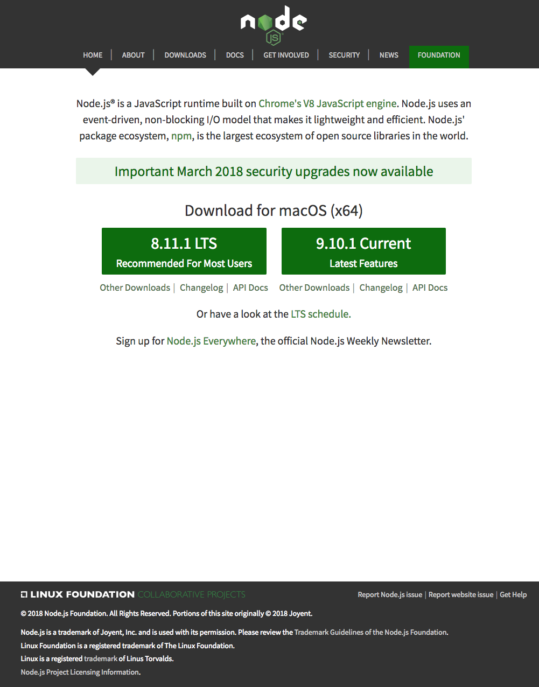{width="6.5in" height="8.2875in"}

> npm -v

### Conclusions

At the end of this exercise, your machine is now ready with the Node
installed for further development. We will examine web development tools
next.

### Exercise (Instructions): Basics of Node.js and NPM

### Objectives and Outcomes

In this exercise you will learn the basics of Node and NPM. At the end
of this exercise, you will be able to:

-   Set up package.json file in the project folder for configuring your
    Node and NPM for this project

-   Install a NPM module and make use of it within your project

### Initializing package.json

-   At the command prompt in your <b>git-test</b> folder, type

> npm init

-   Follow along the prompts and answer the questions as follows: accept
    the default values for most of the entries, except set the entry
    point to index.html

-   This should create a <i>package.json</i> file in your <b>git-test</b>
    folder.

Installing an NPM Module

-   Install an NPM module, lite-server, that allows you to run a Node.js
    based development web server and serve up your project files. To do
    this, type the following at the prompt:

> npm install lite-server \--save-dev

-   You can check out more documentation on lite-server
    [here](https://github.com/johnpapa/lite-server).

-   Next, open package.json in your editor and modify it as shown below.
    Note the addition of two lines, line 7 and line 9.

>    \"start\": \"npm run lite\",
>    \"test\": \"echo \\\"Error: no test specified\\\" && exit 1\",
>    \"lite\": \"lite-server\"
>  },
>  \"repository\": {
>    \"type\": \"git\",
>    \"url\": \"git+[https://jogesh_k\_muppala@bitbucket.org/jogesh_k\_muppala/git-test.git]{.underline}\"
>  },
>  \"author\": \"\",
>  \"license\": \"ISC\",
>  \"homepage\": \"[https://bitbucket.org/jogesh_k\_muppala/git-test#readme]{.underline}\",
>  \"devDependencies\": {
>    \"lite-server\": \"\^2.2.2\"
>  }
>}

-   Next, start the development server by typing the following at the
    prompt:

> npm start

-   This should open your <i>index.html</i> page in your default browser.

-   If you now open the <i>index.html</i> page in an editor and make changes
    and save, the browser should immediately refresh to reflect the
    changes.

### Setting up .gitignore

-   Next, create a file in your project directory named <i>.gitignore</i>
    (<b>Note</b>: the name starts with a period)Then, add the following to
    the .gitignore file

```
node_modules
```

-   Then do a git commit and push the changes to the online repository.
    You will note that the node_modules folder will not be added to the
    commit, and will not be uploaded to the repository.

### Conclusions

In this exercise you learnt to set up package.json, install a npm
package and start a development server.

### Setting up your Development Environment: Git and Node: Additional Resources

### PDFs of Presentations

<b>Git.pdf</b>

PDF File

<b>Git-Exercises.pdf</b>

PDF File

<b>NodeJS.pdf</b>

PDF File

<b>Exercises-Node-NPM.pdf</b>

PDF File

### Additional Resources (Git)

-   Git site [http://git-scm.com](http://git-scm.com/).

-   [Installing
    Git](https://git-scm.com/book/en/v2/Getting-Started-Installing-Git)
    chapter from Pro Git

-   [Git reference manual](https://git-scm.com/docs)

-   Quick reference guides: [GitHub Cheat
    Sheet](https://services.github.com/on-demand/downloads/github-git-cheat-sheet.pdf)
    (PDF) \| [Visual Git Cheat
    Sheet](http://ndpsoftware.com/git-cheatsheet.html) (SVG \| PNG)

-   [Atlassian comprehensive Git
    tutorial](https://www.atlassian.com/git/tutorials/)

### Additional Resources (Node.js and NPM)

-   [Nodejs.org](https://nodejs.org/)

-   [Npmjs.com](https://www.npmjs.com/)

-   [Node API Documentation](https://nodejs.org/api/)

-   [NPM Documentation](https://docs.npmjs.com/)

-   [lite-server](https://github.com/johnpapa/lite-server)

## Introduction to React: Objectives and Outcomes

In this lesson you will be given a quick overview of JavaScript
frameworks and libraries and then introduced to React in particular. We
will learn some basics of React and how to configure a React application
using the create-react-app the command line tool. At the end of this
lesson, you will be able to:

-   Get a basic overview of JavaScript frameworks and libraries

-   Understand the architecture of an React application

-   Scaffold out a starter React application using <i>create-react-app</i>,
    the command line tool

### Front-end JavaScript Frameworks and Libraries Overview

## Introduction to React

We ended the previous lecture with a question, is React a library or is
it a framework and what exactly is React? 

Let\'s examine these questions in a bit more detail in this lecture. 

Let\'s start out with the very first question. 

What exactly is React and how is it different from the other frameworks
or libraries that we have mentioned in the previous lecture? 

When you visit React website, you see it clearly specified right on the
front page that React is a JavaScript library for building user
interfaces. 

Now again, depending on who you ask some people tend to  call React a
library and others tend to call it a framework. 

Now, let\'s not bother ourselves too much in splitting our hairs over
whether it is a framework, or a library but let\'s concentrate more on
what it actually helps us accomplish. 

It is more important for us to understand that rather than worrying
about whether it is a framework or a library. 

The React approach to implementing them applications is what we are
after in this course. 

So, React also states that it uses a declarative approach. 

Now that leaves you in a confused state because we saw that frameworks
generally tend to use the declarative approach. 

But in React, the declarative approach used by React as specified on its
website says that, it makes it easy to create interactive UIs with
simple views for each state within your application. 

And also React takes care of automatically updating the UI and then
rendering any changes to their specific components as required on your
page. 

You just heard me mentioning the term Component. 

React Indeed is a component based approach. 

In a Component based approach, we encapsulate behaviors into small units
called Components. 

We will examine Components in more detail in the next lesson. 

There it will become more clear to you how, and why a component based
approach is useful for implementing our Web applications in React. 

Furthermore, React makes no assumptions about the entire technology
stack that you\'re going to use for implementing your Web applications. 

React plays well with any technology stack that you can use behind the
seats. 

React itself concentrates only on the user interface side of the
story, and that leaves it up to the application designer to decide how
they want to implement the architecture and how they want your
application to interact with the back-end server. 

So, as we go through this course, we will examine one approach that we
use for implementing the entire technology stack which includes the Flux
architecture approach, and in specifically the use of Redux for
implementing a state based storage for our Web application and also the
use of Fetch for interacting with our back-end server. 

Again, I\'ve mentioned a few terms like Flux, Redux, and Fetch. 

We will examine these towards the second half of this course. 

It\'s obviously useful to examine the history behind the React
approach. 

So, to understand where React originated, and how it came about to the
state it is today. 

React was first designed by Jordan Walke who was part of the Facebook
team. 

It was first deployed for Facebook\'s news feed around 2011. 

Subsequently in 2013, React was open sourced at this JS conference. 

React took off as an approach for implementing Web applications from
then onwards. 

React is designed for speed, speed of implementing the application,
simplicity, and scalability. 

The three essence of React, and why it has become so popular in the real
value. 

As we examine React more in this course, you\'ll become more and more
familiar with why this approach is very suited for implementing Web
applications. 

As you enter the React world you will be bombarded with a lot of
vocabulary that is used in the React world. 

You will hear people talking about One-way data flow especially in the
context of the Flux Architecture. 

You will often hear people mentioning about JSX, we will examine JSX in
the very next lecture and understand what role it plays in developing a
React application. 

We\'ll hear about Components which we will examine in the next lesson
and also in the second module of this course in more detail and we\'ll
here about the state and how a React Component interacts with the state
of your application and the way you store the state of your
application, or do you store the state in a specific component. 

We\'ll also hear about Props, a way of passing data between the various
components. 

Also, we\'ll hear about Virtual Dom, and how is it different from Real
DOM. 

Why React manipulate the Virtual DOM, and how the Virtual DOM eventually
gets incorporated, or rendered onto the Real DOM. 

And Element, the React Element, which is the smallest unit of building
up a React application. 

A component being a collection of React elements. 

Then we hear about the Flux and Redux architectures in a bit more
detail. 

Again, as we go along this course we will examine these concepts and
these terminology in more detail. 

Again, don\'t get overwhelmed with the vocabulary that you hear in the
React world. 

If you learn step by step, you\'ll begin to pretty soon get a very good
handle on all this vocabulary and you can easily go ahead and impress
people by throwing these words at them, and trying to impress them or
how much you know about React. 

So, this is the jargon that you will end up learning also at the end of
this course. 

Enough of the jargon. 

Let\'s go ahead and get our hands dirty by starting to build a full
fledged React application, which will form part of all the exercises as
you go through the rest of this course. 

We will start with our first exercise where we\'ll install the
create-react-app, which we will use to scaffold out our very first React
application in the first exercise, and then we will start building upon
this application throughout the remaining exercises of this course.

## Exercise (Video): Getting Started with React

Now that we have examined React briefly in the previous two lectures,
I\'m sure you\'re curious about getting started with React, getting your
hands dirty with starting out on a React application.

So, in this exercise, we will look at how we will get started with
React. I\'m sure by now your computer is already configured with Note
and you have access to NPM, the package manager that comes with Note.

## Exercise (Instructions): Getting Started with React

### Objectives and Outcomes

In this first React exercise, you will first install <i>create-react-app</i>,
the command line tool for scaffolding React applications. You will then
use the tool to scaffold out a basic React application. We will
thereafter develop this application into a full-fledged React
application in the process of doing the exercises in this course. At the
end of this exercise you will be able to:

-   Install <i>create-react-app</i>

-   Scaffold out a basic React application

### Installing Yarn

-   Yarn is another package manager like NPM, but is better suited and
    faster to work with for React applications. So let us install yarn
    and use it for building our React applications.

-   To install Yarn, you can find the instructions for your specific
    platform at <https://yarnpkg.com/en/docs/install>.

-   If you choose not to install Yarn, you can continue to use npm in
    place of yarn without any problem.

### Installing <i>create-react-app</i>

From the React documentation we learn that the <i>create-react-app</i> CLI
makes it easy to create an application that already works, right out of
the box. It already follows the best practices suggested by the React
community!

-   To install <i>create-react-app</i> globally, type the following at the
    prompt:

```
yarn global add create-react-app@1.5.2
```

Use <i>sudo</i> on a Mac and Linux. Alternately you can use npm, by typing
\"npm install -g create-react-app@1.5.2\".

-   This will make the command line tool for creating React
    applications. To learn more about the various commands that this CLI
    provides, type at the prompt:

```
create-react-app \--help
```

### Generating and Serving a React Project using <i>create-react-app</i>

-   At a convenient location on your computer, create a folder named
    <i>React</i> and move into that folder.

-   Then type the following at the prompt to create a new React
    application named <i>confusion</i>:

```
create-react-app confusion
```

-   This should create a new folder named <i>confusion</i> within your
    <i>React</i> folder and create the React application in that folder.

-   Move to the <i>confusion</i> folder and type the following at the prompt:

```
yarn start
```

-   This will compile the project and then open a tab in your default
    browser at the address \<Your Computer\'s Name\>:3000.

-   You can initialize your project to be a Git repository by typing the
    following commands at the prompt:

```
git commit -m \"Initial Setup\"
git init
git add .
```

-   Thereafter you can set up an online Git repository and synchronize
    your project to the online repository. Make sure that the online Git
    repository is a <b><i>private</i></b> repository.

### Conclusions

In this exercise you installed the create-react-app CLI tool and created
a basic React project and served up the compiled project to your
browser.

## React App Overview

## Introduction to JSX

## Exercise (Video): Configuring your React Application

## Exercise (Instructions): Configuring your React Application

### Objectives and Outcomes

In this exercise we will set up our project to use Reactstrap (a package
supporting easy to use React based Bootstrap 4 components). We will then
introduce our first reactstrap component into our application. At the
end of this exercise you will be able to:

-   Configure your React project to use reactstrap.

-   Start using reactstrap components in your application.

### Configure your React Project to use Reactstrap

-   To configure your project to use reactstrap, type the following at
    the prompt to install reactstrap, and Bootstrap 4:

```
yarn add bootstrap@4.0.0
yarn add reactstrap@5.0.0
yarn add react-popper@0.9.2
```

<b>Note</b>: You can also install the same using npm using the \"npm
install \<package\> \--save\" option if you are using npm instead of
yarn.

### Configure to use Bootstrap 4

-   Next, open index.js file in the src folder and add the following
    line into the imports:

> . . .
> import \'bootstrap/dist/css/bootstrap.min.css\';
> . . .

### Adding a Navigation Bar:

-   Open App.js in the src folder and update it as follows:
 
> class App extends Component {
>   render() {
>     return (
>       \<div className=\"App\"\>
>         \<Navbar dark color=\"primary\"\>
>           \<div className=\"container\"\>
>             \<NavbarBrand href=\"/\"\>Ristorante Con Fusion\</NavbarBrand\>
>           \</div\>
>         \</Navbar\>
>       \</div\>
>     );
>   }
> }
> 
> . . .
> 
> import { Navbar, NavbarBrand } from \'reactstrap\';
> 
> . . .

-   Do a Git commit with the message \"Configuring React\"

### Conclusions

In this exercise we learnt to configure our React application to use
Reactstrap.

## Introduction to React: Additional Resources

### PDFs of Presentations

<b>1-JavaScript-Frameworks.pdf</b>

PDF File

<b>2-Intro-React.pdf</b>

PDF File

<b>3-React-App-Overview.pdf</b>

PDF File

<b>4-Intro-JSX.pdf</b>

PDF File

### React Resources

-   [Reactjs.org](https://reactjs.org/)

-   [create-react-app](https://github.com/facebook/create-react-app)

-   [reactstrap](https://reactstrap.github.io/)

-   [reactstrap Navbar](https://reactstrap.github.io/components/navbar/)

-   [Introducing JSX](https://reactjs.org/docs/introducing-jsx.html)

-   [Convert JSX using Online Babel
    Compiler](https://babeljs.io/repl/#?presets=react&code_lz=GYVwdgxgLglg9mABACwKYBt1wBQEpEDeAUIogE6pQhlIA8AJjAG4B8AEhlogO5xnr0AhLQD0jVgG4iAXyJA)

### Definitions

-   [Framework](https://en.wikipedia.org/wiki/Software_framework)

-   [Hollywood
    Principle](https://en.wikipedia.org/wiki/Hollywood_principle)

-   [Inversion of
    Control](https://en.wikipedia.org/wiki/Inversion_of_control)

-   [Imperative vs Declarative
    Programming](https://netguru.co/blog/imperative-vs-declarative)

-   [Imperative vs
    Declarative](http://latentflip.com/imperative-vs-declarative)

### Blog Articles

-   [5 Best JavaScript Frameworks in
    2017](https://hackernoon.com/5-best-javascript-frameworks-in-2017-7a63b3870282#.tt1k09l1d)

-   [Top JavaScript Frameworks & Topics to Learn in
    2017](https://medium.com/javascript-scene/top-javascript-frameworks-topics-to-learn-in-2017-700a397b711#.pe809bf0u)

-   [Declarative vs. Imperative Programming for the
    Web](http://codenugget.co/2015/03/05/declarative-vs-imperative-programming-web.html)

-   [Is React library or a
    framework?](https://develoger.com/is-reactjs-library-or-a-framework-a14786f681a0)

-   [Is React a library or a framework and
    why?](https://www.quora.com/Is-React-a-library-or-a-framework-and-why)

-   [An Introduction to the React
    Framework](https://www.upwork.com/hiring/development/an-introduction-to-the-react-framework/)

-   [React is a
    framework](https://www.sohamkamani.com/blog/2016/11/16/react-is-a-framework/)

-   [Why isn\'t React called framework? What does it lack to be a
    framework?](https://hashnode.com/post/why-isnt-react-called-framework-what-does-it-lack-to-be-a-framework-ciwm324og010xzx53wjfq354i)

## React Components: Objectives and Outcomes

In this lesson you will learn about React components and how we
construct an React component and design its views. At the end of this
lesson you will be able to:

-   Create a React component

-   Construct the React component code and the view for your component
    using JSX and JavaScript

## React Components

## Exercise (Video): React Components Part 1

## Exercise (Instructions): React Components Part 1

### Exercise Resources

<b>images</b>

ZIP File

### Objectives and Outcomes

In this exercise you will add the first component to your React
application and update its view using JSX. At the end of this exercise
you will be able to:

-   Add components to your React application

-   Use JSX to define the views of your component.

### Adding a Menu Component

-   First, download the <i>images.zip</i> file provided above and then unzip
    the file. Create a folder named <i>assets</i> in the <i>public</i> folder.
    Move the resulting <i>images</i> folder containing some PNG files to the
    React project\'s <i>public/assets</i> folder. These image files will be
    useful for our exercises.

-   Next, add a new folder named <i>components</i> in the <i>src</i> folder, and
    create a new file named <i>MenuComponent.js</i> in this folder.

-   Add the following code to <i>MenuComponent.js</i>:

>         this.state = {
>             dishes: \[
>                 {
>                   id: 0,
>                   name:\'Uthappizza\',
>                   image: \'assets/images/uthappizza.png\',
>                   category: \'mains\',
>                   label:\'Hot\',
>                   price:\'4.99\',
> 
> 
>               description:\'A unique combination of Indian Uthappam (pancake) and Italian pizza, topped with Cerignola olives, ripe vine cherry tomatoes, Vidalia onion, Guntur chillies and Buffalo Paneer.\'                  >      },
>               {
>                   id: 1,
>                   name:\'Zucchipakoda\',
>                   image: \'assets/images/zucchipakoda.png\',
>                   category: \'appetizer\',
>                   label:\'\',
>                   price:\'1.99\',
>                   description:\'Deep fried Zucchini coated with mildly spiced Chickpea flour batter accompanied w> ith a sweet-tangy tamarind sauce\'                        },
>                {
>                   id: 2,
>                   name:\'Vadonut\',
>                   image: \'assets/images/vadonut.png\',
>                   category: \'appetizer\',
>                   label:\'New\',
>                   price:\'1.99\',
> 
>                   description:\'A quintessential ConFusion experience, is it a vada or is it a donut?\'          >               },
>                {
>                   id: 3,
>                   name:\'ElaiCheese Cake\',
>                   image: \'assets/images/elaicheesecake.png\',
>                   category: \'dessert\',
>                   label:\'\',
>                   price:\'2.99\',
>                   description:\'A delectable, semi-sweet New York Style Cheese Cake, with Graham cracker crust an> d spiced with Indian cardamoms\'                        }
> 
> class Menu extends Component {
>     constructor(props) {
>        super(props);
> import React, { Component } from \'react\';
> import { Media } from \'reactstrap\';

-   Next, open <i>App.js</i> file and update it as follows:

> . . .
> 
> import Menu from \'./components/MenuComponent\';
> 
> . . .
> 
>     \<Menu /\>
> 
> . . .

-   Open <i>App.css</i> file and delete all its contents.

-   Save all changes and do a Git commit with the message \"Components
    Part 1\".

### Conclusions

In this exercise we added a new component to our React application,
added data to its class, and then updated the app to show the
information in the web page.

## React Components: State and Props

## Exercise (Video): React Components Part 2

## Exercise (Instructions): React Components Part 2

### Objectives and Outcomes

In this exercise we will continue modifying the menu component from the
previous exercise. Instead of a list, we will use a Card component from
reactstrap to display the menu in a different way. Also we will use the
Card component to display the details of a selected dish. At the end of
this exercise you will be able to:

-   Make use of the Card component to display a list of items.

-   Use the Card component to display detailed information.

### Exercise Resources

<b>dishes</b>

JS File

### Updating the Menu Component

-   Open <i>MenuComponent.js</i> and update its contents as follows. Note
    that we have removed the dishes variable from the state of the
    component, and updated it to use the Card: 

```
>     constructor(props) {
>         super(props);
>
>         this.state = {
>             selectedDish: null
>         }
>     }
>
>     onDishSelect(dish) {
>         this.setState({ selectedDish: dish});
>     }
>
>     renderDish(dish) {
>         if (dish != null)
>             return(
>                 \<Card\>
>                     \<CardImg top src={dish.image} alt={dish.name} /\>
>                     \<CardBody\>
>                       \<CardTitle\>{dish.name}\</CardTitle\>
>                       \<CardText\>{dish.description}\</CardText\>
>                     \</CardBody\>
>                 \</Card\>
>             );
>         else
>             return(
>                 \<div\>\</div\>
>             );
>     }
>
>     render() {
>         const menu = this.props.dishes.map((dish) =\> {
>             return (
>               \<div  className=\"col-12 col-md-5 m-1\"\>
> class Menu extends Component {
>
> import { Card, CardImg, CardImgOverlay, CardText, CardBody,
>     CardTitle } from \'reactstrap\';
>  . . .
```

-   Add a folder named <i>shared</i> under the <i>src</i> folder.

-   In the <i>shared</i> folder, create a new file named <i>dishes.js</i> and add
    the following content to it (<b>Note</b>: Alternately you can download
    the <i>dishes.js</i> file given above in the Exercise Resources and move
    it to the shared folder. Make sure the file is named <i>dishes.js</i>):

```
> export const DISHES =
>     [
>         {
>         id: 0,
>         name:'Uthappizza',
>         image: 'assets/images/uthappizza.png',
>         category: 'mains',
>         label:'Hot',
>         price:'4.99',
>        description:'A unique combination of Indian Uthappam (pancake) and Italian pizza, topped with Cerignola olives, ripe vine cherry tomatoes, Vidalia onion, Guntur chillies and Buffalo Paneer.',
>         comments: [
>             {
>             id: 0,
>             rating: 5,
>             comment: "Imagine all the eatables, living in conFusion!",
>             author: "John Lemon",
>             date: "2012-10-16T17:57:28.556094Z"
>             },
>             {
>             id: 1,
>             rating: 4,
>             comment: "Sends anyone to heaven, I wish I could get my mother-in-law to eat it!",
>             author: "Paul McVites",
>
>             date: "2014-09-05T17:57:28.556094Z"
>             },
>             {
>             id: 2,
>             rating: 3,
>             comment: "Eat it, just eat it!",
>             author: "Michael Jaikishan",
>             date: "2015-02-13T17:57:28.556094Z"
>             },
>             {
>             id: 3,
>             rating: 4,
>             comment: "Ultimate, Reaching for the stars!",
>             author: "Ringo Starry",
>             date: "2013-12-02T17:57:28.556094Z"
>             },
>             {
```

-   Open <i>App.js</i> and update it as follows:

```
> . . .
>
> import { DISHES } from './shared/dishes';
>
> . . .
>
> class App extends Component {
>   constructor(props) {
>     super(props);
>     this.state = {
>       dishes: DISHES
>     };
>   }
>
> . . .
>
>   <Menu dishes={this.state.dishes} />
>
> . . .
```

-   Save the changes and do a Git commit with the message "Components Part 2".

Conclusions

In this exercise we used a list of Cards to display the information in
the menu component. Also, we used a card to display the details of a
selected dish.

## React Components: Lifecycle Methods Part 1

## React Components: Additional Resources

### PDFs of Presentations

<b>5-Component-Part1.pdf</b>

PDF File

<b>6-Component-Part2.pdf</b>

PDF File

<b>7-Lifecycle-Methods.pdf</b>

PDF File

### React Resources

-   [React
    Components](https://reactjs.org/docs/components-and-props.html)

-   [React Component
    State](https://reactjs.org/docs/state-and-lifecycle.html)

-   [React Component
    Props](https://reactjs.org/docs/components-and-props.html)

-   [reactstrap Media
    Object](https://reactstrap.github.io/components/media/)

-   [React.Component and Lifecycle
    Methods](https://reactjs.org/docs/react-component.html)

-   [reactstrap Card](https://reactstrap.github.io/components/card/)

-   [Bootstrap unstyled
    list](http://getbootstrap.com/docs/4.0/content/typography/#unstyled)

-   [React Dev Tools](https://github.com/facebook/react-devtools)

-   [React Dev Tools Chrome
    Extension](https://chrome.google.com/webstore/detail/react-developer-tools/fmkadmapgofadopljbjfkapdkoienihi)

## Assignment 1 Requirements (Video): React Components

## Peer-graded Assignment: React Components

<b>Deadline</b>Oct 23, 11:59 PM PDT

i

It looks like this is your first peer-graded assignment. [Learn
more](https://learner.coursera.help/hc/articles/208279926-Submit-peer-reviewed-assignments)

<b>Ready for the assignment?</b>

You will find instructions below to submit.

In this assignment you will add a new component to the React application
to show the details of a selected dish. You will use the Card component
and the Bootstrap unstyled list component to prepare the view for this
new component.

## Step-By-Step Assignment Instructions

<b>less </b>

<b>Objectives and Outcomes</b>

In this assignment, you will continue to work with the React application
that you have been developing in the exercises. You will add a new
component named <b><i>DishdetailComponent</i></b> that will display the details
of a selected dish. You will then design the view for the component
using the card component. At the end of this assignment, you should have
completed the following tasks:

-   Created a new DishdetailComponent and added it to your React
    > application.

-   Updated the view of the DishdetailComponent to display the details
    > of the selected dish using an reactstrap card component.

-   Updated the view of the DishdetailComponent to display the list of
    > comments about the dish using the Bootstrap unstyled list
    > component.

<b>Assignment Requirements</b>

This assignment requires you to complete the following tasks. Detailed
instructions for each task are given below. The picture of the completed
web page included below indicates the location within the web page that
will be updated by the three tasks.

<b>Task 1</b>

In this task you will be adding a new <b><i>DishdetailComponent</i></b> to your
React application and include the component into the menu component\'s
view so that the details of a specific dish are displayed there:

-   Replace the card showing the selected dish in MenuComponent\'s view
    > with the DishdetailComponent, and make sure to pass the selected
    > dish information as props to the DishdetailComponent.

-   Create a new <i>DishDetail</i> class in a file named
    > <i>DishdetailComponent.js</i> in the <i>components</i> folder

-   Export the <i>DishDetail</i> class from this file so that it can be
    > imported in <i>MenuComponent.js</i> and used to construct the view of
    > the selected dish.

-   Return a \<div\> from the render() function. This \<div\> should use
    > the Bootstrap <i>row</i> class to position the content within the
    > \<div\>. This div will display both the details of the dish in a
    > Card and the list of comments side-by-side for medium to extra
    > large screens, but will stack them for xs and sm screens.

-   The card should be enclosed inside a \<div\> appropriate Bootstrap
    > column classes so that it occupies the entire 12 columns for the
    > xs and sm screen sizes, and 5 columns for md screens and above.
    > Also apply a class of m-1 to this div.

-   The comments should be enclosed in a \<div\> to which you apply
    > appropriate column classes so that it occupies the entire 12
    > columns for the xs and sm screen sizes, and 5 columns for md
    > screens and above. Also apply a class of m-1 to this div.

-   If the dish is null then you should return an empty \<div\>

<b>Task 2</b>

In this task you will be adding a card component to the
<b><i>DishdetailComponent</i></b> view to display the details of the dish given
above:

-   Implement a function named renderDish() that takes the dish as a
    > parameter and returns the JSX code for laying out the details of
    > the dish in a reactstrap Card. You have already seen this as part
    > of the MenuComponent class in the exercise earlier.

```{=html}
<!-- -->
```
-   Display the name of the dish as the Card title, and the description
    > as the Card text.

<b>Task 3</b>

In this task you will use the comments that are included in the dish
object above to display a list of the comments for the dish. Please use
your JavaScript knowledge to recall how you would access an inner
property in a JavaScript object that itself points to an array of
JavaScript objects (comments). This task involves the following steps:

-   Implement a function named renderComments() that takes the comments
    > array as a parameter and lays out each comment as shown in the
    > image below. You should use the Bootstrap list-unstyled class on
    > the list.

-   Each comment should be displayed on two lines, the first one showing
    > the comment, and the second line showing the comment author\'s
    > name and the date.

-   The comments should contain a \<h4\> header with the word
    > \"Comments\".

-   Remember to enclose the header and comments inside a \<div\> before
    > returning the JSX code. Otherwise React will not do the layout
    > correctly.

-   If the comments are null, then you should return an empty \<div\>.

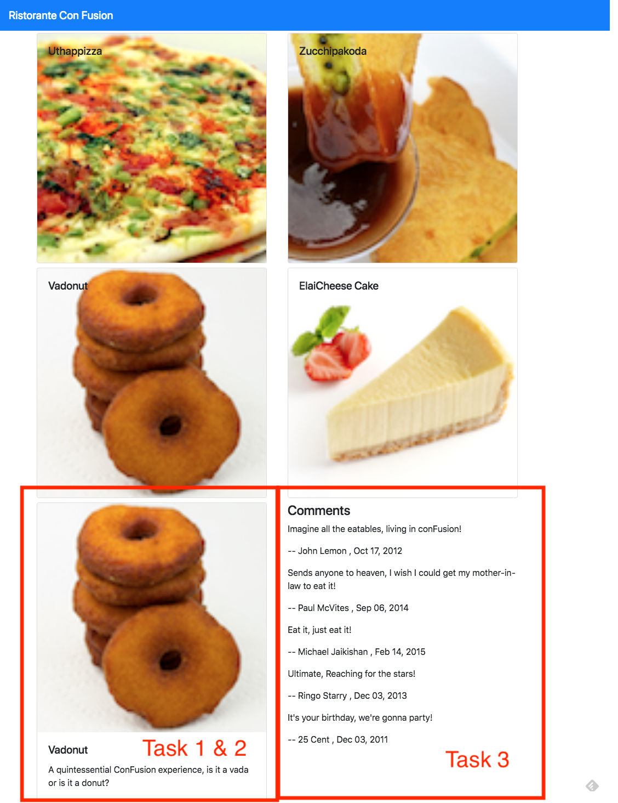{width="6.5in"
height="8.436111111111112in"}

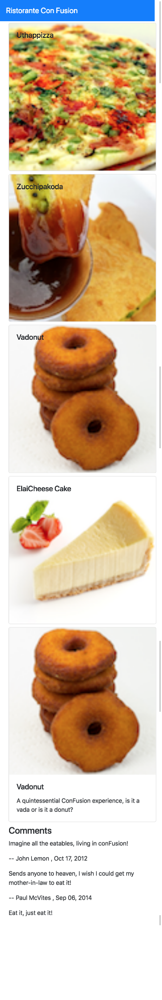{width="1.4645833333333333in"
height="9.0in"}

## Review criteria

<b>less </b>

Upon completion of the assignment, your submission will be reviewed
based on the following criteria:

<b>Task 1:</b>

  -   A new <b><i>DishdetailComponent</i></b> has been added to your React application.

  -   Included the DishDetail into your MenuComponent\'s view to show the selected dish.

  -   Passing the selected dish as props to the DishDetail Component.

  -   Used the appropriate Bootstrap classes to the card so that it occupies the entire row for xs and sm screen sizes, and 5 columns for md screens and above.

  -   Used the appropriate Bootstrap classes to the div containing the list of comments so that it occupies the entire row for xs and sm  screen sizes, and 5 columns for md screens and above.

<b>Task 2:</b>

-   Used the Card component to display the details of the dish.

<b>Task 3:</b>

-   Included a list of comments about the dish into the dishdetail view.

## Assignment 1: React Components: Additional Resources

### Assignment 1 Screenshots

{width="6.5in"
height="8.436111111111112in"}{width="1.4645833333333333in"
height="9.0in"}

### React Resources

-   [React
    Components](https://reactjs.org/docs/components-and-props.html)

-   [React Component
    State](https://reactjs.org/docs/state-and-lifecycle.html)

-   [React Component
    Props](https://reactjs.org/docs/components-and-props.html)

-   [reactstrap Media
    Object](https://reactstrap.github.io/components/media/)

-   [reactstrap Card](https://reactstrap.github.io/components/card/)

-   [Bootstrap unstyled
    list](http://getbootstrap.com/docs/4.0/content/typography/#unstyled)

-   [Bootstrap Grid](http://getbootstrap.com/docs/4.0/layout/grid/)

## Module 5: Ideation: Objectives and Outcomes

The first step in your journey towards the implementation of the
Capstone project begins with an idea. In this module you will develop
the idea for your project, the set of expected features, survey the
market to look at similar ideas to enable you to differentiate your
project from others, while at the same time drawing inspiration from
them. You are required to submit a formal ideation report following the
structure given in the template. This will enable your peers to provide
you feedback and suggestions for your project.

Before you get started on a project, the first step is to develop the
idea for the project. In this module you will explore how you develop
your idea and come up with possible set of features for your project. At
the end of this step you should be able to:

-   Clearly express the central idea of your project, and identify the
    problem being addressed

-   Delineate a set of features that you expect your website and app
    should support

-   Identify other projects that might have similar features and would
    act as exemplars for your project

## Ideation Report Template

### Project Title

### 1. Introduction

-   A brief introduction to your website idea. State the goals of the
    project.

-   The values / benefits (tangible and intangible) this application can
    bring to a company/organization/end-user.

### 2. Expected List of Features

-   A brief list of features that you expect your website to support.

-   Brief justifications for including these features.

### 3. Market Survey

  -   Do a survey of the Web to find about five web sites that might have similar ideas as yours.

  -   Briefly compare the features of these applications with your application idea.

### 4. References

  -   Give references to any material / websites / books etc. relevant to your application idea

  -   Give the links to the websites relevant to your idea, that you listed in the section above.

## Honors Peer-graded Assignment: Ideation

<b>Deadline</b>Oct 23, 11:59 PM PDT

<b>Ready for the assignment?</b>

You will find instructions below to submit.

In this assignment you will be submitting a written report describing
the general idea of your project, the expected list of features and a
survey of existing projects, websites and/or apps that are similar to
your ideas and/or have some features similar to your proposed project.
The structure of the written report should adhere to the report template
given in this module, and emphasize the points specified in the
template. The written submission needs to be no more than three standard
Letter/A4 sized pages.

## Review criteria

<b>less </b>

Your submission will be reviewed based on the following criteria by
peers in order to provide you with constructive feedback on your project
idea:

1.  Does the Ideation report clearly state the idea of the project and
    > the primary aim and purpose of the proposed website ?

2.  Does the Ideation report list the expected features that will be
    > supported by the website?

3.  Did the user provide a survey of related ideas/projects/websites
    > that have some similarities to the proposed idea?

4.  Does the Ideation report provide references to suitable sources in
    > support of the project idea?

## Ideation: Additional Resources

### General Resources

-   [Ideation (creative
    process)](https://en.wikipedia.org/wiki/Ideation_(creative_process))

### Volunteer your Services

-   [VolunteerMatch.org](http://www.volunteermatch.org/)

-   [Free Code Camp](https://www.freecodecamp.com/)

## Module 6: React Component Types: Objectives and Outcomes

In this lesson you will learn about various types of React components:
Presentational, Container and Functional components. At the end of this
lesson you will be able to:

-   Identify the salient features and uses for the various types of
    components

-   Create presentational, container and functional components in your
    React application

## Presentational and Container Components

Notes

## Exercise (Video): Presentational and Container Components

## Exercise (Instructions): Presentational and Container Components

### Objectives and Outcomes

In this exercise we understand about how presentational components deal
with the look and feel of the app and container components deal with the
data and behavior. At the end of this exercise you will learn about:

-   Organizing your React app into presentational and container
    components

-   Enable your presentational components to be concerned with the look
    and feel of your app

-   Enable container components to deal with the state, provide the data
    and handle user interactions.

### Add a Container Component

-   Add a new component named <i>MainComponent.js</i> in the components
    folder and update its contents as follows:

```
> import React, { Component } from 'react';
> import { Navbar, NavbarBrand } from 'reactstrap';
> import Menu from './MenuComponent';
> import DishDetail from './DishdetailComponent';
> import { DISHES } from '../shared/dishes';
>  
> class Main extends Component {
>  
>   constructor(props) {
>     super(props);
>     this.state = {
>         dishes: DISHES,
>         selectedDish: null
>     };
>   }
>  
>   onDishSelect(dishId) {
>     this.setState({ selectedDish: dishId});
>   }
>  
>   render() {
>     return (
>       <div>
>         <Navbar dark color="primary">
>           <div className="container">
>             <NavbarBrand href="/">Ristorante Con Fusion</NavbarBrand>
>           </div>
>         </Navbar>
>         <Menu dishes={this.state.dishes} onClick={(dishId) => this.onDishSelect(dishId)} />
>         <DishDetail dish={this.state.dishes.filter((dish) => dish.id === this.state.selectedDish)[0]} />
>       </div>
>     );
>   }
> }
>  
> export default Main;
```

-   Update the <i>App.js</i> by removing the state related information, and
    make use of Main Component to render the UI:

```
> . . .
> import Main from './components/MainComponent';
>  
> class App extends Component {
>  
>   render() {
>     return (
>       <div className="App">
>         <Main />
>       </div>
>     );
>   }
> }
>  
> . . .
```

### Turn Menu Component into a Presentational Component

-   Open MenuComponent.js and update its contents by removing the state
    and removing the DishdetailComponent reference, and make use of the
    onClick supplied by MainComponent through the props to deal with the
    clicking of a menu item:

```
> . . .
>                     <Card key={dish.id}
>                         onClick={() => this.props.onClick(dish.id)}>
> . . .
```

-   The DishdetailComponent is already structured as a presentational
    component and hence needs no further update, except wrapping the
    return value from render() within a \<div\> with the className as
    container.

-   To print out the date for a comment in a format more suitable for
    human readability, you can update your renderComment function with
    the code snippet shown below:

```
> {new Intl.DateTimeFormat('en-US', { year: 'numeric', month: 'short', day: '2-digit'}).format(new Date(Date.parse(comment.date)))}
```

-   Save all the changes and do a Git commit with the message
    "Presentational and Container Components"

### Conclusions

In this exercise you learnt how to structure your app into
presentational and container components.

## React Components: Lifecycle Methods Part 2

## Functional Components

## Exercise (Video): Functional Components

## Exercise (Instructions): Functional Components

### Objectives and Outcomes

In this lesson we explore the design of functional components in React.
We will reimplement both the MenuComponent and DishdetailComponent as
pure functional components. At the end of this exercise you will be able
to:

-   Implement functional components in React

-   Illustrate the reimplementation of presentational components as pure
    functional components

### Implementing Functional Components

-   Open MenuComponent.js and update it as follows:

```
> import React from 'react';
> import { Card, CardImg, CardImgOverlay,
>     CardTitle } from 'reactstrap';
>  
>     function RenderMenuItem ({dish, onClick}) {
>         return (
>             <Card
>                 onClick={() => onClick(dish.id)}>
>                 <CardImg width="100%" src={dish.image} alt={dish.name} />
>                 <CardImgOverlay>
>                     <CardTitle>{dish.name}</CardTitle>
>                 </CardImgOverlay>
>             </Card>
>         );
>     }
>
>     const Menu = (props) => {
>  
>         const menu = props.dishes.map((dish) => {
>             return (
>                 <div className="col-12 col-md-5 m-1"  key={dish.id}>
>                     <RenderMenuItem dish={dish} onClick={props.onClick} />
>                 </div>
>             );
>         });
>  
>         return (
>             <div className="container">
>                 <div className="row">
>                     {menu}
>                 </div>
>             </div>
>         );
>     }
>  
> export default Menu;
```

-   Then open DishdetailComponent.js and update it as follows:

```
> import React from 'react';
> import { Card, CardImg, CardText, CardBody,
>     CardTitle } from 'reactstrap';
>     function RenderDish({dish}) {
>       . . .
>     }
>     function RenderComments({comments}) {
>       . . .
>     }
>     const  DishDetail = (props) => {
>       . . .
>     }
> export default DishDetail;
```

-   Save all the changes and do a Git commit with the message
    "Functional Components".

### Conclusions

In this exercise we have learnt to implement our components as pure functional components.

## React Component Types: Additional Resources

### PDFs of Presentations

<b>1-Component-Types-Part1.pdf</b>

PDF File

<b>2-Component-Types-Part2.pdf</b>

PDF File

Other Resources

-   [Presentational and Container
    Components](https://medium.com/@dan_abramov/smart-and-dumb-components-7ca2f9a7c7d0)

-   [Presentational and Container Components (Redux
    Perspective)](https://redux.js.org/basics/usage-with-react)

-   [React Component
    Patterns](https://levelup.gitconnected.com/react-component-patterns-ab1f09be2c82)

-   [Functional Stateless Components in
    React](https://javascriptplayground.com/functional-stateless-components-react/)

## Module 8: React Router: Objectives and Outcomes

In this lesson we cover the basics of React router. We examine how the
router enables the navigation among views of various components that
form part of a React application. At the end of this lesson you will be
able to:

-   Set up the router module to enable navigation among multiple
    component views

-   Set up the routes to enable the navigation

## React Virtual DOM

## Exercise (Video): Header and Footer

## Exercise (Instructions): Header and Footer

### Objectives and Outcomes

In this exercise you will add in a header and a footer to our React
application using two React components. This will illustrate the use of
multiple components put together form the application\'s view. You will
also add in the Font Awesome icons and Bootstrap-social for use within
your application. At the end of this exercise you will be able to:

-   Use multiple components and their views to put together the view of
    the application.

-   Make use of Font Awesome icons and Bootstrap-social within your
    React application

### Using Font Awesome Icons and Bootstrap-Social

-   First use yarn or npm to fetch Font Awesome and Bootstrap-social to
    the project by typing the following at the prompt:

```
> yarn add font-awesome@4.7.0
> yarn add bootstrap-social@5.1.1
```

-   Then, open index.js file and update it as follows to enable your
    application to use Font Awesome and Bootstrap Social:

```
> . . .
>  
> import \'font-awesome/css/font-awesome.css\';
> import \'bootstrap-social/bootstrap-social.css\';
>  
> . . .
```

### Adding a Header and a Footer

-   Create a new file named HeaderComponent.js and add the following to
    it:

```
> import React, { Component } from 'react';
> import { Navbar, NavbarBrand, Jumbotron } from 'reactstrap';
>  
> class Header extends Component {
>   render() {
>     return(
>     <React.Fragment>
>       <Navbar dark>
>         <div className="container">
>             <NavbarBrand href="/">Ristorante Con Fusion</NavbarBrand>
>         </div>
>       </Navbar>
>       <Jumbotron>
>            <div className="container">
>                <div className="row row-header">
>                    <div className="col-12 col-sm-6">
>                        <h1>Ristorante con Fusion</h1>
>                       <p>We take inspiration from the World's best cuisines, and create a unique fusion experience. Our lipsmacking creations will tickle your culinary senses!</p>
>                    </div>
>                </div>
>            </div>
>        </Jumbotron>
>     </React.Fragment>
>     );
>   }
> }
>  
> export default Header;
```

-   Then, add another file named FooterComponent.js and add the
    following to it:

```
> import React from 'react';
>  
> function Footer(props) {
>     return(
>     <div className="footer">
>         <div className="container">
>             <div className="row justify-content-center\"\>             
>                 <div className="col-4 offset-1 col-sm-2\"\>
>                     <h5>Links</h5>
>                     <ul className="list-unstyled">
>                         <li><a href="#">Home</a></li>
>                         <li><a href="#">About</a></li>
>                         <li><a href="#">Menu</a></li>
>                         <li><a href="contactus.html">Contact</a></li>
>                     </ul>
>                 </div>
>                 <div className="col-7 col-sm-5">
>                     <h5>Our Address</h5>
>                     <address>
>                       121, Clear Water Bay Road<br />
>                       Clear Water Bay, Kowloon<br />
>                       HONG KONG<br />
>                       <i className="fa fa-phone fa-lg\"\>\</i\>: +852 1234 5678\<br /\>
>                       <i className="fa fa-fax fa-lg\"\>\</i\>: +852 8765 4321\<br /\>
>                       <i className="fa fa-envelope fa-lg\"\>\</i\>: \<a href=\"mailto:confusion@food.net\"\>
>                          confusion@food.net</a>
>                     </address>
>                 </div>
>                 <div className="col-12 col-sm-4 align-self-center">
>                     <div className="text-center">
>  <a className="btn btn-social-icon btn-google" href="[http://google.com/+]{.underline}"><i className="fa fa-google-plus"></i></a>
> <a className="btn btn-social-icon btn-facebook\" href=\"[http://www.facebook.com/profile.php?id=]{.underline}\"\>\<i className="fa fa-facebook"></i></a>
> <a className=\"btn btn-social-icon btn-linkedin\" href=\"[http://www.linkedin.com/in/]{.underline}\"\>\<i className=\"fa fa-linkedin\"\>\</i\>\</a\>
>\<a className=\"btn btn-social-icon btn-twitter\" href=\"[http://twitter.com/]{.underline}\"\>\<i className=\"fa fa-twitter\"\>\</i\>\</a\>
>\<a className=\"btn btn-social-icon btn-google\" href=\"[http://youtube.com/]{.underline}\"\>\<i className=\"fa fa-youtube\"\>\</i\>\</a\>
>\<a className=\"btn btn-social-icon\" href=\"mailto:\"\>\<i className=\"fa fa-envelope-o\"\>\</i\>\</a\>
>                     \</div\>
>                 \</div\>
>             \</div\>
>             \<div className=\"row justify-content-center\"\>             
```

### Integrating Header and Footer into the React Application

-   Now we open MainComponent.js and update it to integrate the header
    and footer into our application:

```
> . . .
>
>  
>
> import Header from \'./HeaderComponent\';
>
> import Footer from \'./FooterComponent\';
>
>  
>
> . . .
>
>  
>
>         \<Header /\>
>
>         \<Menu dishes={this.state.dishes} onClick={(dishId) =\> this.onDishSelect(dishId)} /\>
>
>         \<DishDetail dish={this.state.dishes.filter((dish) =\> dish.id === this.state.selectedDish)\[0\]} /\>
>
>         \<Footer /\>
>
>         
>
> . . .

-   Then update App.css to add some new CSS classes for use in our
    application:

> .row-header{
>
>     margin:0px auto;
>
>     padding:0px auto;
>
> }
>
>  
>
> .row-content {
>
>     margin:0px auto;
>
>     padding: 50px 0px 50px 0px;
>
>     border-bottom: 1px ridge;
>
>     min-height:400px;
>
> }
>
>  
>
> .footer{
>
>     background-color: #D1C4E9;
>
>     margin:0px auto;
>
>     padding: 20px 0px 20px 0px;
>
> }
>
> .jumbotron {
>
>     padding:70px 30px 70px 30px;
>
>     margin:0px auto;
>
>     background: #9575CD ;
>
>     color:floralwhite;
>
> }
>
>  
>
> address{
>
>     font-size:80%;
>
>     margin:0px;
>
>     color:#0f0f0f;
>
> }
>
>  
>
> .navbar-dark {
>
>     background-color: #512DA8;
>
> }
```

-   Save all the changes and do a Git commit with the message \"Header
    and Footer\"

### Conclusions

In this exercise we updated the React application to use Font Awesome
and Bootstrap Social, and also integrated two new components, Header and
Footer, into our application.

## React Router

## Exercise (Video): React Router

## Exercise (Instructions): React Router

### Objectives and Outcomes

In this exercise we learn to use the React Router to configure and set
up navigation among various pages in a React application. At the end of
this exercise you will be able to:

-   Install and configure your application to use React Router

-   Configure the routes for React router to enable you to navigate to
    various pages within your React application

### Installing and Configuring React Router

-   First install React Router into your project by typing the following
    at the prompt:

> yarn add react-router-dom@4.2.2

-   Then, open <i>App.js</i> and update it as follows:

```
> . . .
>
>  
>
> import { BrowserRouter } from \'react-router-dom\';
>
>  
>
> . . .
>
>  
>
>     \<BrowserRouter\>
>
>       \<div className=\"App\"\>
>
>         \<Main /\>
>
>       \</div\>
>
>     \</BrowserRouter\>
>
>     
>
> . . .
```

### Add a Home Component

-   Create a new file named HomeComponent.js in the components folder
    and add the following to it:

```
> import React from \'react\';
>
>  
>
> function Home(props) {
>
>     return(
>
>       \<div className=\"container\"\>
>
>         \<h4\>Home\</h4\>
>
>       \</div\>
>
>     );
>
> }
>
>  
>
> export default Home;   
```

### Configuring the Router

-   Open <i>MainComponent.js</i> file and update it as follows:

```
> . . .
>
> import Home from \'./HomeComponent\';
>
> . . .
>
> import { Switch, Route, Redirect } from \'react-router-dom\';
>
> . . .
>
>   render() {
>
>     const HomePage = () =\> {
>       return(
>           \<Home 
>           /\>
>       );
>     }
>
> . . .
>           \<Switch\>
>               \<Route path=\'/home\' component={HomePage} /\>
>               \<Route exact path=\'/menu\' component={() =\> \<Menu dishes={this.state.dishes} /\>} /\>
>               \<Redirect to=\"/home\" /\>
>           \</Switch\>
>
> . . .
>
>  
```

-   Open <i>HeaderComponent.js</i> and update its contents with the
    following:

```
> import { Nav, Navbar, NavbarBrand, NavbarToggler, Collapse, NavItem, Jumbotron } from \'reactstrap\';
>
> import { NavLink } from \'react-router-dom\';
>
>  
>
> class Header extends Component {
>
>     constructor(props) {
>
>         super(props);
>
>     
>
>         this.toggleNav = this.toggleNav.bind(this);
>
>         this.state = {
>
>           isNavOpen: false
>
>         };
>
>       }
>
>  
>
>       toggleNav() {
>
>         this.setState({
>
>           isNavOpen: !this.state.isNavOpen
>
>         });
>
>       }
>
>  
>
>     render() {
>
>         return(
>
>             \<div\>
>
>                 \<Navbar dark expand=\"md\"\>
>
>                     \<div className=\"container\"\>
>
>                         \<NavbarToggler onClick={this.toggleNav} /\>
>
> \<NavbarBrand className=\"mr-auto\" href=\"/\"\>\\</NavbarBrand\>
>
>                         \<Collapse isOpen={this.state.isNavOpen} navbar\>
>
>                             \<Nav navbar\>
>
>                             \<NavItem\>
>
> \<NavLink className=\"nav-link\"  to=\'/home\'\>\<span className=\"fa fa-home fa-lg\"\>\</span\> Home\</NavLink\>
>
>                             \</NavItem\>
>
>                             \<NavItem\>
>
> \<NavLink className=\"nav-link\" to=\'/aboutus\'\>\<span className=\"fa fa-info fa-lg\"\>\</span\> About Us\</NavLink\>
>
>                             \</NavItem\>
>
>                             \<NavItem\>
>
>  \<NavLink className=\"nav-link\"  to=\'/menu\'\>\<span className=\"fa fa-list fa-lg\"\>\</span\> Menu\</NavLink\>
>
>                             \</NavItem\>
>
>                             \<NavItem\>
>
> \<NavLink className=\"nav-link\" to=\'/contactus\'\>\<span className=\"fa fa-address-card fa-lg\"\>\</span\> Contact Us\</NavLink\>
>
>                             \</NavItem\>
```

-   Then, open FooterComponent.js and update it as follows:

```
> . . .
>
>  
>
> import { Link } from \'react-router-dom\';
>
>  
>
> . . .
>
>  
>
>                         \<li\>\<Link to=\'/home\'\>Home\</Link\>\</li\>
>
>                         \<li\>\<Link to=\'/aboutus\'\>About Us\</Link\>\</li\>
>
>                         \<li\>\<Link to=\'/menu\'\>Menu\</Link\>\</li\>
>
>                         \<li\>\<Link to=\'/contactus\'\>Contact Us\</Link\>\</li\>
>
>                         
>
> . . .
```

-   Open MenuComponent.js and remove the onClick() from the Card in the
    RenderMenuItem() function.

-   Save all the changes and do a Git commit with the message \"React
    Router\".

### Conclusions

In this exercise you learn about installing, configuring and using the
React Router for navigation within your React app.

## React Router: Additional Resources

### PDFs of Presentations

<b>3-VirtualDOM.pdf</b>

PDF File

<b>4-React-Router.pdf</b>

PDF File

### React Resources

-   [react-router](https://github.com/ReactTraining/react-router)

-   [react-router-dom](https://github.com/ReactTraining/react-router/tree/master/packages/react-router-dom)

-   [React Router
    Documentation](https://reacttraining.com/react-router/)

-   [React Router Dom
    Documentation](https://reacttraining.com/react-router/web/guides/philosophy)

### Other Resources

-   [React Router DOM: set-up, essential components, & parameterized
    routes](https://blog.logrocket.com/react-router-dom-set-up-essential-components-parameterized-routes-505dc93642f1)

-   [Basic intro to React Router
    v4](https://medium.com/@thejasonfile/basic-intro-to-react-router-v4-a08ae1ba5c42)

-   [A Simple React Router v4
    Tutorial](https://medium.com/@pshrmn/a-simple-react-router-v4-tutorial-7f23ff27adf)

## Module 09: Single Page Applications: Objectives and Outcomes

In this lesson you will explore single page applications (SPA) and React
support for SPA. You will learn to use the routes and React router that
enables the development of SPAs. At the end of this lesson, you will be
able to:

-   Design SPA using React

-   Use the <i>React router</i> to construct SPA

## Single Page Applications (video)

## Exercise (Video): Single Page Applications Part 1

## Exercise (Instructions): Single Page Applications Part 1

### Objectives and Outcomes

In this exercise you will continue to develop the React application as a
single page application, integrating the various components. At the end
of this exercise you will be able to:

-   Leverage the React router to enable the development of single page
    applications

-   Provide a way of navigating among various pages using the React
    router support.

### Exercise Resources

<b>dishes</b>

JS File

<b>promotions</b>

JS File

<b>leaders</b>

JS File

<b>comments</b>

JS File

### Integrating the Contact Component

-   Add a new file named <i>ContactComponent.js</i> file and update its
    contents as follows:

```
> import React from \'react\';
>
> function Contact(props) {
>     return(
>         \<div className=\"container\"\>
>             \<div className=\"row row-content\"\>
>                 \<div className=\"col-12\"\>
>                 \<h3\>Location Information\</h3\>
>                 \</div\>
>                 \<div className=\"col-12 col-sm-4 offset-sm-1\"\>
>                         \<h5\>Our Address\</h5\>
>                         \<address\>
>                         121, Clear Water Bay Road\<br /\>
>                         Clear Water Bay, Kowloon\<br /\>
>                         HONG KONG\<br /\>
>                         \<i className=\"fa fa-phone\"\>\</i\>: +852 1234 5678\<br /\>
>                         \<i className=\"fa fa-fax\"\>\</i\>: +852 8765 4321\<br /\>
>  \<i className=\"fa fa-envelope\"\>\</i\>: \<a href=\"mailto:confusion@food.net\"\>confusion@food.net\</a\>
>
>                         \</address\>
>                 \</div\>
>                 \<div className=\"col-12 col-sm-6 offset-sm-1\"\>
>                     \<h5\>Map of our Location\</h5\>
>                 \</div\>
>                 \<div className=\"col-12 col-sm-11 offset-sm-1\"\>
>                     \<div className=\"btn-group\" role=\"group\"\>
>
>\<a role=\"button\" className=\"btn btn-primary\" href=\"tel:+85212345678\"\>\<i className=\"fa fa-phone\"\>\</i\> Call\</a\>
>
>\<a role=\"button\" className=\"btn btn-info\"\>\<i className=\"fa fa-skype\"\>\</i\> Skype\</a\>
>
>\<a role=\"button\" className=\"btn btn-success\" href=\"mailto:confusion@food.net\"\>\<i className=\"fa fa-envelope-o\"\>\</i\> Email\</a\>
>
>                     \</div\>
>                 \</div\>
>             \</div\>
>         \</div\>
>     );
> }
>
> export default Contact;
```

-   Update the <i>MainComponent.js</i> file to integrate the ContactComponent
    by adding in the following:

```
> . . .
>
>  
>
> import Contact from \'./ContactComponent\';
>
>  
>
> . . .
>
>  
>
>               \<Route exact path=\'/contactus\' component={Contact} /\>} /\>
>
>  
```

### Updating the Home Component

-   First update <i>dishes.js</i> file in the shared folder to update the
    dishes as follows. (<b>NOTE</b>: Alternately you can download
    <i>dishes.js, comments.js, promotions.js</i> and <i>leaders.js</i> given above
    in Exercise resources and move them to the shared folder):

```
> export const DISHES =
>     \[
>         {
>         id: 0,
>         name:\'Uthappizza\',
>         image: \'/assets/images/uthappizza.png\',
>         category: \'mains\',
>         label:\'Hot\',
>         price:\'4.99\',
>         featured: true,
>
>  description:\'A unique combination of Indian Uthappam (pancake) and Italian pizza, topped with Cerignola olives, ripe vine cherry tomatoes, Vidalia onion, Guntur chillies and Buffalo Paneer.\'                    
>         },
>         {
>         id: 1,
>         name:\'Zucchipakoda\',
>         image: \'/assets/images/zucchipakoda.png\',
>         category: \'appetizer\',
>         label:\'\',
>         price:\'1.99\',
>         featured: false,
>description:\'Deep fried Zucchini coated with mildly spiced Chickpea flour batter accompanied with a sweet-tangy tamarind sauce\'
>
>         },
>         {
>         id: 2,
>         name:\'Vadonut\',
>         image: \'/assets/images/vadonut.png\',
>         category: \'appetizer\',
>         label:\'New\',
>         price:\'1.99\',
>         featured: false,
>         description:\'A quintessential ConFusion experience, is it a vada or is it a donut?\'
>         },
>         {
>         id: 3,
>         name:\'ElaiCheese Cake\',
>         image: \'/assets/images/elaicheesecake.png\',
>         category: \'dessert\',
>         label:\'\',
>         price:\'2.99\',
>         featured: false,
```

-   Now add a new file named <i>comments.js</i> to the shared folder and
    update it as follows. We are now moving the comments about the
    dishes into its own file:

```
> export const COMMENTS = 
>
> \[
>
>     {
>
>         id: 0,
>
>         dishId: 0,
>
>         rating: 5,
>
>         comment: \"Imagine all the eatables, living in conFusion!\",
>
>         author: \"John Lemon\",
>
>         date: \"2012-10-16T17:57:28.556094Z\"
>
>     },
>
>     {
>
>         id: 1,
>
>         dishId: 0,
>
>         rating: 4,
>
>         comment: \"Sends anyone to heaven, I wish I could get my mother-in-law to eat it!\",
>
>         author: \"Paul McVites\",
>
>         date: \"2014-09-05T17:57:28.556094Z\"
>
>     },
>
>     {
>
>         id: 2,
>
>         dishId: 0,
>
>         rating: 3,
>
>         comment: \"Eat it, just eat it!\",
>
>         author: \"Michael Jaikishan\",
>
>         date: \"2015-02-13T17:57:28.556094Z\"
>
>     },
>
>     {
>
>         id: 3,
>
>         dishId: 0,
>
>         rating: 4,
>
>         comment: \"Ultimate, Reaching for the stars!\",
>
>         author: \"Ringo Starry\",
>
>         date: \"2013-12-02T17:57:28.556094Z\"
>
>     },
>
>     {
>
>         id: 4,
>
>         dishId: 0,
>
>         rating: 2,
>
>         comment: \"It\'s your birthday, we\'re gonna party!\",
>
>         author: \"25 Cent\",

-   Next add a new file named <i>promotions.js</i> file to the shared folder
    and update its contents as follows:

> export const PROMOTIONS = \[
>
>     {
>
>       id: 0,
>
>       name: \'Weekend Grand Buffet\',
>
>       image: \'/assets/images/buffet.png\',
>
>       label: \'New\',
>
>       price: \'19.99\',
>
>       featured: true,
>
>       description: \'Featuring mouthwatering combinations with a choice of five different salads, six enticing appetizers, six main entrees and five choicest desserts. Free flowing bubbly and soft drinks. All for just \$19.99 per person\'
>
>     }
>
>   \];

-   Next add a new file named <i>leaders.js</i> file to the shared folder and
    update its contents as follows:

> export const LEADERS = \[
>
>     {
>
>       id: 0,
>
>       name: \'Peter Pan\',
>
>       image: \'/assets/images/alberto.png\',
>
>       designation: \'Chief Epicurious Officer\',
>
>       abbr: \'CEO\',
>
>       featured: false,
>
>       description: \"Our CEO, Peter, credits his hardworking East Asian immigrant parents who undertook the arduous journey to the shores of America with the intention of giving their children the best future. His mother\'s wizardy in the kitchen whipping up the tastiest dishes with whatever is available inexpensively at the supermarket, was his first inspiration to create the fusion cuisines for which The Frying Pan became well known. He brings his zeal for fusion cuisines to this restaurant, pioneering cross-cultural culinary connections.\"
>
>     },
>
>     {
>
>       id: 1,
>
>       name: \'Dhanasekaran Witherspoon\',
>
>       image: \'/assets/images/alberto.png\',
>
>       designation: \'Chief Food Officer\',
>
>       abbr: \'CFO\',
>
>         featured: false,
>
>       description: \'Our CFO, Danny, as he is affectionately referred to by his colleagues, comes from a long established family tradition in farming and produce. His experiences growing up on a farm in the Australian outback gave him great appreciation for varieties of food sources. As he puts it in his own words, Everything that runs, wins, and everything that stays, pays!\'
>
>     },
>
>     {
>
>       id: 2,
>
>       name: \'Agumbe Tang\',
>
>       image: \'/assets/images/alberto.png\',
>
>       designation: \'Chief Taste Officer\',
>
>       abbr: \'CTO\',
>
>         featured: false,
>
>       description: \'Blessed with the most discerning gustatory sense, Agumbe, our CFO, personally ensures that every dish that we serve meets his exacting tastes. Our chefs dread the tongue lashing that ensues if their dish does not meet his exacting standards. He lives by his motto, You click only if you survive my lick.\'
>
>     },
>
>     {
>
>       id: 3,
>
>       name: \'Alberto Somayya\',
>
>       image: \'/assets/images/alberto.png\',
>
>       designation: \'Executive Chef\',
>
>       abbr: \'EC\',
>
>       featured: true,
>
>       description: \'Award winning three-star Michelin chef with wide International experience having worked closely with whos-who in the culinary world, he specializes in creating mouthwatering Indo-Italian fusion experiences. He says, Put together the cuisines from the two craziest cultures, and you get a winning hit! Amma Mia!\'
>
>     }
>
>   \];

-   Now update the HomeComponent.ts file to fetch and display the
    featured dish, promotion and leader as follows:

```
> import React from \'react\';
> import { Card, CardImg, CardText, CardBody,
>     CardTitle, CardSubtitle} from \'reactstrap\';
> function RenderCard({item}) {
>     return(
>         \<Card\>
>             \<CardImg src={item.image} alt={item.name} /\>
>             \<CardBody\>
>             \<CardTitle\>{item.name}\</CardTitle\>
>             {item.designation ? \<CardSubtitle\>{item.designation}\</CardSubtitle\> : null }
>             \<CardText\>{item.description}\</CardText\>
>             \</CardBody\>
>         \</Card\>
>     );
> }
> function Home(props) {
>     return(
>         \<div className=\"container\"\>
>             \<div className=\"row align-items-start\"\>
>                 \<div className=\"col-12 col-md m-1\"\>
>                     \<RenderCard item={props.dish} /\>
>                 \</div\>
>                 \<div className=\"col-12 col-md m-1\"\>
>                     \<RenderCard item={props.promotion} /\>
>                 \</div\>
>                 \<div className=\"col-12 col-md m-1\"\>
>                     \<RenderCard item={props.leader} /\>
>                 \</div\>
>             \</div\>
>         \</div\>
>     );
> }
> export default Home;
```

-   Next, update MainComponent.js as follows:

```
> . . .
> import { COMMENTS } from \'../shared/comments\';
> import { PROMOTIONS } from \'../shared/promotions\';
> import { LEADERS } from \'../shared/leaders\';
> . . .
> class Main extends Component {
>   constructor(props) {
>     super(props);
>     this.state = {
>       dishes: DISHES,
>       comments: COMMENTS,
>       promotions: PROMOTIONS,
>       leaders: LEADERS
>     };
>   }
>   . . .
>     const HomePage = () =\> {
>       return(
>           \<Home 
>               dish={this.state.dishes.filter((dish) =\> dish.featured)\[0\]}
>               promotion={this.state.promotions.filter((promo) =\> promo.featured)\[0\]}
>               leader={this.state.leaders.filter((leader) =\> leader.featured)\[0\]}
>           /\>
>       );
>     }
> . . .
```

-   Save all the changes and do a Git commit with the message \"Single
    Page Applications Part 1\".

### Conclusions

In this exercise you developed the Angular application further by
integrating the components into a single page application.

## Module 7: React Router: Parameters

## Exercise (Video): Single Page Applications Part 2

## Exercise (Instructions): Single Page Applications Part 2

### Objectives and Outcomes

In this exercise you will integrate the DishdetailComponent into your
single page application. You will use a route parameter in the URL to
pass in the details of the selected dish to the DishdetailComponent. At
the end of this exercise you will be able to:

-   Configure the routes in your React router configuration to enable
    the use of route parameters within the URL to pass information to a
    component.

### Updating to Use Parameters on Routes

-   Open <i>MenuComponent.js</i> and add the following changes to it to
    enable the information about the selected dish to be passed to the
    DishdetailComponent:

```
. . .
>  
> import { Card, CardImg, CardImgOverlay,
>     CardTitle, Breadcrumb, BreadcrumbItem } from \'reactstrap\';
> import { Link } from \'react-router-dom\';
>
>     function RenderMenuItem ({dish, onClick}) {
>         return (
>             \<Card\>
>                 \<Link to={\`/menu/\${dish.id}\`} \>
>                     \<CardImg width=\"100%\" src={dish.image} alt={dish.name} /\>
>                     \<CardImgOverlay\>
>                         \<CardTitle\>{dish.name}\</CardTitle\>
>                     \</CardImgOverlay\>
>                 \</Link\>
>             \</Card\>
>         );
>     }
> . . .
>         return (
>             \<div className=\"container\"\>
>                 \<div className=\"row\"\>
>                     \<Breadcrumb\>
>                         \<BreadcrumbItem\>\<Link to=\"/home\"\>Home\</Link\>\</BreadcrumbItem\>
>                         \<BreadcrumbItem active\>Menu\</BreadcrumbItem\>
>                     \</Breadcrumb\>
>                     \<div className=\"col-12\"\>
>                         \<h3\>Menu\</h3\>
>                         \<hr /\>
>                     \</div\>                
>                 \</div\>
>                 \<div className=\"row\"\>
>                     {menu}
>                 \</div\>
>             \</div\>
>         );
> . . .
```

-   Open <i>MainComponent.js</i> and update it as follows:

```
> . . .
>     const DishWithId = ({match}) =\> {
>       return(
>           \<DishDetail dish={this.state.dishes.filter((dish) =\> dish.id === parseInt(match.params.dishId,10))\[0\]} 
>             comments={this.state.comments.filter((comment) =\> comment.dishId === parseInt(match.params.dishId,10))} /\>
>       );
>     };
> . . .
>               \<Route path=\'/menu/:dishId\' component={DishWithId} /\>
> . . .
```

### Updating DishDetail Component

-   Open <i>DishdetailComponent.js</i> and update it as follows:

```
> . . .
> import { Card, CardImg, CardText, CardBody,
>     CardTitle, Breadcrumb, BreadcrumbItem } from \'reactstrap\';
> import { Link } from \'react-router-dom\';
> . . .
>             return (
>                 \<div className=\"container\"\>
>                 \<div className=\"row\"\>
>                     \<Breadcrumb\>
>                         \<BreadcrumbItem\>\<Link to=\"/menu\"\>Menu\</Link\>\</BreadcrumbItem\>
>                         \<BreadcrumbItem active\>{props.dish.name}\</BreadcrumbItem\>
>                     \</Breadcrumb\>
>                     \<div className=\"col-12\"\>
>                         \<h3\>{props.dish.name}\</h3\>
>                         \<hr /\>
>                     \</div\>                
>                 \</div\>
>                 \<div className=\"row\"\>
>                     \<div className=\"col-12 col-md-5 m-1\"\>
>                         \<RenderDish dish={props.dish} /\>
>                     \</div\>
>                     \<div className=\"col-12 col-md-5 m-1\"\>
>                         \<RenderComments comments={props.comments} /\>
>                     \</div\>
>                 \</div\>
>                 \</div\>
>             );
> . . .
```

### Adding Breadcrumbs to ContactComponent

-   Open ContactComponent.js and add Breadcrumbs to it as follows:

```
> . . .
> import { Breadcrumb, BreadcrumbItem } from \'reactstrap\';
> import { Link } from \'react-router-dom\';
> . . .
>             \<div className=\"row\"\>
>                 \<Breadcrumb\>
>                     \<BreadcrumbItem\>\<Link to=\"/home\"\>Home\</Link\>\</BreadcrumbItem\>
>                     \<BreadcrumbItem active\>Contact Us\</BreadcrumbItem\>
>                 \</Breadcrumb\>
>                 \<div className=\"col-12\"\>
>                     \<h3\>Contact Us\</h3\>
>                     \<hr /\>
>                 \</div\>                
>             \</div\>
> . . .
```

-   Save all the changes and do a Git commit with the message \"Single
    Page Applications Part 2\".

### Conclusions

In this exercise you have seen the use of parameters within the URL to
pass information to another component.

## Single Page Applications: Additional Resources

### PDFs of Presentations

<b>5-Single-Page-Apps.pdf</b>

PDF File

<b>6-React-Router-Parameters.pdf</b>

PDF File

### React Resources

-   [react-router](https://github.com/ReactTraining/react-router)

-   [react-router-dom](https://github.com/ReactTraining/react-router/tree/master/packages/react-router-dom)

-   [React Router
    Documentation](https://reacttraining.com/react-router/)

-   [React Router Dom
    Documentation](https://reacttraining.com/react-router/web/guides/philosophy)

### Other Resources

-   [Arrow
    Functions](https://developer.mozilla.org/en-US/docs/Web/JavaScript/Reference/Functions/Arrow_functions)

-   [Single Page Applications
    (Wikipedia)](https://en.wikipedia.org/wiki/Single-page_application)

-   [Deep linking](https://en.wikipedia.org/wiki/Deep_linking)

-   [Single Page Apps in depth](http://singlepageappbook.com/)

-   [SPA and the Single Page Myth](http://www.johnpapa.net/pageinspa/)

## Assignment 2: React Router and Single Page Applications

## Peer-graded Assignment: React Router and Single Page Applications

<b>Deadline</b>Oct 30, 11:59 PM PDT

<b>Ready for the assignment?</b>

You will find instructions below to submit.

1.  [<b>Instructions</b>](https://www.coursera.org/learn/front-end-react/peer/ptyN7/react-router-and-single-page-applications)

2.  [<b>My
    > submission</b>](https://www.coursera.org/learn/front-end-react/peer/ptyN7/react-router-and-single-page-applications/submit)

3.  [<b>Discussions</b>](https://www.coursera.org/learn/front-end-react/peer/ptyN7/react-router-and-single-page-applications/discussions)

In this assignment you will continue working with the React application
by adding a new component named AboutComponent to serve up the details
of the corporate leaders, and you will then integrate the AboutComponent
into the single page application.

## Step-By-Step Assignment Instructions

<b>less </b>

<b>Assignment Resources</b>

<b>AboutComponent</b>

JS File

<b>Objectives and Outcomes</b>

At the end of this assignment, you should have completed the following
tasks:

-   Integrated the AboutComponent given above into the single page
    > application.

-   Added a new functional component named \<RenderLeader\> through the
    > RenderLeader() function to AboutComponent.js that renders the
    > details of a given leader using the reactstrap \<Media\>
    > component.

-   Construct and render the list of leaders in the About Us page using
    > the \<RenderLeader\> component implemented above.

<b>Assignment Requirements</b>

This assignment requires you to complete the following tasks. Detailed
instructions for each task are given below. The picture of the completed
web page included below indicates the location within the web page that
will be updated by the three tasks.

<b>Task 1</b>

In this task you will be integrating the AboutComponent into the single
page application:

-   First, download the <i>AboutComponent.js</i> given above and move it to
    > the components folder, and

-   Update the <i>MainComponent.js</i> file to integrate the AboutComponent
    > into the single page application. You should be able to navigate
    > to the AboutComponent by clicking the links in the navigation bar
    > and the footer.

<b>Task 2</b>

In this task you will implement a new functional component named
\<RenderLeader\> through the RenderLeader() function:

-   The RenderLeader() function receives the details of a leader as its
    > parameter,

```{=html}
<!-- -->
```
-   Implement RenderLeader() function to use the Leader information
    > received as a parameter and render the leader information as shown
    > in the screenshot below using the reactstrap \<Media\> component.
    > Recall how we used the \<Media\> component in the first module to
    > render the details of a dish in the MenuComponent.

-   This will make available the \<RenderLeader\> component for use
    > within your AboutComponent.

<b>Task 3</b>

In this task you will use the \<RenderLeader\> component created in the
previous task to render a list of leaders within your AboutComponent:

-   Update the leaders variable within the AboutComponent() function to
    > make use of the \<RenderLeader\> component to render the list of
    > leaders.

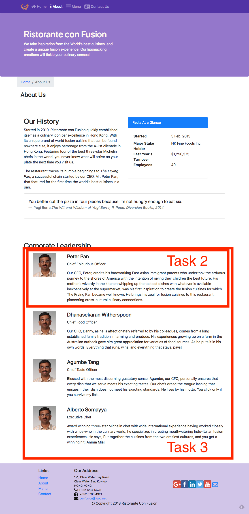{width="4.361805555555556in"
height="9.0in"}

## Review criteria

<b>less </b>

Upon completion of the assignment, your submission will be reviewed
based on the following criteria:

<b>Task 1:</b>

-   The AboutComponent.js file has been downloaded and integrated into
    > our React application.

-   The React application has been appropriately updated to enable
    > navigation to the About Us page of our application.

<b>Task 2:</b>

-   Implemented a new \<RenderLeader\> functional component in your
    > application.

```{=html}
<!-- -->
```
-   Used the reactstrap \<Media\> component to render the details of a
    > leader.

<b>Task 3:</b>

-   Updated the leaders variable within the AboutComponent() function to
    > make use of the \<RenderLeader\> component to render the list of
    > leaders.

## Assignment 2: React Router and Single Page Applications: Additional Resources

### Assignment Resources

<b>AboutComponent</b>

JS File

### Screenshots

{width="4.361805555555556in"
height="9.0in"}

### React Resources

-   [react-router](https://github.com/ReactTraining/react-router)

-   [react-router-dom](https://github.com/ReactTraining/react-router/tree/master/packages/react-router-dom)

-   [React Router
    Documentation](https://reacttraining.com/react-router/)

-   [React Router Dom
    Documentation](https://reacttraining.com/react-router/web/guides/philosophy)

-   [reactstrap \<Media\>
    component](https://reactstrap.github.io/components/media/)

## UI Design and Prototyping: Objectives and Outcomes

Now that you are more clear about your project idea, it\'s time to
conceive how your project is going to look like for the end-users. This
is the time to design the user interface and the flow of your
application. User interface design and prototyping helps you to
conceptualize the look and feel of your application. This can be
achieved in two ways: using wireframe diagrams, or using prototyping
tools. We provide links to wireframing and prototyping tools in the
additional resources. The focus in this lesson is to be able to visually
represent various UI elements to enable designing your application. The
aim is to deliver a reasonable representation of the end-user experience
with your application At the end of this lesson, you should be able to:

-   Construct a wireframe diagram to visually represent the structure of
    your user interface

-   Construct a prototype to enable understanding the flow of your
    application

## UI Design and Prototyping Report Template

### Project Title

### 1. Introduction

-   Give a brief introduction to your project and the list of features.
    Summarize in a few sentences what you proposed in the ideation
    report.

### 2. User Interface Design and Prototype

-   Give some sample user interface layouts for your application. You
    can use either wireframe diagrams or prototyping tools to construct
    the mock representations of your UI design

-   Briefly explain the rationale behind designing your UI and how it is
    geared towards supporting the list of features for your application.

### 3. Navigation Structure

-   Give a brief overview of the navigation structure for your
    application.

-   Briefly indicate a typical flow of your application in terms of user
    experience. You can use any way of representing the flow. You can
    also construct a prototype using one of the prototyping tools to
    illustrate this.

### 4. References

-   Provide any references relevant to the report.

## Honors Peer-graded Assignment: UI Design and Prototyping

<b>Deadline</b>Oct 30, 11:59 PM PDT

<b>Ready for the assignment?</b>

You will find instructions below to submit.

1.  [<b>Instructions</b>](https://www.coursera.org/learn/front-end-react/peer/ivQry/ui-design-and-prototyping)

2.  [<b>My
    > submission</b>](https://www.coursera.org/learn/front-end-react/peer/ivQry/ui-design-and-prototyping/submit)

3.  [<b>Discussions</b>](https://www.coursera.org/learn/front-end-react/peer/ivQry/ui-design-and-prototyping/discussions)

In this assignment you will be submitting a written report that includes
some user interface designs and the flow of your application and the
navigation structure. The report should follow the report template
structure given earlier in this lesson.

## Review criteria

<b>less </b>

Your submission will be reviewed based on the following criteria by
peers in order to provide you with constructive feedback on your project
idea:

1.  Does the report provide a brief overview of the project and the list
    > of features ?

2.  Does the report contain some user interface designs that showcase
    > the realization of the features listed above?

3.  Does the report contain information about the application flow and
    > navigation structure?

4.  Does the report provide references to suitable sources in support of
    > the project?

## UI Design and Prototyping: Additional Resources

### Wireframing, Mockups and UI Design

-   [Wireframe.cc](https://wireframe.cc/)

-   [Moqups.com](https://moqups.com/)

-   [Axure](http://www.axure.com/)

-   [proto.io](https://proto.io/)

-   [framerjs.com](http://framerjs.com/)

-   [The 20 best wireframe
    tools](http://www.creativebloq.com/wireframes/top-wireframing-tools-11121302)

-   [Web Design Inspirations](http://www.webdesign-inspiration.com/)

-   [Adobe Experience
    Design](http://www.adobe.com/products/experience-design.html)

-   [Free Bootstrap Wireframing Set for
    PowerPoint](https://onextrapixel.com/free-bootstrap-wireframing-set-for-powerpoint/)

### UI Templates

-   [Bootstrap Expo](http://expo.getbootstrap.com/)

-   [Ionic Showcase](http://showcase.ionicframework.com/)

### Information Architecture

-   [A visual vocabulary for describing information architecture and
    interaction design](http://www.jjg.net/ia/visvocab/)

-   [The Elements of User Experience](http://www.jjg.net/elements/)

-   [The Elements of User Experience: User-Centered Design for the Web
    and Beyond (2nd Edition) (Voices That
    Matter)](http://www.amazon.com/The-Elements-User-Experience-User-Centered/dp/0321683684/ref=pd_cp_14_1?ie=UTF8&refRID=0RXJWKFHY0TNF5QM2764)

## Controlled Forms: Objectives and Outcomes

In this lesson you will learn about controlled components and how they
can be used to design controlled forms in your React application. At the
end of this exercise you will be able to:

-   Design a controlled form in your React application.

## Controlled Forms

## Exercise (Video): Controlled Forms

## Exercise (Instructions): Controlled Forms

### Objectives and Outcomes

In this exercise you will learn about using controlled components to
design controlled forms in your React application. At the end of this
exercise you will be able to:

-   Design a controlled form in your React application.

### Importing the Necessary Components

-   You will start out by importing the necessary components from
    reactstrap into <i>ContactComponent.js</i> as follows:

```
> . . .
> import React, { Component } from \'react\';
> import { Breadcrumb, BreadcrumbItem,
>             Button, Form, FormGroup, Label, Input, Col } from \'reactstrap\';
>   . . .
```

-   You will then change the <i>ContactComponent</i> to a class-based
    component as follows:

```
> . . .
> class Contact extends Component {
>   render() {
>     . . .
>   }
> }
```

### Creating the Controlled Form

-   Update the <i>ContactComponent.js</i> file as follows to set up the
    Controlled Form:

```
> . . .
>     constructor(props) {
>         super(props);
>         this.state = {
>             firstname: \'\',
>             lastname: \'\',
>             telnum: \'\',
>             email: \'\',
>             agree: false,
>             contactType: \'Tel.\',
>             message: \'\'
>         };
>         this.handleInputChange = this.handleInputChange.bind(this);
>         this.handleSubmit = this.handleSubmit.bind(this);
>     }
>     handleInputChange(event) {
>         const target = event.target;
>         const value = target.type === \'checkbox\' ? target.checked : target.value;
>         const name = target.name;
>         this.setState({
>           \[name\]: value
>         });
>     }
>     handleSubmit(event) {
>         console.log(\'Current State is: \' + JSON.stringify(this.state));
>         alert(\'Current State is: \' + JSON.stringify(this.state));
>         event.preventDefault();
>     }
> . . .
>  
```

-   Then add the controlled form to it as follows:

```
> . . .
>                 \<div className=\"row row-content\"\>
>                    \<div className=\"col-12\"\>
>                       \<h3\>Send us your Feedback\</h3\>
>                    \</div\>
>                     \<div className=\"col-12 col-md-9\"\>
>                         \<Form onSubmit={this.handleSubmit}\>
>                             \<FormGroup row\>
>                                 \<Label htmlFor=\"firstname\" md={2}\>First Name\</Label\>
>                                 \<Col md={10}\>
>                                     \<Input type=\"text\" id=\"firstname\" name=\"firstname\"
>                                         placeholder=\"First Name\"
>                                         value={this.state.firstname}
>                                         onChange={this.handleInputChange} /\>
>                                 \</Col\>
>                             \</FormGroup\>
>                             \<FormGroup row\>
>                                 \<Label htmlFor=\"lastname\" md={2}\>Last Name\</Label\>
>                                 \<Col md={10}\>
>                                     \<Input type=\"text\" id=\"lastname\" name=\"lastname\"
>                                         placeholder=\"Last Name\"
>                                         value={this.state.lastname}
>                                         onChange={this.handleInputChange} /\>
>                                 \</Col\>                        
>                             \</FormGroup\>
>                             \<FormGroup row\>
>                             \<Label htmlFor=\"telnum\" md={2}\>Contact Tel.\</Label\>
>                                 \<Col md={10}\>
>                                     \<Input type=\"tel\" id=\"telnum\" name=\"telnum\"
>                                         placeholder=\"Tel. number\"
>                                         value={this.state.telnum}
>                                         onChange={this.handleInputChange} /\>
>                                 \</Col\>
>                             \</FormGroup\>
>                             \<FormGroup row\>
>                                 \<Label htmlFor=\"email\" md={2}\>Email\</Label\>
>                                 \<Col md={10}\>
>                                     \<Input type=\"email\" id=\"email\" name=\"email\"
>
>                                         placeholder=\"Email\"

-   Save all changes and do a Git commit with the message \"Controlled
    Forms\".

### Conclusions

In this exercise you have learnt to create a controlled form within your
React application.

## Exercise (Video): Controlled Form Validation

## Exercise (Instructions): Controlled Form Validation

### Objectives and Outcomes

In this exercise you will be introduced to simple form validation for
controlled forms in React. At the end of this exercise you will be able
to:

-   Configure and perform simple form validation for your controlled
    forms

### Simple Form Validation

-   Open <i>ContactComponent.js</i> and update it as follows to introduce the
    support to track form errors and perform validation:

> . . .
>
> import { Breadcrumb, BreadcrumbItem, Button, Form, FormGroup, Label, Input, Col, Row, FormFeedback } from \'reactstrap\';
>
> . . .
>
>  
>
> class Contact extends Component {
>
>  
>
>     constructor(props) {
>
>         super(props);
>
>  
>
>         this.state = {
>
>             firstname: \'\',
>
>             lastname: \'\',
>
>             telnum: \'\',
>
>             email: \'\',
>
>             agree: false,
>
>             contactType: \'Tel.\',
>
>             message: \'\',
>
>             touched: {
>
>                 firstname: false,
>
>                 lastname: false,
>
>                 telnum: false,
>
>                 email: false
>
>             }
>
>         }
>
>         this.handleSubmit = this.handleSubmit.bind(this);
>
>         this.handleInputChange = this.handleInputChange.bind(this);
>
>         this.handleBlur = this.handleBlur.bind(this);
>
>     }
>
>     
>
>     . . .
>
>     
>
>     handleBlur = (field) =\> (evt) =\> {
>
>         this.setState({
>
>             touched: { \...this.state.touched, \[field\]: true }
>
>         });
>
>     }
>
>  
>
>     validate(firstname, lastname, telnum, email) {
>
>         const errors = {
>
>             firstname: \'\',

-   Now that we have introduced some functions that can be used for form
    validation, let us update the form itself to make use of these as
    follows:

> . . .
>
>  
>
>                             \<FormGroup row\>
>
>                                 \<Label htmlFor=\"firstname\" md={2}\>First Name\</Label\>
>
>                                 \<Col md={10}\>
>
>                                     \<Input type=\"text\" id=\"firstname\" name=\"firstname\"
>
>                                         placeholder=\"First Name\"
>
>                                         value={this.state.firstname}
>
>                                         valid={errors.firstname === \'\'}
>
>                                         invalid={errors.firstname !== \'\'}
>
>                                         onBlur={this.handleBlur(\'firstname\')}
>
>                                         onChange={this.handleInputChange} /\>
>
>                                     \<FormFeedback\>{errors.firstname}\</FormFeedback\>
>
>                                 \</Col\>
>
>                             \</FormGroup\>
>
>                             \<FormGroup row\>
>
>                                 \<Label htmlFor=\"lastname\" md={2}\>Last Name\</Label\>
>
>                                 \<Col md={10}\>
>
>                                     \<Input type=\"text\" id=\"lastname\" name=\"lastname\"
>
>                                         placeholder=\"Last Name\"
>
>                                         value={this.state.lastname}
>
>                                         valid={errors.lastname === \'\'}
>
>                                         invalid={errors.lastname !== \'\'}
>
>                                         onBlur={this.handleBlur(\'lastname\')}
>
>                                         onChange={this.handleInputChange} /\>
>
>                                     \<FormFeedback\>{errors.lastname}\</FormFeedback\>
>
>                                 \</Col\>
>
>                             \</FormGroup\>
>
>                             \<FormGroup row\>
>
>                                 \<Label htmlFor=\"telnum\" md={2}\>Contact Tel.\</Label\>
>
>                                 \<Col md={10}\>
>
>                                     \<Input type=\"tel\" id=\"telnum\" name=\"telnum\"
>
>                                         placeholder=\"Tel. Number\"
>
>                                         value={this.state.telnum}
>
>                                         valid={errors.telnum === \'\'}
>
>                                         invalid={errors.telnum !== \'\'}
>
>                                         onBlur={this.handleBlur(\'telnum\')}
>
>                                         onChange={this.handleInputChange} /\>
>
>                                     \<FormFeedback\>{errors.telnum}\</FormFeedback\>
>
>                                 \</Col\>

-   You can now test your form by typing in invalid input and check how
    the form validation works.

-   Save all the changes and do a Git commit with the message
    \"Controlled Form Validation\"

### Conclusions

In this exercise you have learnt about doing simple form validation for
controlled forms in React.

## Controlled Forms: Additional Resources

### PDFs of Presentations

<b>1-Controlled-Components-Forms.pdf</b>

PDF File

### React Resources

-   [Controlled Components](https://reactjs.org/docs/forms.html)

-   [reactstrap Form](https://reactstrap.github.io/components/form/)

### Other Resources

-   [Controlled / Uncontrolled React
    Components](https://www.viget.com/articles/controlling-components-react/)

-   [Controlled and Uncontrolled Input Values in
    React](https://medium.com/@peter.yun.kim/controlled-and-uncontrolled-input-values-in-react-907119cc98d4)

-   [Controlled and uncontrolled form inputs in React don\'t have to be
    complicated](https://goshakkk.name/controlled-vs-uncontrolled-inputs-react/)

-   [How to Work with Forms, Inputs and Events in
    React](https://medium.com/capital-one-developers/how-to-work-with-forms-inputs-and-events-in-react-c337171b923b)

-   [Some Thoughts On Forms in
    React](https://medium.com/javascript-inside/some-thoughts-on-forms-in-react-9ca2d9078c20)

-   [Instant form field validation with React\'s controlled
    inputs](https://goshakkk.name/instant-form-fields-validation-react/)

## Module 8: Uncontrolled Forms: Objectives and Outcomes

Forms in React can be approached in two ways, either through
uncontrolled components, or controlled components. In this lesson we
will deal with uncontrolled forms. At the end of this lesson you will be
able to:

-   Create uncontrolled forms through uncontrolled components in React

-   Handle the form submission in the React application

## Uncontrolled Components

## Exercise (Video): Uncontrolled Forms

## Exercise (Instructions): Uncontrolled Forms

In this exercise we will create an uncontrolled form within our React
application using the uncontrolled component approach. At the end of
this exercise you will be able to:

-   Create uncontrolled forms through uncontrolled components in React

-   Handle the form submission in the React application

### Adding a Modal to Host the Form

-   Update <i>HeaderComponent.js</i> as follows to add a new Modal to the
    application to host the form:

> . . .
>
>  
>
> import { Navbar, NavbarBrand, Nav, NavbarToggler, Collapse, NavItem, Jumbotron,
>
>     Button, Modal, ModalHeader, ModalBody,
>
>     Form, FormGroup, Input, Label } from \'reactstrap\';
>
>             
>
> . . .
>
>  
>
>         this.state = {
>
>             isNavOpen: false,
>
>             isModalOpen: false
>
>         };
>
>         
>
> . . .
>
>  
>
>         this.toggleModal = this.toggleModal.bind(this);
>
>  
>
> . . .
>
>  
>
>  
>
>       toggleModal() {
>
>         this.setState({
>
>           isModalOpen: !this.state.isModalOpen
>
>         });
>
>       }
>
>       
>
> . . .
>
>  
>
>                 \<Modal isOpen={this.state.isModalOpen} toggle={this.toggleModal}\>
>
>                     \<ModalHeader toggle={this.toggleModal}\>Login\</ModalHeader\>
>
>                     \<ModalBody\>
>
>                     
>
>                     \</ModalBody\>
>
>                 \</Modal\>
>
>                 
>
> . . .

-   Then, add a button to the Navbar to enable toggling the modal:

> . . .
>
>  
>
>                             \<Nav className=\"ml-auto\" navbar\>
>
>                                 \<NavItem\>
>
>                                     \<Button outline onClick={this.toggleModal}\>\<span className=\"fa fa-sign-in fa-lg\"\>\</span\> Login\</Button\>
>
>                                 \</NavItem\>
>
>                             \</Nav\>
>
>                             
>
> . . .

### Adding the Uncontrolled Form

-   Add the form to the modal body as shown below:

. . .

>  
>
>                         \<Form onSubmit={this.handleLogin}\>
>
>                             \<FormGroup\>
>
>                                 \<Label htmlFor=\"username\"\>Username\</Label\>
>
>                                 \<Input type=\"text\" id=\"username\" name=\"username\"
>
>                                     innerRef={(input) =\> this.username = input} /\>
>
>                             \</FormGroup\>
>
>                             \<FormGroup\>
>
>                                 \<Label htmlFor=\"password\"\>Password\</Label\>
>
>                                 \<Input type=\"password\" id=\"password\" name=\"password\"
>
>                                     innerRef={(input) =\> this.password = input}  /\>
>
>                             \</FormGroup\>
>
>                             \<FormGroup check\>
>
>                                 \<Label check\>
>
>                                     \<Input type=\"checkbox\" name=\"remember\"
>
>                                     innerRef={(input) =\> this.remember = input}  /\>
>
>                                     Remember me
>
>                                 \</Label\>
>
>                             \</FormGroup\>
>
>                             \<Button type=\"submit\" value=\"submit\" color=\"primary\"\>Login\</Button\>
>
>                         \</Form\>
>
>                         
>
> . . .

-   Then, add the following function to the class to handle the form
    submission:

> . . .
>
>  
>
>         this.handleLogin = this.handleLogin.bind(this);
>
> . . .
>
>  
>
>     handleLogin(event) {
>
>         this.toggleModal();
>
>         alert(\"Username: \" + this.username.value + \" Password: \" + this.password.value
>
>             + \" Remember: \" + this.remember.checked);
>
>         event.preventDefault();
>
>  
>
>     }
>
>       
>
> . . .

-   Save all the changes and do a Git commit with the message
    \"Uncontrolled Form\"

### Conclusions

In this exercise we learnt to use an uncontrolled component approach to
add a form to our React application.

## Uncontrolled Forms: Additional Resources

### PDFs of Presentations

<b>2-Uncontrolled-Components-Forms.pdf</b>

PDF File

### React Resources

-   [Uncontrolled
    Components](https://reactjs.org/docs/uncontrolled-components.html)

-   [reactstrap Form](https://reactstrap.github.io/components/form/)

-   [reactstrap Modal
    Component](https://reactstrap.github.io/components/modals/)

### Other Resources

-   [Controlled / Uncontrolled React
    Components](https://www.viget.com/articles/controlling-components-react/)

-   [Controlled and Uncontrolled Input Values in
    React](https://medium.com/@peter.yun.kim/controlled-and-uncontrolled-input-values-in-react-907119cc98d4)

-   [Controlled and uncontrolled form inputs in React don\'t have to be
    complicated](https://goshakkk.name/controlled-vs-uncontrolled-inputs-react/)

-   [How to Work with Forms, Inputs and Events in
    React](https://medium.com/capital-one-developers/how-to-work-with-forms-inputs-and-events-in-react-c337171b923b)

-   [Some Thoughts On Forms in
    React](https://medium.com/javascript-inside/some-thoughts-on-forms-in-react-9ca2d9078c20)

## Introduction to Redux: Objectives and Outcomes

In this lesson you will learn about the Flux architecture as a way of
structuring your React application. You will also be introduced to
Redux, a realization of the flux architecture. At the end of this lesson
you will be able to:

-   Install and Configure Redux in your application

-   Enable your React app to make use of Redux

## Module 9: The Model-View-Controller Framework

## Module 10: The Flux Architecture

## Module xx: Introduction to Redux

## Chapter 1: Exercise (Video): Introduction to Redux

## Chapter 2: Exercise (Instructions): Introduction to Redux

### Objectives and Outcomes

In this exercise you will learn to use Redux. You will install and
configure Redux and use it within your React application. At the end of
this exercise you will be able to:

-   Install and configure Redux within your application

-   Configure your React application to make use of Redux

### Installing and Configuring Redux

-   As a first step you will install Redux and React-Redux into your
    application as follows:

> yarn add redux@3.7.2
>
> yarn add react-redux@5.0.7

-   Next, create a folder named <i>redux</i> in the <i>src</i> folder and then add
    a file named <i>reducer.js</i> with the code below:

> import { DISHES } from \'../shared/dishes\';
>
> import { COMMENTS } from \'../shared/comments\';
>
> import { PROMOTIONS } from \'../shared/promotions\';
>
> import { LEADERS } from \'../shared/leaders\';
>
>  
>
> export const initialState = {
>
>     dishes: DISHES,
>
>     comments: COMMENTS,
>
>     promotions: PROMOTIONS,
>
>     leaders: LEADERS
>
> };
>
>  
>
> export const Reducer = (state = initialState, action) =\> {
>
>     return state;
>
> };

-   Then, add a file named <i>configureStore.js</i> in the <i>redux</i> folder and
    add the following code to it:

> import {createStore} from \'redux\';
>
> import { Reducer, initialState } from \'./reducer\'
>
>  
>
> export const ConfigureStore = () =\> {
>
>     const store = createStore(
>
>         Reducer, // reducer
>
>         initialState, // our initialState
>
>     );
>
>  
>
>     return store;
>
> }

-   Next, open <i>App.js</i> and update it as follows:

> . . .
>
>  
>
>  
>
> import { Provider } from \'react-redux\';
>
> import { ConfigureStore } from \'./redux/configureStore\';
>
>  
>
> const store = ConfigureStore();
>
>  
>
>  
>
> . . .
>
>  
>
>       \<Provider store={store}\>
>
>         \<BrowserRouter\>
>
>           \<div className=\"App\"\>
>
>             \<Main /\>
>
>           \</div\>
>
>         \</BrowserRouter\>
>
>       \</Provider\>
>
>  
>
> . . .

-   Finally, update MainComponent.js to connect it to Redux store and
    use it:

> . . .
>
>  
>
> import { Switch, Route, Redirect, withRouter } from \'react-router-dom\'
>
> import { connect } from \'react-redux\';
>
>  
>
>  
>
> const mapStateToProps = state =\> {
>
>   return {
>
>     dishes: state.dishes,
>
>     comments: state.comments,
>
>     promotions: state.promotions,
>
>     leaders: state.leaders
>
>   }
>
> }
>
>  
>
> . . .
>
>  
>
>     const HomePage = () =\> {
>
>       return(
>
>           \<Home 
>
>               dish={this.props.dishes.filter((dish) =\> dish.featured)\[0\]}
>
>               promotion={this.props.promotions.filter((promo) =\> promo.featured)\[0\]}
>
>               leader={this.props.leaders.filter((leader) =\> leader.featured)\[0\]}
>
>           /\>
>
>       );
>
>     }
>
>  
>
>     const DishWithId = ({match}) =\> {
>
>       return(
>
>           \<DishDetail dish={this.props.dishes.filter((dish) =\> dish.id === parseInt(match.params.dishId,10))\[0\]} 
>
>             comments={this.props.comments.filter((comment) =\> comment.dishId === parseInt(match.params.dishId,10))} /\>
>
>       );
>
>     };
>
>  
>
>     return (
>
>       \<div\>
>
>         \<Header /\>
>
>         \<div\>
>
>           \<Switch\>
>
>               \<Route path=\'/home\' component={HomePage} /\>

-   Save all the changes and do a Git commit with the message \"Intro.
    to Redux\".

### Conclusions

In this exercise you learnt to install and configure Redux and use it in
your React application.

## Introduction to Redux: Additional Resources

### PDFs of Presentations

<b>3-MVC.pdf</b>

PDF File

<b>4-Flux-Arch.pdf</b>

PDF File

<b>5-Intro-Redux.pdf</b>

PDF File

### React Resources

-   [Redux](https://redux.js.org/)

-   [Redux on Github](https://github.com/reactjs/redux)

-   [React and Redux](https://redux.js.org/basics/usage-with-react)

-   [Redux Basics Documentation](https://redux.js.org/basics)

```{=html}
<!-- -->
```
-   [The Flux Architecture](https://facebook.github.io/flux/)

### Other Resources

-   [Redux
    Tutorials](https://github.com/markerikson/react-redux-links/blob/master/redux-tutorials.md)

-   [Flux Architecture In Depth
    Overview](https://facebook.github.io/flux/docs/in-depth-overview.html#content)

## Module xx: React Redux Form: Objectives and Outcomes

In this lesson we will learn to create forms using react-redux-form that
enables us to store form information in the Redux store, and brings
additional benefits. At the end of this lesson you will be able to:

-   Configure and use react-redux-form to create Controlled forms

-   Store the form state in the Redux store

## Chapter 1. React Redux Forms

## Chapter 2. Exercise (Video): React Redux Form

## Chapter 3. Exercise (Instructions): React Redux Form

### Objectives and Outcomes

In this exercise you will install react-redux-form and then convert the
controlled form that we created earlier into a form supported by
react-redux-form. At the end of this exercise you will be able to:

-   Install and configure react-redux-form

-   Implement a controlled form using react-redux-form

### Installing and Using react-redux-form

-   We first install the <i>react-redux-form</i> into our project as follows:

> yarn add <react-redux-form@1.16.8>

-   Then open <i>ContactComponent.js</i> and update the Feedback Form to use
    react-redux-form:

> . . .
>
>  
>
> import { Breadcrumb, BreadcrumbItem,
>
>             Button, Row, Col, Label } from \'reactstrap\';
>
> import { Control, LocalForm, Errors } from \'react-redux-form\';
>
>  
>
> . . .
>
>  
>
>  
>
>     handleSubmit(values) {
>
>         console.log(\'Current State is: \' + JSON.stringify(values));
>
>         alert(\'Current State is: \' + JSON.stringify(values));
>
>         // event.preventDefault();
>
>     }
>
>     
>
> . . .
>
>  
>
>                         \<LocalForm onSubmit={(values) =\> this.handleSubmit(values)}\>
>
>                             \<Row className=\"form-group\"\>
>
>                                 \<Label htmlFor=\"firstname\" md={2}\>First Name\</Label\>
>
>                                 \<Col md={10}\>
>
>                                     \<Control.text model=\".firstname\" id=\"firstname\" name=\"firstname\"
>
>                                         placeholder=\"First Name\"
>
>                                         className=\"form-control\"
>
>                                          /\>
>
>                                 \</Col\>
>
>                             \</Row\>
>
>                             \<Row className=\"form-group\"\>
>
>                                 \<Label htmlFor=\"lastname\" md={2}\>Last Name\</Label\>
>
>                                 \<Col md={10}\>
>
>                                     \<Control.text model=\".lastname\" id=\"lastname\" name=\"lastname\"
>
>                                         placeholder=\"Last Name\"
>
>                                         className=\"form-control\"
>
>                                          /\>
>
>                                 \</Col\>
>
>                             \</Row\>
>
>                             \<Row className=\"form-group\"\>
>
>                                 \<Label htmlFor=\"telnum\" md={2}\>Contact Tel.\</Label\>
>
>                                 \<Col md={10}\>
>
>                                     \<Control.text model=\".telnum\" id=\"telnum\" name=\"telnum\"

-   Save all the changes and do a Git commit with the message \"React
    Redux Form\".

### Conclusions

In this exercise we installed and used the react-redux-form to design a
controlled form.

## Module xx: Exercise (Video): React Redux Form Validation

## Chapter 2: Exercise (Instructions): React Redux Form Validation

### Objectives and Outcomes

In this exercise we will explore simple form validation for
react-redux-form. At the end of this exercise you will be able to:

-   Configure and implement simple form validation for controlled forms
    designed using react-redux-form.

### Implementing Simple Form Validation

-   Open <i>ContactComponent.js</i> and update it as follows to implement
    form validation:

> . . . 
>
>  
>
>  
>
> const required = (val) =\> val && val.length;
>
> const maxLength = (len) =\> (val) =\> !(val) \|\| (val.length \<= len);
>
> const minLength = (len) =\> (val) =\> val && (val.length \>= len);
>
> const isNumber = (val) =\> !isNaN(Number(val));
>
> const validEmail = (val) =\> /\^\[A-Z0-9.\_%+-\]+@\[A-Z0-9.-\]+\\.\[A-Z\]{2,4}\$/i.test(val);
>
>  
>
> . . .
>
>  
>
>                             \<Row className=\"form-group\"\>
>
>                                 \<Label htmlFor=\"firstname\" md={2}\>First Name\</Label\>
>
>                                 \<Col md={10}\>
>
>                                     \<Control.text model=\".firstname\" id=\"firstname\" name=\"firstname\"
>
>                                         placeholder=\"First Name\"
>
>                                         className=\"form-control\"
>
>                                         validators={{
>
>                                             required, minLength: minLength(3), maxLength: maxLength(15)
>
>                                         }}
>
>                                          /\>
>
>                                     \<Errors
>
>                                         className=\"text-danger\"
>
>                                         model=\".firstname\"
>
>                                         show=\"touched\"
>
>                                         messages={{
>
>                                             required: \'Required\',
>
>                                             minLength: \'Must be greater than 2 characters\',
>
>                                             maxLength: \'Must be 15 characters or less\'
>
>                                         }}
>
>                                      /\>
>
>                                 \</Col\>
>
>                             \</Row\>
>
>                             \<Row className=\"form-group\"\>
>
>                                 \<Label htmlFor=\"lastname\" md={2}\>Last Name\</Label\>
>
>                                 \<Col md={10}\>
>
>                                     \<Control.text model=\".lastname\" id=\"lastname\" name=\"lastname\"
>
>                                         placeholder=\"Last Name\"
>
>                                         className=\"form-control\"
>
>                                         validators={{

-   Save all the changes and do a Git commit with the message \"React
    Redux Form Validation\"

### Conclusions

In this exercise you learnt about implementing simple form validation
using react-redux-form.

## Chapter 2: React Redux Form: Additional Resources

### PDFs of Presentations

<b>6-React-Redux-Form.pdf</b>

PDF File

### React Resources

-   [React Redux Form
    Documentation](https://davidkpiano.github.io/react-redux-form/docs.html)

### Other Resources

-   [The boring React Redux
    forms](https://medium.com/@steida/the-boring-react-redux-forms-a15ee8a6b52b)

-   [How to populate react-redux-form with dynamic default
    values](https://swizec.com/blog/populate-react-redux-form-dynamic-default-values/swizec/8158)

-   [Should you store your form state in
    Redux?](https://goshakkk.name/should-i-put-form-state-into-redux/)

## Assignment 3: React Forms and Redux

## Peer-graded Assignment: React Forms and Redux

<b>Deadline</b>Nov 6, 11:59 PM PST

<b>Ready for the assignment?</b>

You will find instructions below to submit.

In this assignment you will be updating the React application with a
react-redux-form based local form and do the form validation in code.

## Step-By-Step Assignment Instructions

<b>less </b>

<b>Assignment Overview</b>

In this assignment you will update the D<i>ishdetailComponent.js</i> to
include a form and do the form validation in code. At the end of this
assignment, you should have completed the following tasks to update the
page:

-   Added a new class component named CommentForm to
    > <i>DishdetailComponent.js</i>.

-   Provide a form to enable users to submit their comments

-   Validate the information entered by the users in the form

<b>Assignment Requirements</b>

<b>Task 1</b>

In this task you will add a new class component named CommentForm. You
need to complete the following:

-   Add a new class component named CommentForm that will add a button
    > to the view as shown in the image below.

-   When the button is clicked, it toggles a modal that will display the
    > comment form.

-   The CommentForm component is used by the RenderComments function to
    > display the button for toggling the modal.

<b>Task 2</b>

In this task you will construct the form for users to submit their
comments as shown in the image below. You need to complete the
following:

-   Set up the form as a local form using the react-redux-form with the
    > three fields: author, rating and comment.

-   The rating field in the comment form is implemented using a select,
    > the author is implemented using a text field, while the comment
    > uses a textarea with six rows.

<b>Task 3</b>

In this task, you will enable form validation as shown in the images
below. You need to complete the following:

-   The author field should at least be three characters long.

-   The author field should be less than or equal to 15 characters.

-   The user should be alerted by showing the invalid message displayed
    > at the bottom of the field.

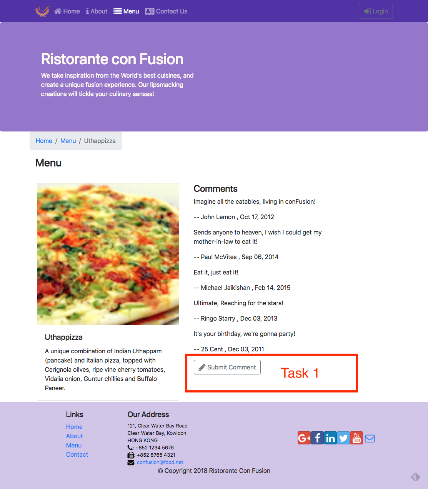{width="6.5in"
height="7.429861111111111in"}

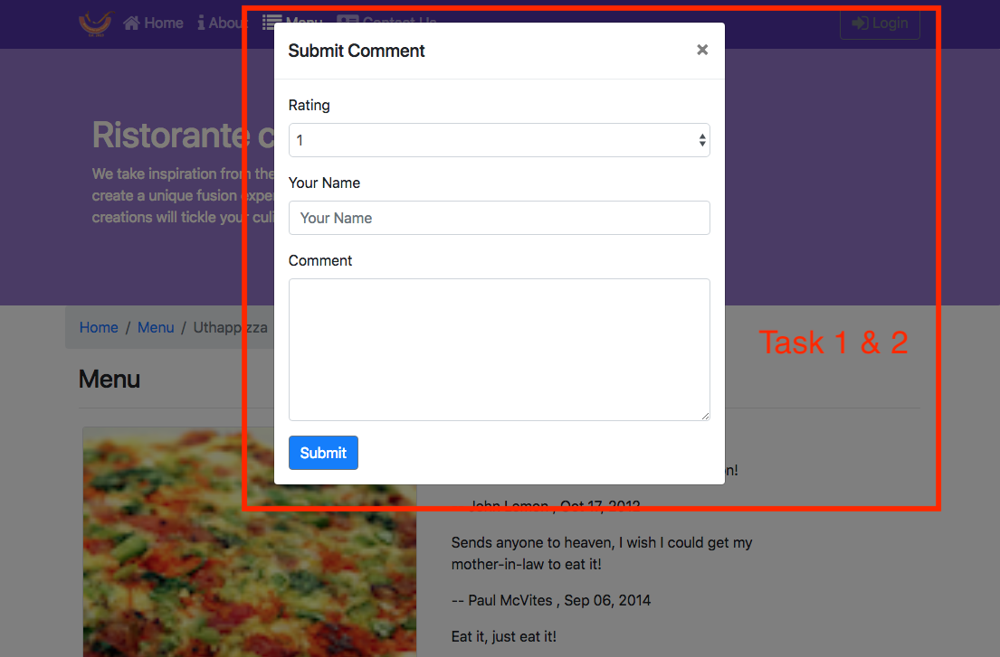{width="6.5in"
height="4.278472222222222in"}

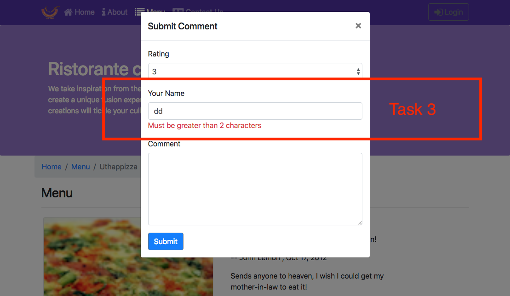{width="6.5in"
height="3.779861111111111in"}

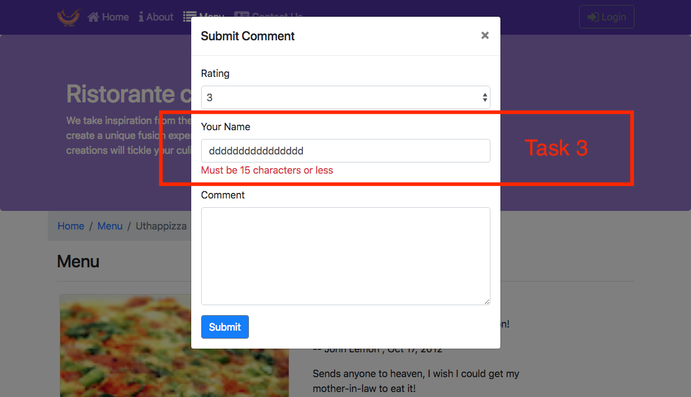{width="6.5in"
height="3.7381944444444444in"}

## Review criteria

<b>less </b>

Upon completion of the assignment, your submission will be reviewed
based on the following criteria:

<b>Task 1:</b>

-   A CommentForm component is implemented that adds a button to the
    > view, which when clicked will toggle a modal containing the form.

<b>Task 2:</b>

-   The form is set up with the three fields correctly.

-   A select is included in the form to enable users to submit the
    > rating, a text field for author and a text area for the comment.

<b>Task 3:</b>

-   The author field is being properly validated. If incorrect, the user
    > is alerted.

## Assignment 3: React Forms and Redux: Additional Resources

### Assignment Screenshots

{width="6.5in"
height="7.429861111111111in"}{width="6.5in"
height="4.278472222222222in"}{width="6.5in"
height="3.779861111111111in"}{width="6.5in"
height="3.7381944444444444in"}

### React Resources

-   [reactstrap Modal
    Component](https://reactstrap.github.io/components/modals/)

```{=html}
<!-- -->
```
-   [React Redux Form
    Documentation](https://davidkpiano.github.io/react-redux-form/docs.html)

## Redux Actions: Objectives and Outcomes

In this lesson we will look at how to create redux actions and how
action creators can be designed to return the action objects. Thereafter
we look at how to dispatch actions. We also look at how to split the
reducer into simpler functions and combine them. At the end of this
exercise, you will be able to:

-   Define Redux actions

-   Create action creator functions that return action objects

-   Split the reducer function into multiple simpler functions and
    combine the reducer functions

## Module xx: Redux Actions

## Module xx: Exercise (Video): Combining Reducers

## Exercise (Instructions): Combining Reducers

### Objectives and Outcomes

In this exercise you will learn about how we can have separate reducers
managing parts of the state, and how they can be combined together to
manage the whole state. At the end of this exercise you will be able to:

-   Implement reducers that are responsible for only part of the state

-   Combine the reducers to manage the entire state

### Splitting the Reducer

-   In the redux folder, create a new file named dishes.js and add the
    following to it:

```
> import { DISHES } from \'../shared/dishes\';
>
> export const Dishes = (state = DISHES, action) =\> {
>     switch (action.type) {
>         default:
>           return state;
>       }
> };
```

-   Then, create a file named comments.js and add the following to it:

```
> import { COMMENTS } from \'../shared/comments\';
>
>  
>
> export const Comments = (state = COMMENTS, action) =\> {
>
>     switch (action.type) {
>
>  
>
>         default:
>
>           return state;
>
>       }
>
> };
```

-   Similarly, create a new file named promotions.js and add the
    following to it:

```
> import { PROMOTIONS } from \'../shared/promotions\';
>
>  
>
> export const Promotions = (state = PROMOTIONS, action) =\> {
>
>     switch (action.type) {
>
>         default:
>
>           return state;
>
>       }
>
> };
```

-   And finally, create a new file named leaders.js and add the
    following to it:

```
> import { LEADERS } from \'../shared/leaders\';
>
> export const Leaders = (state = LEADERS, action) =\> {
>     switch (action.type) {
>         default:
>           return state;
>       }
> };
```

-   Now that we have split the management of state into different
    reducers that manage partial state, we need to combine them
    together. Open configureStore.js and update it as follows:

```
> import {createStore, combineReducers} from \'redux\';
> import { Dishes } from \'./dishes\';
> import { Comments } from \'./comments\';
> import { Promotions } from \'./promotions\';
> import { Leaders } from \'./leaders\';
>
> export const ConfigureStore = () =\> {
>     const store = createStore(
>         combineReducers({
>             dishes: Dishes,
>             comments: Comments,
>             promotions: Promotions,
>             leaders: Leaders
>         })
>     );
>  
>     return store;
> }
```

-   Now we can safely delete the reducer.js file from the project.

-   Save all the changes and do a Git commit with the message
    \"Combining Reducers\".

### Conclusions

In this exercise we have learnt to split the reducer into multiple
reducers that manage partial state, and then combine them together.

## Module xx: Exercise (Video): Redux Actions

## Exercise (Instructions): Redux Actions

### Objectives and Outcomes

In this exercise we will learn to define various Redux actions and
implement the action creators to dispatch the actions to the Redux
store. At the end of this exercise you will be able to:

-   Define Redux actions and implement the action creators

-   Dispatch actions from the action creators to update the system state
    in the Redux store

### Creating Actions

-   In the <i>redux</i> folder create a new file named <i>ActionTypes.js</i> and
    add the following to it:

```
> export const ADD_COMMENT = \'ADD_COMMENT\';
```

-   Then, create a file named <i>ActionCreators.js</i> and add the following
    to it:

```
> import \<i> as ActionTypes from \'./ActionTypes\';
>
>  
>
> export const addComment = (dishId, rating, author, comment) =\> ({
>
>     type: ActionTypes.ADD_COMMENT,
>
>     payload: {
>
>         dishId: dishId,
>
>         rating: rating,
>         author: author,
>         comment: comment
>     }
> });
```

-   Next, update <i>comments.js</i> to initiate action when the action is
    dispatched by the ActionCreator as follows:

```
> import { COMMENTS } from \'../shared/comments\';
>
> import \</i> as ActionTypes from \'./ActionTypes\';
>
> export const Comments = (state = COMMENTS, action) =\> {
>     switch (action.type) {
>         case ActionTypes.ADD_COMMENT:
>             var comment = action.payload;
>             comment.id = state.length;
>             comment.date = new Date().toISOString();
>             console.log(\"Comment: \", comment);
>             return state.concat(comment);
>         default:
>           return state;
>       }
> };
```

-   Now update <i>MainComponent.js</i> to make the action available for use
    within the DishdetailComponent as follows:

```
> . . .
>
>  
> import { addComment } from \'../redux/ActionCreators\';
>
> . . .
>
>   const mapDispatchToProps = dispatch =\> ({
>
>     addComment: (dishId, rating, author, comment) =\> dispatch(addComment(dishId, rating, author, comment))
>
>   });
>
> . . .
>
>       \<DishDetail dish={this.props.dishes.filter((dish) =\> dish.id === parseInt(match.params.dishId,10))\[0\]}
>         comments={this.props.comments.filter((comment) =\> comment.dishId === parseInt(match.params.dishId,10))}
>         addComment={this.props.addComment}
>       /\>
>
> . . .
>
> export default withRouter(connect(mapStateToProps, mapDispatchToProps)(Main));
```

-   Finally, update <i>DishdetailComponent.js</i> as follows to initiate the
    action upon the user submitting the comment form:

```
> . . .
>
>  
>
>   function RenderComments({comments, addComment, dishId}) {
>
>  
>
>  
>
>  
>
> . . .
>
>  
>
>       \<CommentForm dishId={dishId} addComment={addComment} /\>
>
>  
>
>  
>
> . . .
>
>  
>
>         this.props.addComment(this.props.dishId, values.rating, values.author, values.comment);
>
>  
>
>  
>
>  
>
> . . .
>
>  
>
>       \<RenderComments comments={props.comments}
>
>         addComment={props.addComment}
>
>         dishId={props.dish.id}
>
>       /\>
>
>  
>
> . . .
```

-   Save all the changes and do a Git commit with the message \"Redux
    Actions\"

### Conclusions

In this exercise we have learnt to create and dispatch actions to update
the system state in the Redux store.

## Redux Actions: Additional Resources

### PDFs of Presentations

### Redux Resources

-   [Redux Actions](https://redux.js.org/basics/actions)

-   [Redux Reducers](https://redux.js.org/basics/reducers)

-   [Redux Usage with
    React](https://redux.js.org/basics/usage-with-react)

## Module xx: Redux Thunk: Objectives and Outcomes

Redux Thunk
[middleware](https://github.com/reactjs/redux/blob/master/docs/advanced/Middleware.md)
allows you to write action creators that return a function instead of an
action. In this lesson you will see the use of redux thunk to return a
function. At the end of this lesson you will be able to:

-   Use Redux Thunk middleware to return a function instead of an action

-   Use a logger middleware to print a log of actions initiated on the
    Redux store.

## Redux Thunk

## Exercise (Video): Redux Thunk

Notes

## Exercise (Instructions): Redux Thunk

### Objectives and Outcomes

Redux Thunk
[middleware](https://github.com/reactjs/redux/blob/master/docs/advanced/Middleware.md)
allows you to write action creators that return a function instead of an
action. In this exercise you will see the use of redux thunk to return a
function. At the end of this exercise you will be able to:

-   Use Redux Thunk middleware to return a function instead of an action

-   Use a logger to print a log of actions initiated on the Redux store.

### Installing Redux Thunk and Logger

-   Install Redux Thunk and Logger as shown below:

```
> yarn add redux-thunk@2.2.0
>
> yarn add redux-logger@3.0.6
```

-   Then open <i>configureStore.js</i> and update it to use the Thunk and
    Logger as follows:

```
> import {createStore, combineReducers, applyMiddleware } from \'redux\';
>
> . . .
>
> import thunk from \'redux-thunk\';
> import logger from \'redux-logger\';
>
> . . .
>         combineReducers({
>             dishes: Dishes,
>             comments: Comments,
>             promotions: Promotions,
>             leaders: Leaders
>         }),
>         applyMiddleware(thunk, logger)
>
> . . .
```

-   Next, open <i>ActionTypes.js</i> and add new action types as follows:

```
. . .

export const DISHES_LOADING = \'DISHES_LOADING\';
export const DISHES_FAILED = \'DISHES_FAILED\';
export const ADD_DISHES = \'ADD_DISHES\';
```

-   Then open ActionCreators.js and add new actions:

```
> . . .
>
>  
>
> import { DISHES } from \'../shared/dishes\';
>
>  
>
> . . .
>
>  
>
>  
>
> export const fetchDishes = () =\> (dispatch) =\> {
>
>  
>
>     dispatch(dishesLoading(true));
>
>  
>
>     setTimeout(() =\> {
>
>         dispatch(addDishes(DISHES));
>
>     }, 2000);
>
> }
>
>  
>
> export const dishesLoading = () =\> ({
>
>     type: ActionTypes.DISHES_LOADING
>
> });
>
>  
>
> export const dishesFailed = (errmess) =\> ({
>
>     type: ActionTypes.DISHES_FAILED,
>
>     payload: errmess
>
> });
>
>  
>
> export const addDishes = (dishes) =\> ({
>
>     type: ActionTypes.ADD_DISHES,
>
>     payload: dishes
>
> });
```

-   Next, open dishes.js and add the code to respond to actions as
    follows:

```
> import \</i> as ActionTypes from \'./ActionTypes\';
>
>  
>
> export const Dishes = (state = { isLoading: true,
>
>     errMess: null,
>
>     dishes:\[\]}, action) =\> {
>
>     switch (action.type) {
>
>         case ActionTypes.ADD_DISHES:
>
>             return {\...state, isLoading: false, errMess: null, dishes: action.payload};
>
>  
>
>         case ActionTypes.DISHES_LOADING:
>
>             return {\...state, isLoading: true, errMess: null, dishes: \[\]}
>
>  
>
>         case ActionTypes.DISHES_FAILED:
>
>             return {\...state, isLoading: false, errMess: action.payload};
>
>  
>
>         default:
>
>             return state;
>
>     }
>
> };
```

-   Add a new component named <i>LoadingComponent.js</i> to display a loading
    message as follows:

```
> import React from \'react\';
>
>  
>
> export const Loading = () =\> {
>
>     return(
>
>         \<div className=\"col-12\"\>
>
>             \<span className=\"fa fa-spinner fa-pulse fa-3x fa-fw text-primary\"\>\</span\>
>
>             \<p\>Loading . . .\</p\>
>
>         \</div\>
>
>     );
>
> };
```

-   Now we will update the remaining components to use the actions.
    First, open <i>MainComponent.js</i> and update it as follows:

```
> . . .
> import { addComment, fetchDishes } from \'../redux/ActionCreators\';
> . . .
>   fetchDishes: () =\> { dispatch(fetchDishes())}
> . . .
>   componentDidMount() {
>     this.props.fetchDishes();
>   }
> . . .
>     const HomePage = () =\> {
>       return(
>           \<Home 
>               dish={this.props.dishes.dishes.filter((dish) =\> dish.featured)\[0\]}
>               dishesLoading={this.props.dishes.isLoading}
>               dishesErrMess={this.props.dishes.errMess}
>               promotion={this.props.promotions.filter((promo) =\> promo.featured)\[0\]}
>               leader={this.props.leaders.filter((leader) =\> leader.featured)\[0\]}
>           /\>
>       );
>     }
>     const DishWithId = ({match}) =\> {
>       return(
>\<DishDetail dish={this.props.dishes.dishes.filter((dish) =\> dish.id === parseInt(match.params.dishId,10))\[0\]}
>
>             isLoading={this.props.dishes.isLoading}
>             errMess={this.props.dishes.errMess}
> comments={this.props.comments.filter((comment) =\> comment.dishId === parseInt(match.params.dishId,10))}
>             addComment={this.props.addComment}
>           /\>
>       );
>     };
> . . .
```

-   Open <i>DishdetailComponent.js</i> and update it as follows:

```
> . . .
> import { Loading } from \'./LoadingComponent\';
> . . .
>         if (props.isLoading) {
>             return(
>                 \<div className=\"container\"\>
>                     \<div className=\"row\"\>            
>                         \<Loading /\>
>                     \</div\>
>                 \</div\>
>             );
>         }
>         else if (props.errMess) {
>             return(
>                 \<div className=\"container\"\>
>                     \<div className=\"row\"\>            
>                         \<h4\>{props.errMess}\</h4\>
>                     \</div\>
>                 \</div\>
>             );
>         }
>         else if (props.dish != null) 
> . . .
```

-   Open <i>HomeComponent.js</i> and update it as follows:

```
> . . .
> import { Loading } from \'./LoadingComponent\';
> . . .
>  
>
> function RenderCard({item, isLoading, errMess}) {
>
>     if (isLoading) {
>         return(
>                 \<Loading /\>
>         );
>     }
>     else if (errMess) {
>         return(
>                 \<h4\>{errMess}\</h4\>
>         );
>     }
>     else 
>         return(
>             \<Card\>
>
>                 \<CardImg src={item.image} alt={item.name} /\>
>                 \<CardBody\>
>                 \<CardTitle\>{item.name}\</CardTitle\>
>                 {item.designation ? \<CardSubtitle\>{item.designation}\</CardSubtitle\> : null }
>                 \<CardText\>{item.description}\</CardText\>
>                 \</CardBody\>
>             \</Card\>
>         );
> }
> . . .
> \<RenderCard item={props.dish} isLoading={props.dishesLoading} errMess={props.dishesErrMess}  /\>
>
> . . .
```

-   Finally, update <i>MenuComponent.js</i> as follows:

```
> . . .
> import { Loading } from \'./LoadingComponent\';
> . . .
>         const menu = props.dishes.dishes.map((dish) =\> {
> . . .
>
>         if (props.dishes.isLoading) {
>             return(
>                 \<div className=\"container\"\>
>                     \<div className=\"row\"\>            
>                         \<Loading /\>
>                     \</div\>
>                 \</div\>
>             );
>         }
>         else if (props.dishes.errMess) {
>             return(
>                 \<div className=\"container\"\>
>                     \<div className=\"row\"\> 
>                         \<div className=\"col-12\"\>
>                             \<h4\>{props.dishes.errMess}\</h4\>
>                         \</div\>
>                     \</div\>
>                 \</div\>
>             );
>         }
>         else
> . . .
```

-   Save all the changes and do a Git commit with the message \"Redux
    Thunk\".

### Conclusions

In this exercise we saw the use of Redux Thunk and the Logger.

## Exercise (Video): React-Redux-Form Revisited

## Exercise (Instructions): React-Redux-Form Revisited

### Objectives and Outcomes

In this exercise we will explore the interaction between
react-redux-form and the Redux store. We will see how to map the form
into the store so that the state of the form will be persisted in the
store. At the end of this exercise you will be able to:

-   Use react-redux-form to interact with Redux store and store the
    state of the form in the store.

### Updating the Feedback Form

-   Add a new file named <i>forms.js</i> in the <i>redux</i> folder and add the
    following to it:

```
> export const InitialFeedback = {
>     firstname: \'\',
>     lastname: \'\',
>     telnum: \'\',
>     email: \'\',
>     agree: false,
>     contactType: \'Tel.\',
>     message: \'\'
> };
```

-   Then, open <i>configureStore.js</i> and update it to add the form to the
    reducers:

```
> . . .
> import { createForms } from \'react-redux-form\';
> . . .
> import { InitialFeedback } from \'./forms\';
> . . .
>         combineReducers({
>             dishes: Dishes,
>             comments: Comments,
>             promotions: Promotions,
>             leaders: Leaders,
>             \...createForms({
>                 feedback: InitialFeedback
>             })
>         }),
> . . .
```

-   Next, open <i>MainComponent.js</i> and update it as follows:

```
> . . .
> import { actions } from \'react-redux-form\';
> . . .
>   resetFeedbackForm: () =\> { dispatch(actions.reset(\'feedback\'))}
> . . .
> \<Route exact path=\'/contactus\' component={() =\> \<Contact resetFeedbackForm={this.props.resetFeedbackForm} /\>} /\>
>
> . . .
```

-   Open CommentComponent.js and update it as follows:

```
> . . .
> import { Control, Form, Errors, actions } from \'react-redux-form\';
> . . .
>     handleSubmit(values) {
>         console.log(\'Current State is: \' + JSON.stringify(values));
>         alert(\'Current State is: \' + JSON.stringify(values));
>         this.props.resetFeedbackForm();
>         // event.preventDefault();
>     }
> . . .
>                         \<Form model=\"feedback\" onSubmit={(values) =\> this.handleSubmit(values)}\>
>                           . . .
>
>                         \</Form\>
> . . .
```

-   Save all the changes and do a Git commit with the message \"React
    Redux Forms Revisited\".

### Conclusions

In this exercise we have seen how to use react-redux-form together with
Redux to persist form state.

## Redux Thunk: Additional Resources

### PDFs of Presentations

<b>2-Redux-Thunk.pdf</b>

PDF File

### Redux Resources

-   [Redux Middleware](https://redux.js.org/advanced/middleware)

-   [Redux Thunk](https://github.com/gaearon/redux-thunk)

-   [Redux Logger](https://github.com/evgenyrodionov/redux-logger)

-   [React-redux-form](https://davidkpiano.github.io/react-redux-form/docs.html)

## Module: Client-Server Communication: Objectives and Outcomes

In this lesson you will learn about communication between your React
application and a server. You will establish a simple server using the
json-server node module. At the end of this lesson, you will be able to:

-   Set up a simple server that makes data available for clients

-   Access the data from the server using a browser.

-   Use the json-server as a simple static web server.

## Networking Essentials

## Brief Representational State Transfer (REST)

## Exercise (Video): Setting up a Server using json-server

## Exercise (Instructions): Setting up a Server using json-server

### Exercise Resources

<b>db</b>

JSON File

<b>images</b>

ZIP File

### Objectives and Outcomes

The Node module, <i>json-server</i>, provides a very simple way to set up a
web server that supports a full-fledged REST API server. It can also
serve up static web content from a folder. This lesson will leverage
these two features to provide the back-end for your React application.
In this exercise, you will configure and start a server using
<i>json-server</i> to enable serving your application data to your Angular
application. At the end of this exercise, you will be able to:

-   Configure and start a simple server using the json-server module

-   Configure your server to serve up static web content stored in a
    folder named <i>public</i>.

### Installing json-server

-   json-server is a node module, and hence can be installed globally by
    typing the following at the command prompt:

     npm install json-server -g

If you are using OSX or Linux, use <b>sudo</b> at the front of the command.
This will install json-server that can be started from the command line
from any folder on your computer.

### Configuring the Server

-   At any convenient location on your computer, create a new folder
    named <b>json-server</b>, and move to this folder.

-   Download the db.json file provided above to this folder.

-   Move to this folder in your terminal window, and type the following
    at the command prompt to start the server:

```
>      json-server \--watch db.json -p 3001 -d 2000
```

-   This should start up a server at port number 3001 on your machine.
    The data from this server can be accessed by typing the following
    addresses into your <b>browser address bar</b>:

```
> [http://localhost:3001/dishes]{.underline}
>
> [http://localhost:3001/promotions]{.underline}
>
> [http://localhost:3001/leaders]{.underline}
>
> [http://localhost:3001/feedback]{.underline}
```

-   Type these addresses into the browser address and see the JSON data
    being served up by the server. This data is obtained from the
    db.json file

```{=html}
<!-- -->
```
-   The json-server also provides a static web server. Any resources
    that you put in a folder named <b>public</b> in the <b>json-server</b>
    folder above, will be served by the server at the following address:

```
>   <http://localhost:3001/>
```

-   Shut down the server by typing <b>ctrl-C</b> in the terminal window.

### Serving up the Images

-   Create a public folder in your json-server folder.

-   Download the images.zip file that we provide above, unzip it and
    move the images folder containing the images to the public folder.

-   Restart the json-server as we did before. Now your server will serve
    up the images for our React app. You can view these images by typing
    the following into your browser address bar:

```
> [http://localhost:3001/images/]{.underline}\<image name\>.png
```

### Conclusions

In this exercise, you learnt how to configure and start a simple server
using the <b>json-server</b> node module. You also learnt how the server
can serve up static web content.

## Client-Server Communication: Additional Resources

### PDFs of Presentations

<b>3-Networking-Essentials.pdf</b>

PDF File

<b>4-REST.pdf</b>

PDF File

### Exercise Resources

<b>db</b>

JSON File

<b>images</b>

ZIP File

### Other Resources

-   [json-server](https://github.com/typicode/json-server)

-   [Creating Demo APIs with
    json-server](https://egghead.io/lessons/nodejs-creating-demo-apis-with-json-server)

-   [JSON](http://www.json.org/)

## Fetch: Objectives and Outcomes

In this lesson you will learn about Fetch as a means of communication
between your React application and a REST API server. At the end of this
lesson you will be able to:

-   Install Fetch in your React application

-   Use Fetch to communicate from your React application with a REST API
    server

## Promises

## Fetch

## Exercise (Video): Fetch from Server

## Exercise (Instructions): Fetch from Server

### Objectives and Outcomes

In this exercise you will incorporate Fetch into your React app and then
use it to communicate with the REST API server. At the end of this
exercise you will be able to:

-   Incorporate Fetch into your React app

-   Use Fetch to communicate with the REST API server

### Fetch

-   As a first step, let us install Fetch into our project as follows:

> yarn add cross-fetch@2.1.0

-   Now that we have installed Fetch, let us configure your application
    to connect to the server. First, create a file named <i>baseUrl.js</i> in
    the <i>shared</i> folder and add the following to it:

```
> export const baseUrl = \'[http://localhost:3001/]{.underline}\';
```

-   Make sure that the json-server is running and servi

-   ng up the data as illustrated in the previous exercise

-   Next, open <i>ActionTypes.js</i> and add the following:

```
. . .
export const ADD_COMMENTS = \'ADD_COMMENTS\';
export const COMMENTS_FAILED = \'COMMENTS_FAILED\';
export const PROMOS_LOADING = \'PROMOS_LOADING\';
export const ADD_PROMOS = \'ADD_PROMOS\';
export const PROMOS_FAILED = \'PROMOS_FAILED\';
```

-   Then, open <i>ActionCreators.js</i> and update it as follows:

```
> . . .
> import { baseUrl } from \'../shared/baseUrl\';
> . . .
>     return fetch(baseUrl + \'dishes\')
>     .then(response =\> response.json())
>     .then(dishes =\> dispatch(addDishes(dishes)));
> . . .
> export const fetchComments = () =\> (dispatch) =\> {    
>     return fetch(baseUrl + \'comments\')
>     .then(response =\> response.json())
>     .then(comments =\> dispatch(addComments(comments)));
> };
> export const commentsFailed = (errmess) =\> ({
>     type: ActionTypes.COMMENTS_FAILED,
>     payload: errmess
> });
> export const addComments = (comments) =\> ({
>     type: ActionTypes.ADD_COMMENTS,
>     payload: comments
> });
> export const fetchPromos = () =\> (dispatch) =\> {
>     dispatch(promosLoading());
>     return fetch(baseUrl + \'promotions\')
>     .then(response =\> response.json())
>     .then(promos =\> dispatch(addPromos(promos)));
> }
> export const promosLoading = () =\> ({
>     type: ActionTypes.PROMOS_LOADING
```

-   Next, open <i>comments.js</i> and update it as follows:

```
> import \</i> as ActionTypes from \'./ActionTypes\';
>
> export const Comments = (state = { errMess: null, comments:\[\]}, action) =\> {
>   switch (action.type) {
>     case ActionTypes.ADD_COMMENTS:
>       return {\...state, errMess: null, comments: action.payload};
>     case ActionTypes.COMMENTS_FAILED:
>       return {\...state, errMess: action.payload};
>     case ActionTypes.ADD_COMMENT:
>         var comment = action.payload;
>         comment.id = state.comments.length;
>         comment.date = new Date().toISOString();
>         return { \...state, comments: state.comments.concat(comment)};
>     default:
>       return state;
>   }
> };
```

-   Similarly, open <i>promotions.js</i> and update it as follows:

```
> import \</i> as ActionTypes from \'./ActionTypes\';
> export const Promotions = (state  = { isLoading: true,
>                                         errMess: null,
>                                         promotions:\[\]}, action) =\> {
>     switch (action.type) {
>         case ActionTypes.ADD_PROMOS:
>         return {\...state, isLoading: false, errMess: null, promotions: action.payload};
>         case ActionTypes.PROMOS_LOADING:
>             return {\...state, isLoading: true, errMess: null, promotions: \[\]}
>         case ActionTypes.PROMOS_FAILED:
>             return {\...state, isLoading: false, errMess: action.payload};
>         default:
>           return state;
>       }
> };
```

-   Now that the Redux actions are all updated, it\'s time to update the
    components.

-   Open <i>MainComponent.js</i> and update it as follows:

```
> . . . 
> import { addComment, fetchDishes, fetchComments, fetchPromos } from \'../redux/ActionCreators\';
> . . .
> const mapDispatchToProps = dispatch =\> ({
>   addComment: (dishId, rating, author, comment) =\> dispatch(addComment(dishId, rating, author, comment)),
>   fetchDishes: () =\> { dispatch(fetchDishes())},
>   resetFeedbackForm: () =\> { dispatch(actions.reset(\'feedback\'))},
>   fetchComments: () =\> dispatch(fetchComments()),
>   fetchPromos: () =\> dispatch(fetchPromos())
> });
>
> . . .
>   componentDidMount() {
>     this.props.fetchDishes();
>     this.props.fetchComments();
>     this.props.fetchPromos();
>   }
> . . .
>           \<Home 
>               dish={this.props.dishes.dishes.filter((dish) =\> dish.featured)\[0\]}
>               dishesLoading={this.props.dishes.isLoading}
>               dishErrMess={this.props.dishes.errMess}
>               promotion={this.props.promotions.promotions.filter((promo) =\> promo.featured)\[0\]}
>               promoLoading={this.props.promotions.isLoading}
>               promoErrMess={this.props.promotions.errMess}
>               leader={this.props.leaders.filter((leader) =\> leader.featured)\[0\]}
>           /\>
> . . .
>\<DishDetail dish={this.props.dishes.dishes.filter((dish) =\> dish.id === parseInt(match.params.dishId,10))\[0\]}
>             isLoading={this.props.dishes.isLoading}
>             errMess={this.props.dishes.errMess}
```

-   Then, open <i>MenuComponent.js</i> and update it as follows:

```
> . . .
> import { baseUrl } from \'../shared/baseUrl\';
> . . .
>                     \<CardImg width=\"100%\" src={baseUrl + dish.image} alt={dish.name} /\>
> . . .
```

-   Then, open <i>HomeComponent.js</i> and update it as follows:

```
> . . .
> import { baseUrl } from \'../shared/baseUrl\';
> . . .
>
>        \<CardImg src={baseUrl + item.image} alt={item.name} /\>
> . . .
>         \<RenderCard item={props.promotion} isLoading={props.promoLoading} errMess={props.promoErrMess} /\>
>
> . . .
```

-   Then, open <i>DishdetailComponent.js</i> and update it as follows:

```
> . . .
>
> import { baseUrl } from \'../shared/baseUrl\';
> . . .
>                 \<CardImg top src={baseUrl + dish.image} alt={dish.name} /\>
> . . .
```

-   Save all the changes and do a Git commit with the message \"Fetch
    from Server\".

### Conclusions

In this exercise you have learnt to install Fetch and use it communicate
with the server.

## Exercise (Video): Fetch Handling Errors

## Exercise (Instructions): Fetch Handling Errors

### Objectives and Outcomes

In this exercise you will learn how to handle errors encountered while
communicating with the server. At the end of this exercise you will be
able to:

-   Configure your app to appropriately handle errors encountered while
    communicating with the server

### Handling Errors

-   Open <i>ActionCreators.j</i>s and update it as follows:

```
> . . .
>
> export const fetchDishes = () =\> (dispatch) =\> {
>
>     dispatch(dishesLoading(true));
>
>     return fetch(baseUrl + \'dishes\')
>     .then(response =\> {
>         if (response.ok) {
>           return response;
>         } else {
>           var error = new Error(\'Error \' + response.status + \': \' + response.statusText);
>           error.response = response;
>           throw error;
>         }
>       },
>       error =\> {
>             var errmess = new Error(error.message);
>             throw errmess;
>       })
>     .then(response =\> response.json())
>     .then(dishes =\> dispatch(addDishes(dishes)))
>     .catch(error =\> dispatch(dishesFailed(error.message)));
> }
> . . .
> export const fetchComments = () =\> (dispatch) =\> {    
>     return fetch(baseUrl + \'comments\')
>     .then(response =\> {
>         if (response.ok) {
>           return response;
>         } else {
>           var error = new Error(\'Error \' + response.status + \': \' + response.statusText);
>           error.response = response;
>           throw error;
>         }
>       },
>       error =\> {
>             var errmess = new Error(error.message);
```

-   Save all the changes and do a Git commit with the message \"Fetch
    Handling Errors\".

### Conclusions

In this exercise you learnt how to configure your app to handle errors
in communicating with the server.

## Exercise (Video): Fetch Post Comment

## Exercise (Instructions): Fetch Post Comment

### Objectives and Outcomes

In this exercise you will learn how to configure Fetch to be able to
post data to the server. At the end of this exercise, you will be able
to:

-   Configure Fetch to post data to the server

-   Receive and process the response to the POST operation on the server

### Posting a Comment

-   Open <i>ActionCreators.js</i> and update it as follows:

```
> . . .
>
> export const addComment = (comment) =\> ({
>     type: ActionTypes.ADD_COMMENT,
>     payload: comment
> });
>
> export const postComment = (dishId, rating, author, comment) =\> (dispatch) =\> {
>     const newComment = {
>         dishId: dishId,
>         rating: rating,
>         author: author,
>         comment: comment
>     };
>     newComment.date = new Date().toISOString();
>     return fetch(baseUrl + \'comments\', {
>         method: \"POST\",
>         body: JSON.stringify(newComment),
>         headers: {
>           \"Content-Type\": \"application/json\"
>         },
>         credentials: \"same-origin\"
>     })
>     .then(response =\> {
>         if (response.ok) {
>           return response;
>         } else {
>           var error = new Error(\'Error \' + response.status + \': \' + response.statusText);
>           error.response = response;
>           throw error;
>         }
>       },
>       error =\> {
>             throw error;
>       })
>     .then(response =\> response.json())
>     .then(response =\> dispatch(addComment(response)))
>    .catch(error =\>  { console.log(\'post comments\', error.message); alert(\'Your comment could not be posted\\nError: \'+error.message); });
```

-   Open <i>comment.js</i> and <b>remove</b> the following two lines from it:

```
> . . .
>
>        comment.id = state.comments.length;
>        comment.date = new Date().toISOString();
>
>  . . .
```

-   Open <i>MainComponent.js</i> and update it as follows:

```
> . . .
>
> import { postComment, fetchDishes, fetchComments, fetchPromos } from \'../redux/ActionCreators\';
>
> . . .
>
>   postComment: (dishId, rating, author, comment) =\> dispatch(postComment(dishId, rating, author, comment))
>
> . . .
>             postComment={this.props.postComment}
> . . .
```

-   Finally, open <i>DishdetailComponent.js</i> and update it as follows:

```
> . . .
>     function RenderComments({comments, postComment, dishId}) {
> . . .
>                     \<CommentForm dishId={dishId} postComment={postComment} /\>
> . . .
>             this.props.postComment(this.props.dishId, values.rating, values.author, values.comment);
> . . .
>                             postComment={props.postComment}
> . . .
```

-   Save all the changes and do a Git commit with the message \"Fetch
    Post Comment\".

### Conclusions

In this exercise you learnt to use Fetch to post data to the server.

## Fetch: Additional Resources

### PDFs of Presentations

<b>5-Promises.pdf</b>

PDF File

<b>6-Fetch.pdf</b>

PDF File

### Fetch Resources

-   [Cross-Fetch](https://github.com/lquixada/cross-fetch)

### Promise Resources

-   [JavaScript
    Promise](https://developer.mozilla.org/en/docs/Web/JavaScript/Reference/Global_Objects/Promise)

-   [JS Promise (Part 1 -
    Basics)](https://medium.com/@ramsunvtech/promises-of-promise-part-1-53f769245a53)

-   [JavaScript Promises for
    Dummies](https://scotch.io/tutorials/javascript-promises-for-dummies)

-   [JavaScript Promises: an
    Introduction](https://developers.google.com/web/fundamentals/getting-started/primers/promises)

### Other Resources

-   [Introduction to
    fetch()](https://developers.google.com/web/updates/2015/03/introduction-to-fetch)

-   [Using
    Fetch](https://developer.mozilla.org/en-US/docs/Web/API/Fetch_API/Using_Fetch)

-   [Fetch vs. Axios.js for making http
    requests](https://medium.com/@thejasonfile/fetch-vs-axios-js-for-making-http-requests-2b261cdd3af5)

## Module xx: React Animations: Objectives and Outcomes

In this lesson we will learn about adding various subtle animations to
our React app for a better user experience. At the end of this lesson
you will be able to:

-   Add subtle animations using the react-transition-group

-   Add additional component animations using react-animation-components

## React Animations

## Exercise (Video): React Animations

## Exercise (Instructions): React Animations

### Objectives and Outcomes

In this exercise you will learn to implement animations in your React
app using react-transition-group. At the end of this exercise you will
be able to:

-   Configure your app to use react-transition-group for animations

-   Implement simple animation using the react-transition-group

### Installing React-Transition-Group

-   Install react-transition-group in your React project as follows:

yarn add react-transition-group@2.3.0

-   Configure CSS classes for use in animation. Open <i>App.css</i> and add
    the following classes:

```
> . . .
>
> .page-enter {
>     opacity: 0.01;
>     transform: translateX(-100%);
> }
>
> .page-enter-active {
>     opacity: 1;
>     transform: translateX(0%);
>     transition: all 300ms ease-in;
> }
>
> .page-exit {
>     opacity: 1;
>     transform: translateX(0%);
> }
> .page-exit-active {
>     opacity: 0.01;
>     transform: translateX(100%);
>     transition: all 300ms ease-out;
> }
>  
```

-   Then, open MainComponent.js and add in the following to configure
    the animation:

```
> . . .
>
> import { TransitionGroup, CSSTransition } from \'react-transition-group\';
>
> . . .
>
>           \<TransitionGroup\>
>             \<CSSTransition key={this.props.location.key} classNames=\"page\" timeout={300}\>
>               \<Switch location={this.props.location}\>
>                   \<Route path=\'/home\' component={HomePage} /\>
>                   \<Route exact path=\'/aboutus\' component={() =\> \<About leaders={this.props.leaders} /\>} /\>} /\>
>                   \<Route exact path=\'/menu\' component={() =\> \<Menu dishes={this.props.dishes} /\>} /\>
>                   \<Route path=\'/menu/:dishId\' component={DishWithId} /\>
                  \<Route exact path=\'/contactus\' component={() =\> \<Contact resetFeedbackForm={this.props.resetFeedbackForm} /\>} /\>
>                   \<Redirect to=\"/home\" /\>
>               \</Switch\>
>             \</CSSTransition\>
>           \</TransitionGroup\>
>
> . . .
```

-   Save all the changes and do a Git commit with the message \"React
    Animations\".

### Conclusions

In this exercise we implemented simple animation using
react-transition-group.

## Exercise (Video): React Animation Components

## <b>Exercise (Instructions): React Animation</b> Components

### Objectives and Outcomes

In this exercise you will learn to use react-animation-components to add
more subtle animations to your React app. At the end of this exercise
you will be able to:

-   Use react-animation-components to add more subtle animations to your
    React app.

### Installing React-Animation-Components

-   Install react-animation-components into your React app as follows:

```
> yarn add react-animation-components@3.0.0
>
> yarn add prop-types@15.6.0
```

### Adding Animations

-   Open <i>HomeComponents.js</i> and update as follows:

```
> . . .
>
> import { FadeTransform } from \'react-animation-components\';
>
> . . .
>
>             \<FadeTransform
>                 in
>                 transformProps={{
>                     exitTransform: \'scale(0.5) translateY(-50%)\'
>                 }}\>
>                 \<Card\>
>                     \<CardImg src={baseUrl + item.image} alt={item.name} /\>
>                     \<CardBody\>
>                     \<CardTitle\>{item.name}\</CardTitle\>
>                     {item.designation ? \<CardSubtitle\>{item.designation}\</CardSubtitle\> : null }
>                     \<CardText\>{item.description}\</CardText\>
>                     \</CardBody\>
>                 \</Card\>
>             \</FadeTransform\>
>
> . . .
```

-   Open DishdetailComponents.js and update it as follows:

```
> . . .
>
> import { FadeTransform, Fade, Stagger } from \'react-animation-components\';
>
> . . .
>
>             \<FadeTransform
>                 in
>                 transformProps={{
>                     exitTransform: \'scale(0.5) translateY(-50%)\'
>                 }}\>
>             \<Card\>
>                 \<CardImg top src={baseUrl + dish.image} alt={dish.name} /\>
>                 \<CardBody\>
>                     \<CardTitle\>{dish.name}\</CardTitle\>
>                     \<CardText\>{dish.description}\</CardText\>
>                 \</CardBody\>
>             \</Card\>
>             \</FadeTransform\>
>
> . . .
>
>                     \<Stagger in\>
>                         {comments.map((comment) =\> {
>                             return (
>                                 \<Fade in\>
>                                 \<li key={comment.id}\>
>                                 \<p\>{comment.comment}\</p\>
>                                 \<p\>\-- {comment.author} , {new Intl.DateTimeFormat(\'en-US\', { year: \'numeric\', month: \'short\', day: \'2-digit\'}).format(new Date(Date.parse(comment.date)))}\</p\>
>                                 \</li\>
>                                 \</Fade\>
>                             );
>                         })}
>                         \</Stagger\>
>
> . . .
```

-   Save all the changes and do a Git commit with the message \"React
    Animation Components\".

### Conclusions

In this exercise you saw yet another way of adding subtle animations
using react-animation-components.

## React Animations: Additional Resources

### PDFs of Presentations

<b>7-Animations.pdf</b>

PDF File

### React Animations

-   [Animation Add-Ons](https://reactjs.org/docs/animation.html)

-   [react-transition-group](https://github.com/reactjs/react-transition-group)

-   [React Transition Group
    Documents](https://reactcommunity.org/react-transition-group/)

-   [react-animation-components](https://github.com/unruffledBeaver/react-animation-components)

### Other Resources

-   [How to build animated microinteractions in
    React](https://medium.freecodecamp.org/how-to-build-animated-microinteractions-in-react-aab1cb9fe7c8)

-   [UI Animations with React --- The Right
    Way](https://medium.com/@joethedave/achieving-ui-animations-with-react-the-right-way-562fa8a91935)

-   [React Animations in
    Depth](https://medium.com/react-native-training/react-animations-in-depth-433e2b3f0e8e)

-   [What's the most developer-friendly React animation
    library?](https://www.freshtilledsoil.com/whats-the-most-developer-friendly-react-animation-library/)

-   [Amazing React animation with
    react-pose](https://medium.com/@joomiguelcunha/amazing-react-animation-with-react-pose-3b67d9eb6e07)

## Assignment 4: Redux, Client-Server Communication and Fetch

## Peer-graded Assignment: Redux, Client-Server Communication and Fetch

<b>Deadline</b> Nov 13, 11:59 PM PST

<b>Ready for the assignment?</b>

You will find instructions below to submit.

In this assignment, you will update the web application to get data from
the server to render the information corresponding to the leadership
team of the company. In addition, you will handle the submission of the
feedback form by posting the feedback to the server.

## Step-By-Step Assignment Instructions

<b>less </b>

<b>Assignment Overview</b>

At the end of this assignment, you should have completed the following:

-   Introduced new action types and action creators to support the
    > fetching of the leaders information from the server and update the
    > Redux store.

-   Updated the Home and the About component to render the information
    > about the leaders using the downloaded data from the server

-   Add simple animations to the About component where the leaders
    > information is displayed.

-   Enabled the users to submit feedback through the feedback form by
    > creating a new feedback service that accepts the form data and
    > uses Restangular to record their feedback on the server.

<b>Assignment Requirements</b>

<b>Task 1</b>

In this task, you will update the Redux actions and the Home and About
components to use the data from the server for rendering the leader
information:

-   Add new action types in <i>ActionTypes.js</i> to support the fetching of
    > the leaders information from the server

-   Add new action creators in <i>ActionCreators.js</i> to enable the
    > fetching of the leaders information from the server and update the
    > Redux store

-   Update the code in <i>leaders.js</i> to respond to the dispatched Redux
    > actions and update the Redux store and appropriately handle the
    > loading and errors.

-   Update the code in <i>MainComponent.js</i> to fetch and use the leaders
    > information.

-   Update <i>HomeComponent.js</i> to render the leader information.

-   Update <i>AboutComponent.js</i> to render the leaders information. You
    > should handle the loading and error condition appropriately.

<b>Task 2</b>

In this task, you will enable the saving of the feedback data submitted
using the feedback form in the Contact component. You will save the
feedback form data submitted by the user to the server:

-   Implement a new action creator named postFeedback() that takes a
    > Feedback object as a parameter and submits the feedback to the
    > server using Fetch. Recall that the feedback data is accessible at
    > <http://localhost:3001/feedback> on the json-server.

-   Update <i>MainComponent.j</i>s to make the new dispatch method
    > postFeedback() available to ContactComponent.

-   Update the <i>ContactComponent.js</i> to submit the form data using the
    > postFeedback() method by passing the feedback form data.

<b>Task 3</b>

In this task you will use simple animation using
react-animation-components to enable a staggered rendering of the list
of leaders in AboutComponent:

-   Use the expand animation that we have already used earlier to
    > judiciously apply animation to the various stages of the form
    > submission.

<b>Screenshots</b>

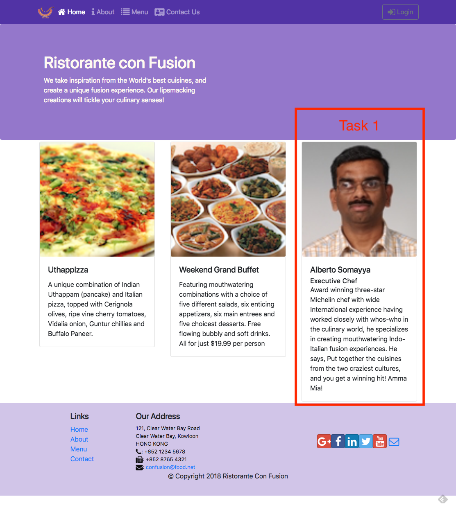{width="6.5in"
height="7.308333333333334in"}

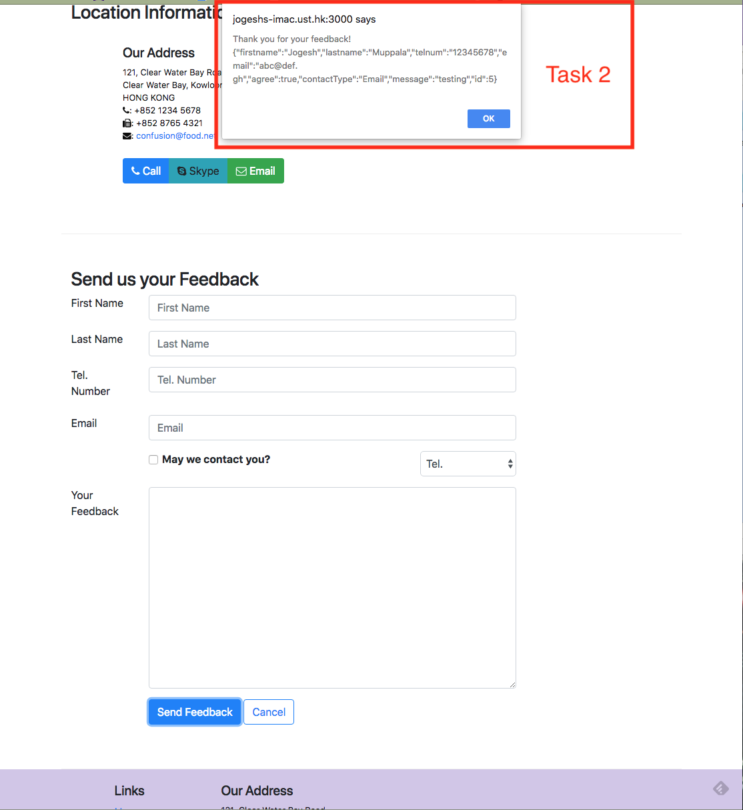{width="6.5in"
height="7.084027777777778in"}

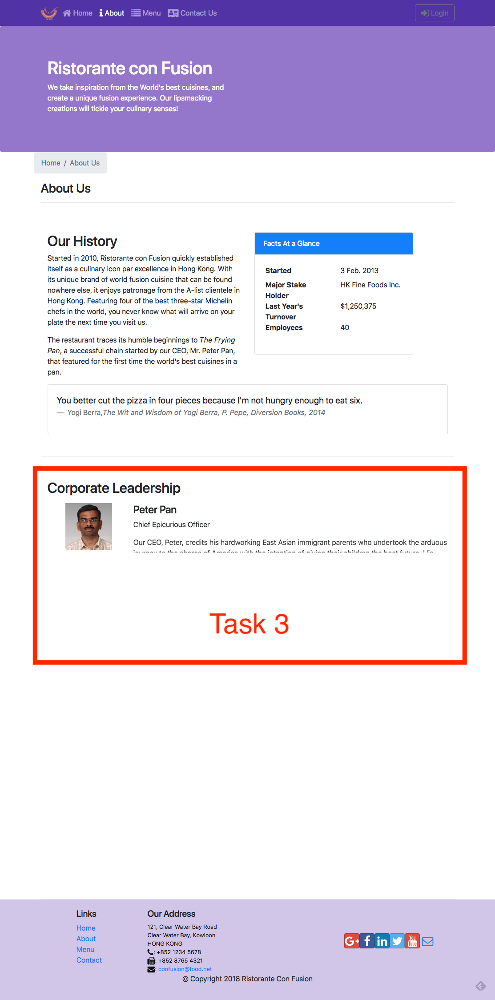{width="4.454861111111111in"
height="9.0in"}

## Review criteria

<b>less </b>

Your assignment will be assessed based on the following criteria:

<b>Task 1</b>

-   Appropriate action types and action creators have been added.

-   The Home component is correctly using the leader data, and handling
    > any errors that might arise.

-   The About component is correctly using the leader data, and handling
    > any errors that might arise.

<b>Task 2</b>

-   A new postFeedback() action creator is correctly implemented to post
    > the feedback data to the server.

-   The Contact component has been correctly updated to use
    > postFeedback() to post the form data to the server.

<b>Task 3</b>

-   Appropriate animation has been added to stagger the rendering of the
    > leaders in the AboutComponent.

## Assignment 4: Redux, Client-Server Communication and Fetch: Additional Resources

### Assignment Screenshots

{width="6.5in"
height="7.308333333333334in"}{width="6.5in"
height="7.084027777777778in"}{width="4.454861111111111in"
height="9.0in"}

### React Resources

-   [Redux Actions](https://redux.js.org/basics/actions)

-   [Redux Reducers](https://redux.js.org/basics/reducers)

-   [Redux Usage with
    React](https://redux.js.org/basics/usage-with-react)

-   [Cross-Fetch](https://github.com/lquixada/cross-fetch)

```{=html}
<!-- -->
```
-   [Animation Add-Ons](https://reactjs.org/docs/animation.html)

-   [react-transition-group](https://github.com/reactjs/react-transition-group)

-   [React Transition Group
    Documents](https://reactcommunity.org/react-transition-group/)

-   [react-animation-components](https://github.com/unruffledBeaver/react-animation-components)

## Module xx: Building and Deployment: Objectives and Outcomes

In this lesson you will learn about Webpack and how react-scripts uses
webpack to package your React application to create a distribution
folder. At the end of this exercise you will be able to:

-   Understand the Webpack way of packaging applications into bundles

-   Use react-scripts to build a distribution folder with your React
    application bundled using Webpack

## Introduction to Webpack

## Exercise (Video): Building and Deploying the React Application

## Exercise (Instructions): Building and Deploying the React Application

### Objectives and Outcomes

In this exercise you will learn to use the react-scripts to build a
distribution folder with the set of application files that can be copied
to a server to deploy your React application. At the end of this
exercise you will be able to:

-   Build your React application using the react-scripts to create a
    distribution folder

-   Deploy your application to a server by copying the built files to
    your server

### Building the Distribution Folder

-   To build the distribution folder containing your React application,
    type the following at the prompt:

npm run build

-   This should build a distribution folder named <i>build</i> containing all
    your application files.

### Deploying your React Application

-   To deploy your React application you need a server. Fortunately we
    already have the json-server available on our computer.

-   Copy the contents of the build folder to the public folder of your
    json-server

-   Now your React application can be accessed at the link
    <http://localhost:3001/>.

-   If you are setting up a server on the cloud or anywhere, all that
    you need to do is copy the contents of the build folder to the
    server side to deploy your React application. The exact procedure
    depends on the cloud service provider that you choose to use. Please
    consult their documentation to see the procedure to set up the
    server.

### Conclusions

In this exercise you learnt to use the react-scripts to build and deploy
your React application.

## Building and Deployment: Additional Resources

### PDFs of Presentations

<b>8-Webpack.pdf</b>

PDF File

### React Resources

-   [Webpack: an
    Introduction](https://angular.io/docs/ts/latest/guide/webpack.html)

-   [create-react-app
    Build](https://github.com/facebook/create-react-app/blob/master/packages/react-scripts/template/README.md#npm-run-build)

### Other Resources

-   [Webpack](https://webpack.js.org/concepts/)

-   [Webpack on Github](https://webpack.github.io/)

## Project Implementation: Objectives and Outcomes

This is the final stretch before you complete your project. By this time
you should already have a good scaffolding for your website. As you
flesh out your project and race towards completion, it is time to pause
and take stock of the current situation. Perhaps a critical look back at
the past, with the view of learning from our experience and
consolidating this learning into an effective, organized and repeatable
process is in order. Upon completion of the project it is important not
only to demonstrate the working project, but also summarize the process
of reaching the final goal. At the end of this lesson, you will be able
to:

-   Document the process of starting from an idea and reaching the
    conclusion of the project, not just the implementation, but also
    recognizing the process of reaching the end.

-   Learn lessons from the process in understanding what worked and what
    did not, and being able to make intelligent choices in the future
    based on the experience

-   Understand the design and development process through the practice.

## Final Report Template

### Project Title

### 1. Introduction

-   Briefly describe the salient features of your project.

### 2. Design and Implementation

Give a detailed system description and design and implementation
details.

In particular, this section should contain:

-   Details of how you converted from design to the actual realization
    of your project in terms of implementing the code.

-   Any choices that you made, and any modifications that you made to
    the design, in response to difficulties that you might have
    encountered while implementing the project.

-   A brief discussion of various modules and libraries that you used in
    implementing your project. In particular highlight the reasons for
    your choices briefly.

-   Include a few screen shots of your website in the report

### 3. Conclusions

-   Briefly state what results you obtained from your project.

-   Discuss any features and shortcomings of the project.

-   Discuss any choices that you might have made differently, in
    hindsight after completing the project.

### 4. References

-   Give references to any material / websites / books etc. relevant to
    your project.

## Honors Peer-graded Assignment: Project Implementation and Final Report

<b>Deadline</b> Nov 13, 11:59 PM PST

<b>Ready for the assignment?</b>

You will find instructions below to submit.

It\'s finally time to submit your Capstone project for evaluation. You
need to write a final report giving some details about your
implementation as per the specification in the final report template. In
addition, you will also submit your source code after uploading it to
any suitable site like Github, Bitbucket or others that can be publicly
accessed by providing the URL of the site. Make sure that you have
sufficiently documented the implementation of your project code by
adding appropriate comments within the code so that reviewers can easily
understand the code. If your server is running on any publicly hosted
server, please submit the URL of the site

## Review criteria

<b>less </b>

Your final project submission will be evaluated by your peers
considering the following items:

-   Have the details of the implementation been briefly described in the
    > final report?

-   Have any justifications for the choices made been provided in the
    > final report?

-   Has the source code been made available for review?

-   Has the URL to the server where the project is running been
    > provided?

..the end.

Last updated 2-15-23 10:37pm
